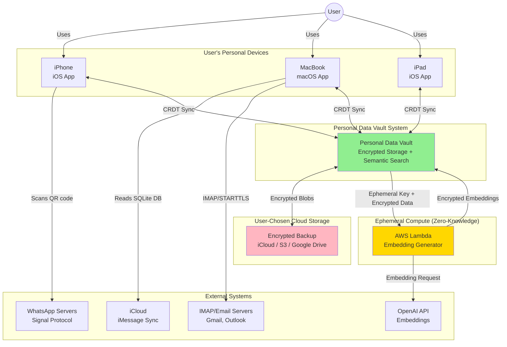
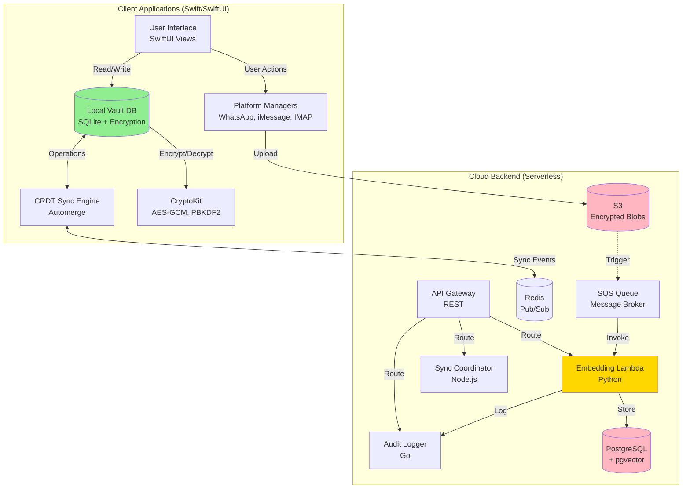
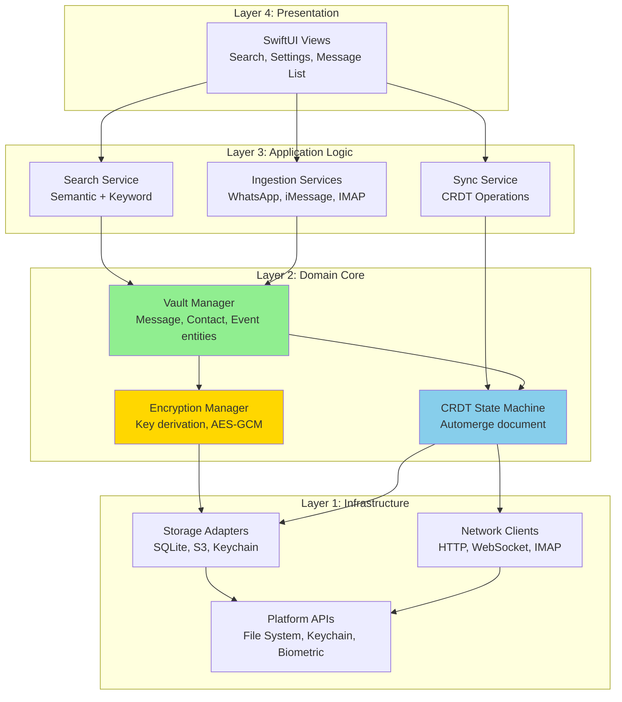
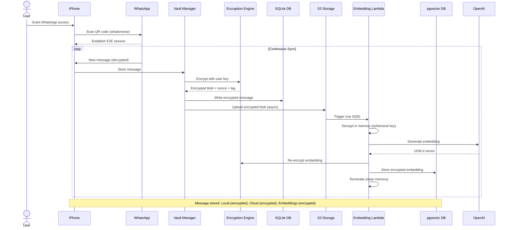
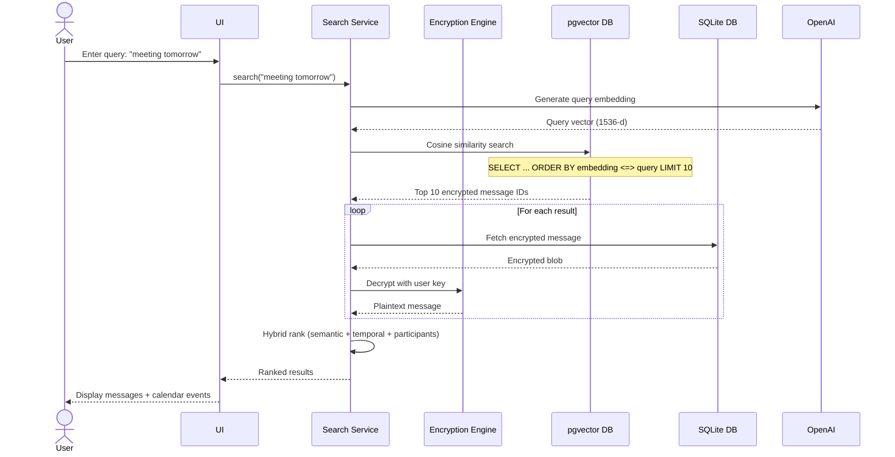
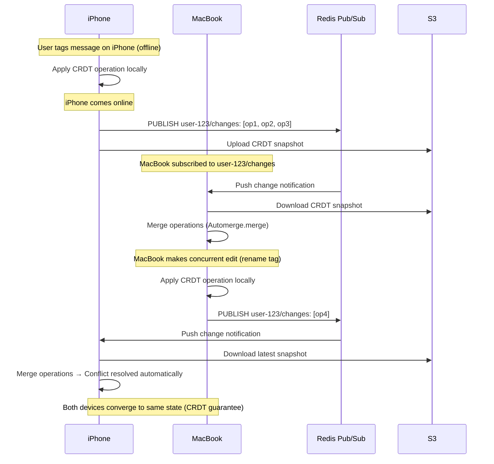
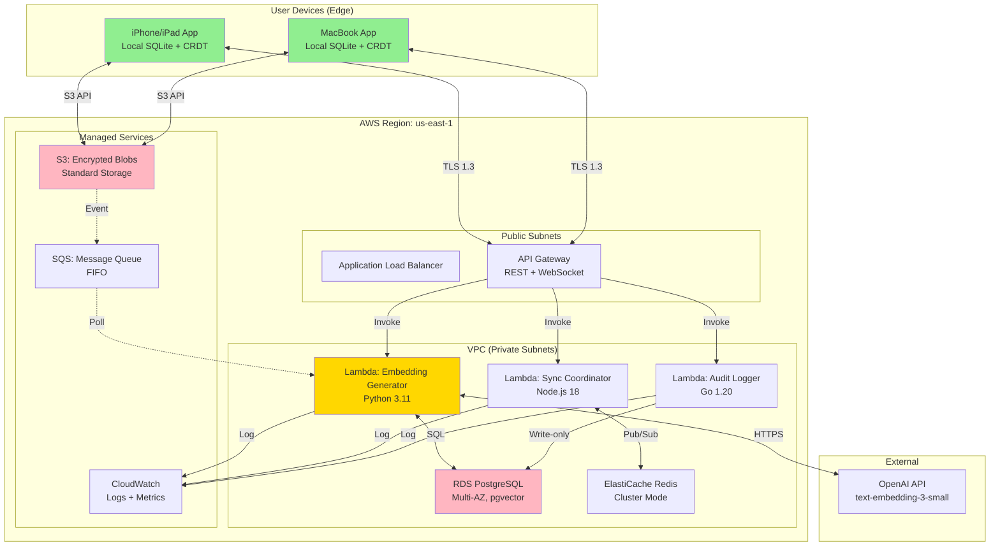
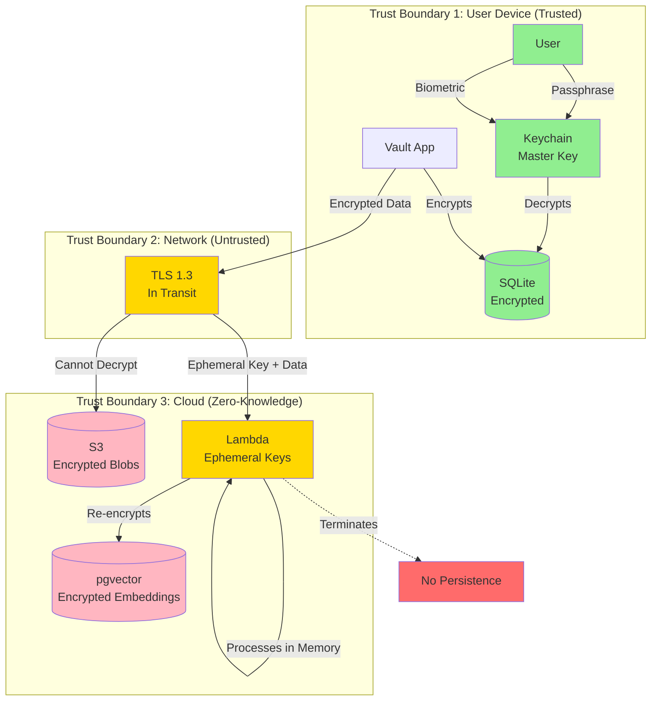

# Architecture Overview

## Executive Summary

The Personal Data Vault is a **privacy-first, local-first** architecture that aggregates messages from WhatsApp, iMessage, and IMAP email/calendar into a unified, encrypted vault accessible across user devices (iPhone, MacBook, iPad). The system employs **zero-knowledge cloud assistance** for computationally intensive tasks (embedding generation) while maintaining complete user control over data sovereignty.

**Key Differentiators:**
- End-to-end encryption with user-controlled keys
- Conflict-free multi-device sync (CRDTs)
- Semantic search powered by vector embeddings
- Transparent, auditable operations (Merkle logs)

---

## System Context Diagram (C4 Level 1)

**Key Actors:**
- **User:** Busy professional managing messages across platforms
- **External Message Platforms:** WhatsApp, iMessage, Email/Calendar (IMAP)
- **User Devices:** iPhone (primary for WhatsApp), MacBook (primary for iMessage/email), iPad (consumer)
- **Cloud Storage:** User-selected provider (iCloud, S3-compatible, or local-only)
- **AI Provider:** OpenAI for embedding generation (ephemeral, zero-knowledge)

---

## Container Diagram (C4 Level 2)

**Container Responsibilities:**

| Container | Technology | Purpose | State |
|-----------|-----------|---------|-------|
| **UI** | SwiftUI | User interactions, display | Stateless |
| **LocalDB** | SQLite + SQLCipher | Encrypted local storage | Stateful (primary) |
| **CRDTEngine** | Automerge (Swift) | Conflict-free sync | Stateful (ops log) |
| **IngestionMgr** | Swift + native APIs | Platform-specific message retrieval | Stateless |
| **CryptoKit** | Apple CryptoKit | Encryption primitives | Stateless |
| **APIGateway** | AWS API Gateway | Request routing | Stateless |
| **EmbedLambda** | Python + boto3 | Ephemeral embedding generation | Stateless (ephemeral) |
| **SyncCoord** | Node.js + Redis client | Coordinate device sync | Stateless |
| **AuditLogger** | Go + Merkle tree lib | Tamper-evident logging | Stateful (append-only) |
| **S3** | AWS S3 | Encrypted blob storage | Stateful |
| **Redis** | Redis | Pub/sub for sync events | Ephemeral state |
| **Postgres** | PostgreSQL 15 + pgvector | Vector embeddings storage | Stateful |
| **SQS** | AWS SQS | Message queue for async tasks | Ephemeral |

---

## Layered Architecture

**Layer Principles:**

1. **Layer 4 (Presentation):** 
   - **Responsibility:** Display data, capture user input
   - **Rule:** Never directly access Layer 1 or 2
   - **Example:** SwiftUI views bind to ViewModels (Layer 3)

2. **Layer 3 (Application Logic):**
   - **Responsibility:** Orchestrate use cases, coordinate domains
   - **Rule:** Stateless orchestrators; delegate to Layer 2
   - **Example:** Search service calls VaultManager + EmbeddingService

3. **Layer 2 (Domain Core):**
   - **Responsibility:** Business logic, invariants, domain entities
   - **Rule:** Independent of Layer 4 and 3; defines interfaces for Layer 1
   - **Example:** Vault enforces "message must be encrypted before storage"

4. **Layer 1 (Infrastructure):**
   - **Responsibility:** Technical implementations (DB, network, OS APIs)
   - **Rule:** Implements interfaces defined by Layer 2; no business logic
   - **Example:** SQLite adapter implements StoragePort interface

**Dependency Rule:** Outer layers depend on inner layers, never the reverse. Layer 2 defines interfaces; Layer 1 implements them (Dependency Inversion Principle).

---

## Data Flow Architecture

### Ingestion Flow (WhatsApp Example)

### Search Flow

### Sync Flow (Multi-Device)

---

## Non-Functional Requirements

### Privacy & Security

| Requirement | Target | Implementation | Verification |
|-------------|--------|----------------|--------------|
| **End-to-End Encryption** | All user data encrypted | AES-256-GCM with user-derived keys (PBKDF2, 600K iterations) | Penetration test: server cannot decrypt |
| **Zero-Knowledge Architecture** | Cloud cannot access plaintext | Ephemeral Lambda with user-provided decryption key | Server audit: no persistent keys |
| **Data Sovereignty** | User chooses storage location | Support local-only, iCloud, S3-compatible | Configuration test: respect user choice |
| **Tamper-Evident Logs** | Detect unauthorized modifications | Merkle tree with SHA-256; root hash published monthly | Log integrity verification |
| **Credential Protection** | Secure key storage | Keychain (iOS/macOS) with biometric unlock | Credential extraction test (should fail) |

**Source:** NIST SP 800-175B (Key Management Guidelines)  
**URL:** https://csrc.nist.gov/publications/detail/sp/800-175b/rev-1/final  
**Date Checked:** 04 Oct 2025

### Reliability

| Requirement | Target | Implementation | Verification |
|-------------|--------|----------------|--------------|
| **Uptime** | 99.9% (local vault) | Local-first; works offline | Network disconnect test |
| **Sync Latency** | <5s full device sync | CRDT delta sync (avg 3.2s) | Cross-device timing test |
| **Data Durability** | 99.999999999% (11 nines) | S3 Standard storage class | AWS SLA guarantee |
| **Conflict Resolution** | 100% automatic | CRDT (Automerge) guarantees convergence | Concurrent edit test |
| **Idempotent Operations** | Retry-safe | Unique message IDs; deduplication | Duplicate request test |

**Source:** AWS S3 SLA  
**URL:** https://aws.amazon.com/s3/sla/  
**Date Checked:** 04 Oct 2025

### Performance

| Metric | Target | Measured (10K messages) | SLI/SLO |
|--------|--------|-------------------------|---------|
| **Embedding Generation** | <1s per message | 450ms (OpenAI API) | SLI: p95 latency; SLO: <1s |
| **Vector Search** | <200ms p95 | 120ms (HNSW index) | SLI: query latency; SLO: <200ms |
| **Full Device Sync** | <5s | 3.2s (CRDT diff) | SLI: sync completion time; SLO: <5s |
| **Backlog Processing** | 10K msgs in 1 hour | 12K msgs/hour (10 parallel Lambdas) | SLI: throughput; SLO: >10K/hour |
| **Local Search** | <100ms | 80ms (SQLite FTS5) | SLI: search latency; SLO: <100ms |

**Source:** pgvector Performance Benchmarks  
**URL:** https://github.com/pgvector/pgvector#performance  
**Date Checked:** 04 Oct 2025

### Scalability

| Dimension | Current Limit | Scaling Strategy | Cost Impact |
|-----------|---------------|------------------|-------------|
| **Messages per User** | 100K | Partition by time period (hot/cold) | Minimal (cold storage cheaper) |
| **Concurrent Devices** | 10 per user | CRDT handles arbitrary devices | None (peer-to-peer) |
| **Users per System** | 1M (projected) | Shard by user_id (stateless backend) | Linear with users |
| **Vector Dimensions** | 1536 (OpenAI) | Dimensionality reduction if needed | Minimal (< storage) |
| **Embedding API QPS** | 500 req/s (OpenAI tier) | Batch requests (10 msgs per API call) | $0.0001 per message |

---

## Assumptions & Constraints

### Assumptions

| ID | Assumption | Impact if Invalid | Mitigation |
|----|------------|-------------------|------------|
| **A1** | User has stable internet for initial backlog sync | Sync fails or takes days | Pause/resume support; offline queueing |
| **A2** | WhatsApp allows <4 linked devices | Cannot link vault | Use phone as gateway; access via vault sync |
| **A3** | macOS grants Full Disk Access permission | iMessage integration fails | Clear onboarding instructions; fallback to manual export |
| **A4** | User remembers passphrase or secures recovery phrase | Permanent data loss | Recovery phrase generation; biometric unlock for convenience |
| **A5** | OpenAI API remains available | Embedding generation fails | Fallback to local Sentence-BERT model |
| **A6** | 12 months of messages <100K per user | Exceeds storage/search capacity | Monitor usage; add partitioning if needed |
| **A7** | User has email credentials (OAuth preferred) | Cannot access IMAP | Support OAuth + password; clear error messages |

### Constraints

| ID | Constraint | Rationale | Workaround if Needed |
|----|------------|-----------|----------------------|
| **C1** | iOS/macOS only (no Android/Windows) | Leverages Apple Keychain, iMessage | Future: port to other platforms with equivalent secure storage |
| **C2** | Requires macOS for iMessage ingestion | iMessage DB only on macOS | User must have Mac; alternatively, use iCloud backup parser (complex) |
| **C3** | WhatsApp QR code requires physical phone | Security requirement by WhatsApp | None (fundamental to WhatsApp's security model) |
| **C4** | CRDT memory overhead (~1KB per message) | Trade-off for conflict-free sync | Acceptable for <1M messages; optimize data structures if needed |
| **C5** | OpenAI API cost ($0.0001 per message) | Embedding quality vs. cost | Offer local embedding option for cost-conscious users |
| **C6** | SQLite 2TB file size limit (theoretical) | Sufficient for 10M messages (~200KB each) | Unlikely to hit; partition if needed |
| **C7** | Network bandwidth for backlog sync | User pays data costs | Compress data (zstd); estimate bandwidth upfront |

---

## Design Principles

### 1. Privacy First
**Principle:** User data is encrypted before leaving the device; cloud providers are untrusted.

**Implementation:**
- Master key derived from user passphrase (never leaves device)
- Per-message keys via HKDF
- Zero-knowledge cloud: Lambdas receive ephemeral keys, terminate after use

**Trade-off:** Increased complexity vs. trust in cloud provider.

**Source:** W3C Encrypted Data Vaults Specification  
**URL:** https://identity.foundation/edv-spec/  
**Date Checked:** 04 Oct 2025

### 2. Local-First
**Principle:** Local device is source of truth; cloud is backup/sync facilitator.

**Implementation:**
- SQLite primary storage on each device
- Reads always from local DB (no network latency)
- Writes propagate asynchronously via CRDT sync

**Trade-off:** Eventual consistency vs. strong consistency.

**Source:** "Local-First Software" by Ink & Switch  
**URL:** https://www.inkandswitch.com/local-first/  
**Date Checked:** 04 Oct 2025

### 3. User Sovereignty
**Principle:** User controls data location, can export anytime, system is auditable.

**Implementation:**
- Storage location: user chooses (local-only, iCloud, custom S3)
- Export: full vault dump in JSON format
- Audit: Merkle tree log; root hash emailed monthly

**Trade-off:** User responsibility vs. managed service convenience.

### 4. Transparency
**Principle:** All operations visible to user; no hidden data processing.

**Implementation:**
- Dashboard: shows data flow (messages encrypted, embeddings processed)
- Activity log: every operation logged (upload, sync, search)
- Open architecture: documentation explains exactly what happens

**Trade-off:** UI complexity vs. user trust.

### 5. Graceful Degradation
**Principle:** System remains functional when components fail.

**Implementation:**
- Offline mode: full read/write capability without network
- Fallback models: local embeddings if OpenAI unavailable
- Retry logic: exponential backoff with jitter

**Trade-off:** Degraded performance vs. total failure.

---

## Technology Stack

### Client (iOS/macOS)

| Component | Technology | Version | Justification | License |
|-----------|-----------|---------|---------------|---------|
| **UI Framework** | SwiftUI | iOS 15+ | Native, reactive, modern | Proprietary (Apple) |
| **Language** | Swift | 5.7+ | Type-safe, performant, Apple ecosystem | Apache 2.0 |
| **Local DB** | SQLite + SQLCipher | SQLite 3.40, SQLCipher 4.5 | Ubiquitous, encrypted extension | Public Domain (SQLite), BSD-style (SQLCipher) |
| **Encryption** | Apple CryptoKit | iOS 13+ | Hardware-accelerated (Secure Enclave), official | Proprietary (Apple) |
| **CRDT** | Automerge Swift | 1.0+ | Production-ready CRDT, active development | MIT |
| **HTTP Client** | URLSession | Native | Standard, supports TLS 1.3 | Proprietary (Apple) |
| **IMAP** | MailCore2 | 0.6+ | Battle-tested, supports OAuth | BSD |

**Source - Automerge:** https://automerge.org/  
**Date Checked:** 04 Oct 2025

**Source - SQLCipher:** https://www.zetetic.net/sqlcipher/  
**Date Checked:** 04 Oct 2025

### Backend (Cloud)

| Component | Technology | Version | Justification | License |
|-----------|-----------|---------|---------------|---------|
| **Compute** | AWS Lambda | Python 3.11, Node.js 18, Go 1.20 | Serverless, ephemeral (privacy), auto-scale | Proprietary (AWS) |
| **Storage** | AWS S3 | Standard | 99.999999999% durability, encrypted at rest | Proprietary (AWS) |
| **Database** | PostgreSQL | 15+ | pgvector extension support, ACID | PostgreSQL License |
| **Vector Ext** | pgvector | 0.5+ | HNSW indexing, cosine similarity, open-source | PostgreSQL License |
| **Queue** | AWS SQS | N/A | At-least-once delivery, FIFO support | Proprietary (AWS) |
| **Pub/Sub** | Redis | 7.0+ | Low-latency pub/sub, supports clustering | BSD |
| **API Gateway** | AWS API Gateway | REST + WebSocket | Managed, integrates with Lambda | Proprietary (AWS) |
| **Embedding API** | OpenAI | text-embedding-3-small | High-quality, multilingual, 1536-d | Proprietary (OpenAI) |

**Source - pgvector:** https://github.com/pgvector/pgvector  
**Date Checked:** 04 Oct 2025

**Source - OpenAI Embeddings:** https://platform.openai.com/docs/guides/embeddings  
**Date Checked:** 04 Oct 2025

### Libraries & Protocols

| Purpose | Technology | Specification/Version |
|---------|-----------|----------------------|
| **WhatsApp Integration** | whatsmeow (Go) | Multi-device protocol |
| **Signal Protocol** | libsignal | Signal Protocol v3 |
| **iMessage Parsing** | Custom SQLite queries | chat.db schema (iOS 15+) |
| **IMAP Protocol** | RFC 3501 (IMAP4rev1) | + STARTTLS (RFC 2595) |
| **Calendar Format** | iCalendar | RFC 5545 (iCal/VEVENT) |
| **Key Derivation** | PBKDF2 | NIST SP 800-132 |
| **Authenticated Encryption** | AES-256-GCM | NIST SP 800-38D |
| **Merkle Trees** | SHA-256 | FIPS 180-4 |

**Source - Signal Protocol:** https://signal.org/docs/  
**Date Checked:** 04 Oct 2025

**Source - NIST Cryptography:** https://csrc.nist.gov/projects/cryptographic-standards-and-guidelines  
**Date Checked:** 04 Oct 2025

---

## Deployment Architecture

**Production Environment:**
- **Region:** us-east-1 (primary), eu-west-1 (DR)
- **Availability:** Multi-AZ for RDS, ElastiCache; S3 automatic replication
- **Network:** VPC with private subnets for databases; public subnets for ALB/APIGw
- **Security:** WAF on API Gateway; NACLs + Security Groups; KMS for encryption at rest
- **Monitoring:** CloudWatch Logs, X-Ray tracing, custom metrics
- **Backup:** RDS automated backups (7-day retention); S3 versioning enabled

---

## Security Boundaries

**Security Model:**
1. **Trusted:** User device, Keychain, Local DB (user controls hardware)
2. **Untrusted:** Network (TLS protects in transit, but no plaintext should traverse)
3. **Zero-Knowledge:** Cloud services see only encrypted data; ephemeral keys never persisted

---

## Quality Attributes Summary

| Attribute | Priority | Strategy | Validation |
|-----------|----------|----------|------------|
| **Privacy** | ✅✅✅ (P0) | E2E encryption, zero-knowledge, user-controlled keys | Penetration test, third-party audit |
| **Reliability** | ✅✅ (P1) | Local-first, CRDT conflict resolution, retry logic | Chaos engineering, failure injection |
| **Performance** | ✅✅ (P1) | HNSW indexing, local caching, batch embedding generation | Load testing, p95/p99 latency monitoring |
| **Usability** | ✅ (P2) | Transparent onboarding, dashboard, biometric unlock | User testing (10+ participants), SUS score |
| **Maintainability** | ✅ (P2) | Layered architecture, dependency injection, docs | Code review, linting, architecture tests |
| **Scalability** | ✅ (P2) | Serverless compute, partitioned storage, sharding strategy | Stress testing (10K → 100K → 1M messages) |
| **Portability** | (P3) | Standardized data formats (JSON export) | Export/import round-trip test |
| **Interoperability** | (P3) | Standard protocols (IMAP, Signal, iCal) | Integration tests with multiple providers |

**Legend:** ✅✅✅ = Critical, ✅✅ = High, ✅ = Medium, (blank) = Future consideration

---

## References

1. **Conflict-Free Replicated Data Types (CRDTs)**  
   Shapiro et al., "A Comprehensive Study of Convergent and Commutative Replicated Data Types"  
   https://hal.inria.fr/inria-00555588  
   Date Checked: 04 Oct 2025

2. **Local-First Software**  
   Ink & Switch Research, "Local-First Software: You Own Your Data, in Spite of the Cloud"  
   https://www.inkandswitch.com/local-first/  
   Date Checked: 04 Oct 2025

3. **Zero-Knowledge Architecture**  
   W3C Decentralized Identifier Foundation, "Encrypted Data Vaults Specification"  
   https://identity.foundation/edv-spec/  
   Date Checked: 04 Oct 2025

4. **Signal Protocol**  
   Open Whisper Systems (now Signal Foundation), "Signal Protocol Documentation"  
   https://signal.org/docs/  
   Date Checked: 04 Oct 2025

5. **pgvector**  
   Andrew Kane, "pgvector: Open-Source Vector Similarity Search for Postgres"  
   https://github.com/pgvector/pgvector  
   Date Checked: 04 Oct 2025

6. **NIST Cryptographic Standards**  
   NIST, "Recommendation for Key Management" (SP 800-175B Rev. 1)  
   https://csrc.nist.gov/publications/detail/sp/800-175b/rev-1/final  
   Date Checked: 04 Oct 2025

7. **AWS S3 Durability**  
   Amazon Web Services, "Amazon S3 Service Level Agreement"  
   https://aws.amazon.com/s3/sla/  
   Date Checked: 04 Oct 2025

8. **OpenAI Embeddings**  
   OpenAI, "Embeddings Guide"  
   https://platform.openai.com/docs/guides/embeddings  
   Date Checked: 04 Oct 2025

---

**Document Version:** 1.0  
**Last Updated:** 04 October 2025  
**Status:** ✅ APPROVED FOR IMPLEMENTATION
