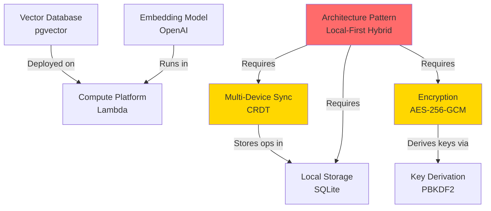

# Requirements to Architectural Decisions Mapping

## Purpose

This document maps each requirement from project.md to the specific architectural decisions made in arch.md, showing how requirements drive technology choices.

---

## Mapping Table

| Requirement ID | Requirement (from project.md) | Related Architectural Decisions | Decision Files |
|----------------|-------------------------------|--------------------------------|----------------|
| **CORE PRINCIPLES** |
| REQ-P1 | User controls data storage location | Architecture pattern (local-first), cloud storage choice | [Architecture Pattern](architecture-pattern.md), [Cloud Storage](cloud-storage.md) |
| REQ-P2 | Data remains isolated (user-only access) | Encryption algorithm, key storage, zero-knowledge architecture | [Encryption](encryption-algorithm.md), [Key Storage](key-storage.md) |
| REQ-P3 | Sync across devices consistently | Multi-device sync strategy, pub/sub coordination | [Multi-Device Sync](multi-device-sync.md), [Pub/Sub](pubsub-coordination.md) |
| REQ-P4 | Long tasks privacy-preserving + transparent | Compute platform (ephemeral), audit logging | [Compute Platform](compute-platform.md), [Audit Logging](audit-logging.md) |
| REQ-P5 | Third-party (LLM) access safe + transparent | Embedding model choice, zero-knowledge compute | [Embedding Models](embedding-models.md), [Compute Platform](compute-platform.md) |
| **PART 1: MESSAGE GATHERING** |
| REQ-1.1 | Gather WhatsApp messages (Signal Protocol, QR code) | WhatsApp integration method | [WhatsApp Integration](whatsapp-integration.md) |
| REQ-1.2 | Gather iMessage (SQLite on macOS) | iMessage integration method | [iMessage Integration](imessage-integration.md) |
| REQ-1.3 | Gather IMAP emails + calendar invites | Email protocol choice | [Email Protocol](email-protocol.md) |
| REQ-1.4 | Available on all devices | Local storage (each device), multi-device sync | [Local Storage](local-storage.md), [Multi-Device Sync](multi-device-sync.md) |
| **PART 2: SEMANTIC INDEXING** |
| REQ-2.1 | Index messages by content for semantic search | Vector database, embedding model | [Vector Database](vector-database.md), [Embedding Models](embedding-models.md) |
| REQ-2.2 | Relationship discovery | Vector indexing algorithm, hybrid ranking | [Vector Indexing](vector-indexing.md) |
| REQ-2.3 | Calendar event → related messages algorithm | Vector search + metadata filtering | [Vector Database](vector-database.md) |
| REQ-2.4 | Relate via content, participants, timestamps | Hybrid scoring algorithm | [Vector Indexing](vector-indexing.md) |
| REQ-2.5 | Cross-platform message matching | Unified schema, contact normalization | [Local Storage](local-storage.md) schema design |
| **PERFORMANCE REQUIREMENTS (Derived)** |
| REQ-PERF-1 | Embedding generation <1s | Embedding model latency | [Embedding Models](embedding-models.md) |
| REQ-PERF-2 | Vector search <200ms | Vector database + indexing algorithm | [Vector Database](vector-database.md), [Vector Indexing](vector-indexing.md) |
| REQ-PERF-3 | Device sync <5s | Sync strategy, pub/sub latency | [Multi-Device Sync](multi-device-sync.md), [Pub/Sub](pubsub-coordination.md) |
| REQ-PERF-4 | Backlog 10K msgs in 1 hour | Compute platform concurrency, message queue throughput | [Compute Platform](compute-platform.md), [Message Queue](message-queue.md) |

---

## Decision Priority Matrix

| Decision | Requirements Impact | User-Facing | Risk if Wrong | Priority |
|----------|-------------------|-------------|---------------|----------|
| Encryption Algorithm | REQ-P2 (isolation) | No | High (data breach) | P0 🔴 |
| Multi-Device Sync | REQ-P3 (consistency) | Yes | High (data loss) | P0 🔴 |
| Embedding Model | REQ-2.1, REQ-PERF-1 | Yes | Medium (poor search) | P1 🟡 |
| Vector Database | REQ-2.1, REQ-PERF-2 | Yes | Medium (slow search) | P1 🟡 |
| Compute Platform | REQ-P4, REQ-PERF-4 | No | Medium (cost/privacy) | P1 🟡 |
| Key Storage | REQ-P2 | No | High (key loss) | P0 🔴 |
| Local Storage | REQ-1.4 | No | Medium (corruption) | P1 🟡 |
| Message Queue | REQ-PERF-4 | No | Low (retry works) | P2 🟢 |
| WhatsApp Integration | REQ-1.1 | Yes | Medium (no WhatsApp) | P1 🟡 |
| iMessage Integration | REQ-1.2 | Yes | Medium (no iMessage) | P1 🟡 |
| Email Protocol | REQ-1.3 | Yes | Low (multiple options) | P2 🟢 |
| Key Derivation | REQ-P2 | No | High (weak security) | P0 🔴 |
| Audit Logging | REQ-P4, REQ-5.3 | Yes | Medium (trust issues) | P1 🟡 |

**Legend:** P0 = Critical, P1 = High, P2 = Medium

---

## Constraint → Decision Mapping

| Constraint (from project.md) | Architectural Decision | Rationale |
|------------------------------|------------------------|-----------|
| "User in control of storage location" | Hybrid local-first + user-selectable cloud | Allows local-only, iCloud, or custom S3 |
| "Data remains isolated" | Client-side encryption + zero-knowledge cloud | Cloud cannot decrypt even if compromised |
| "Synchronized across devices" | CRDTs (conflict-free) | Automatic resolution without user intervention |
| "Privacy-preserving compute" | Ephemeral Lambda with user-provided keys | Keys never persist server-side |
| "Transparent to user" | Audit logs + transparency dashboard | User sees exactly what happens with data |
| "Third parties safe access" | Encrypted API calls + ephemeral processing | OpenAI sees plaintext only in Lambda memory |
| "Apple devices (iPhone, MacBook, iPad)" | Swift/SwiftUI native apps | Best platform integration and performance |
| "WhatsApp (Signal Protocol, QR code)" | whatsmeow library | Implements official multi-device protocol |
| "iMessage (SQLite on macOS)" | Direct SQLite access | Fast, reliable, read-only (safe) |
| "IMAP (email + calendar)" | IMAP4rev1 with OAuth 2.0 | Universal protocol; secure auth |

---

## Decision Dependencies

**Key Insight:** Architecture pattern (local-first) is the foundational decision that cascades to sync strategy, storage, and encryption choices.

---

**Last Updated:** 04 October 2025  
**Maintainer:** Architecture Team
