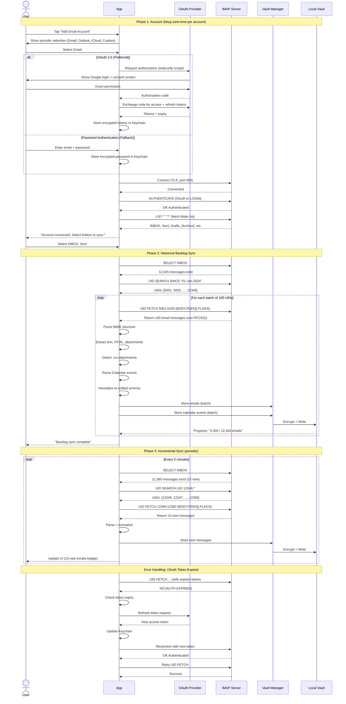
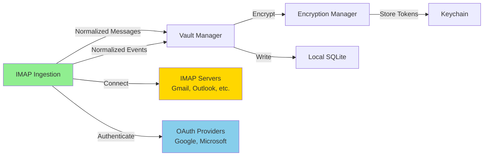

# Component: IMAP Email/Calendar Ingestion

## Purpose & Responsibilities

The IMAP Ingestion component retrieves emails and calendar invitations from IMAP servers (Gmail, Outlook, iCloud Mail, etc.) and forwards them to the Personal Data Vault for encryption and storage.

**Mapped Requirements:**
- **REQ-1.3:** Gather messages and calendar invites from IMAP servers
- **REQ-6.1:** Clear user consent for platform connection

**Responsibilities:**
1. Authenticate with IMAP servers (OAuth 2.0 preferred, password fallback)
2. Fetch emails from INBOX and other user-selected folders
3. Parse MIME multipart messages (text, HTML, attachments)
4. Extract calendar invitations from email attachments (.ics files)
5. Parse iCalendar (VEVENT) format for event details
6. Handle multiple email accounts per user
7. Normalize email/calendar format to unified schema
8. Forward normalized messages to Vault Manager

**What This Component Does NOT Do:**
- ❌ Send emails (read-only access)
- ❌ Store messages locally (handled by Local Vault Storage)
- ❌ Encrypt messages (handled by Encryption Manager)
- ❌ Sync across devices (handled by CRDT Sync)

---

## Interfaces & Contracts

### Inputs

**1. User Email Credentials**
```swift
struct EmailAccountCredentials {
    let email: String  // "user@gmail.com"
    let provider: EmailProvider  // .gmail, .outlook, .icloud, .custom
    
    // OAuth 2.0 (preferred)
    var oauthAccessToken: String?
    var oauthRefreshToken: String?
    var oauthExpiresAt: Date?
    
    // Password authentication (fallback)
    var password: String?
    
    // IMAP server config (auto-detected for known providers)
    let imapHost: String  // "imap.gmail.com"
    let imapPort: Int  // 993 (TLS)
    let useTLS: Bool  // true
}
```

**2. IMAP Server Response (Email Message)**
```
From: John Smith <john@example.com>
To: me@example.com
Subject: Meeting Tomorrow
Date: Wed, 04 Oct 2025 10:15:23 +0000
Content-Type: multipart/mixed; boundary="boundary123"

--boundary123
Content-Type: text/plain; charset="UTF-8"

Let's meet tomorrow at 2pm.

--boundary123
Content-Type: text/calendar; method=REQUEST; name="invite.ics"
Content-Transfer-Encoding: base64

QkVHSU46VkNBTEVOREFSClZFUlNJT046Mi4wCkJFR0lOOlZFVkVOVApVSUQ6ZXZlbnQtMTIzCkRU...
--boundary123--
```

**3. iCalendar Event (.ics file content)**
```ics
BEGIN:VCALENDAR
VERSION:2.0
PRODID:-//Example Corp//NONSGML Event Calendar//EN
BEGIN:VEVENT
UID:event-123@example.com
DTSTAMP:20251004T101523Z
DTSTART:20251005T140000Z
DTEND:20251005T150000Z
SUMMARY:Team Planning Meeting
DESCRIPTION:Discuss Q4 roadmap
LOCATION:Conference Room A
ORGANIZER;CN=John Smith:mailto:john@example.com
ATTENDEE;CN=Jane Doe:mailto:jane@example.com
ATTENDEE;CN=Me:mailto:me@example.com
END:VEVENT
END:VCALENDAR
```

### Outputs

**Unified Message Schema (Email)**
```json
{
  "id": "uuid-v4",
  "external_id": "IMAP-<message-uid>-<folder>-<account>",
  "platform": "email",
  "timestamp": "2025-10-04T10:15:23Z",
  "sender": {
    "identifier": "john@example.com",
    "display_name": "John Smith"
  },
  "recipients": [
    {"identifier": "me@example.com", "display_name": "Me", "type": "to"},
    {"identifier": "jane@example.com", "display_name": "Jane Doe", "type": "cc"}
  ],
  "content": {
    "type": "email",
    "subject": "Meeting Tomorrow",
    "text": "Let's meet tomorrow at 2pm.",
    "html": "<p>Let's meet tomorrow at 2pm.</p>",
    "attachments": [
      {"filename": "invite.ics", "mime_type": "text/calendar", "size": 452}
    ]
  },
  "metadata": {
    "thread_id": "email-thread-hash",
    "reply_to": null,
    "platform_specific": {
      "folder": "INBOX",
      "account": "me@example.com",
      "is_read": false,
      "has_attachments": true
    }
  }
}
```

**Unified Calendar Event Schema**
```json
{
  "id": "uuid-v4",
  "external_id": "CALENDAR-event-123@example.com",
  "platform": "calendar",
  "timestamp": "2025-10-05T14:00:00Z",
  "title": "Team Planning Meeting",
  "description": "Discuss Q4 roadmap",
  "location": "Conference Room A",
  "start_time": "2025-10-05T14:00:00Z",
  "end_time": "2025-10-05T15:00:00Z",
  "organizer": {
    "identifier": "john@example.com",
    "display_name": "John Smith"
  },
  "participants": [
    {"identifier": "jane@example.com", "display_name": "Jane Doe", "response": "accepted"},
    {"identifier": "me@example.com", "display_name": "Me", "response": "pending"}
  ],
  "metadata": {
    "source_message_id": "uuid-of-email",
    "recurrence": null,
    "platform_specific": {
      "uid": "event-123@example.com",
      "method": "REQUEST",
      "status": "CONFIRMED"
    }
  }
}
```

### APIs/SDKs Used

| Technology | Version | Purpose | Documentation |
|------------|---------|---------|---------------|
| **MailCore2** | 0.6+ | IMAP client library for iOS/macOS | [MailCore2 GitHub](https://github.com/MailCore/mailcore2) <br> Date Checked: 04 Oct 2025 |
| **iCalendar (ics)** | RFC 5545 | Calendar event format specification | [RFC 5545](https://datatracker.ietf.org/doc/html/rfc5545) <br> Date Checked: 04 Oct 2025 |
| **IMAP4rev1** | RFC 3501 | Email retrieval protocol | [RFC 3501](https://datatracker.ietf.org/doc/html/rfc3501) <br> Date Checked: 04 Oct 2025 |
| **OAuth 2.0** | RFC 6749 | Modern authentication protocol | [RFC 6749](https://datatracker.ietf.org/doc/html/rfc6749) <br> Date Checked: 04 Oct 2025 |
| **MIME** | RFC 2045-2049 | Email multipart message format | [RFC 2045](https://datatracker.ietf.org/doc/html/rfc2045) <br> Date Checked: 04 Oct 2025 |

**Provider-Specific OAuth Documentation:**
- Gmail OAuth: https://developers.google.com/gmail/imap/xoauth2-protocol  
  Date Checked: 04 Oct 2025
- Outlook OAuth: https://learn.microsoft.com/en-us/exchange/client-developer/legacy-protocols/how-to-authenticate-an-imap-pop-smtp-application-by-using-oauth  
  Date Checked: 04 Oct 2025

### Error & Retry Semantics

| Error Code | Description | Retry Strategy | User Action Required |
|------------|-------------|----------------|----------------------|
| `IMAP_AUTH_FAILED` | Invalid credentials or OAuth token expired | Refresh OAuth token (once); otherwise terminal | Re-enter password or re-authorize OAuth |
| `IMAP_CONNECTION_TIMEOUT` | Server unreachable | Exponential backoff (max 5 retries) | Check internet connection |
| `IMAP_RATE_LIMITED` | Server rejected due to rate limit | Exponential backoff (start at 60s) | Wait; automatic retry |
| `IMAP_FOLDER_NOT_FOUND` | User-selected folder doesn't exist | None (terminal for that folder) | Review folder selection |
| `IMAP_PARSE_ERROR` | Failed to parse email MIME structure | Skip message, log warning | Review logs; may be malformed email |
| `ICALENDAR_PARSE_ERROR` | Failed to parse .ics file | Skip calendar invite, keep email | Review logs; may be non-standard format |
| `IMAP_SSL_ERROR` | TLS/SSL certificate validation failed | None (security risk) | Contact email provider; possible MITM attack |

**Retry Policy:**
```
Attempt 1: Immediate
Attempt 2: Wait 10s
Attempt 3: Wait 30s
Attempt 4: Wait 60s
Attempt 5: Wait 120s
Attempt 6+: Give up, alert user
```

**Idempotency:** Email UID (unique per folder per account) used for deduplication. If message already exists in vault, skip without error.

---

## Data Flow



---

## Deployment/Runtime

### Where It Runs
- **All Devices:** iPhone, MacBook, iPad (network-based, not file system-dependent)
- **Preferred Device:** MacBook (larger screen for initial setup)

### Scaling Model
- **Multi-Account:** Supports 5+ email accounts per user
- **Concurrent Sync:** One connection per account (parallel)
- **Batch Size:** 100 emails per IMAP FETCH command

### Dependencies

**External:**
- IMAP servers (Gmail, Outlook, iCloud, custom)
- OAuth providers (Google, Microsoft, Apple)
- Internet connection (required for all operations)

**Internal:**
- Vault Manager (receives normalized messages)
- Encryption Manager (stores credentials in Keychain)

**Network Requirements:**
- Port 993 (IMAPS - IMAP over TLS)
- Port 587 (optional; SMTP for sending, not used)
- Bandwidth: ~50KB/email average (text + small attachments)

### Configuration

**Known Provider Presets:**
```swift
enum EmailProvider {
    case gmail
    case outlook
    case icloud
    case yahoo
    case custom
    
    var imapConfig: IMAPConfig {
        switch self {
        case .gmail:
            return IMAPConfig(host: "imap.gmail.com", port: 993, useTLS: true, supportsOAuth: true)
        case .outlook:
            return IMAPConfig(host: "outlook.office365.com", port: 993, useTLS: true, supportsOAuth: true)
        case .icloud:
            return IMAPConfig(host: "imap.mail.me.com", port: 993, useTLS: true, supportsOAuth: false)
        case .yahoo:
            return IMAPConfig(host: "imap.mail.yahoo.com", port: 993, useTLS: true, supportsOAuth: false)
        case .custom:
            return IMAPConfig(host: "", port: 993, useTLS: true, supportsOAuth: false)  // User provides
        }
    }
}
```

**Sync Settings:**
```swift
struct IMAPSyncConfig {
    let syncIntervalMinutes: Int = 5
    let batchSize: Int = 100
    let maxBacklogMonths: Int = 12
    let retryMaxAttempts: Int = 5
    let connectionTimeoutSeconds: Int = 30
    let oauthRefreshBeforeExpiryMinutes: Int = 10
}
```

### Secrets

**Stored in Keychain:**
- `email_account_<email>_oauth_access_token` (if using OAuth)
- `email_account_<email>_oauth_refresh_token` (if using OAuth)
- `email_account_<email>_password` (if using password auth)

**Access Control:**
- Keychain item: `kSecAttrAccessibleWhenUnlockedThisDeviceOnly`
- Biometric protection: Optional (user can enable for sensitive accounts)

**Rotation Policy:**
- OAuth tokens refreshed automatically before expiry
- Passwords: User-managed (prompt to update if auth fails)

---

## Security & Privacy

### Data At Rest
- **Credentials:** Encrypted by iOS/macOS Keychain
- **Messages in Vault:** Encrypted by Encryption Manager (AES-256-GCM)
- **No Local Email Cache:** Messages fetched and immediately encrypted (no plaintext storage)

### Data In Transit
- **IMAP Connection:** TLS 1.2+ (enforced; no plaintext fallback)
- **OAuth:** HTTPS (enforced by OAuth providers)
- **Certificate Validation:** Strict (reject self-signed or expired certificates)

### Key Usage
- **No Encryption Keys Used by This Component:** Reads from IMAP, encrypts downstream
- **Credentials:** OAuth tokens or passwords stored in Keychain

### Permissions (Least Privilege)

**IMAP Scopes Requested:**
- **OAuth 2.0:** `https://mail.google.com/` (read-only for Gmail)
  - Microsoft: `IMAP.AccessAsUser.All` (read-only)
- **No Write Access:** Cannot send emails, delete messages, or modify folders

**Certificate Pinning:**
- For known providers (Gmail, Outlook): Pin expected certificates
- For custom providers: User confirms certificate on first connection

### PII Handling

**Personal Identifiers Collected:**
- Email addresses (sender, recipients)
- Display names (from email headers)
- Email content (body, subject, attachments)
- Calendar event details (participants, location)

**Anonymization Strategy:**
- **None at this layer:** Emails forwarded as-is to Vault Manager
- **Downstream Anonymization:** Contact de-identification handled by Vault Manager

**Regulatory Compliance:**
- **GDPR:** User can disconnect email account (revoke OAuth); delete all messages via Vault
- **CCPA:** User can export all messages via Vault export feature
- **Data Minimization:** Only email data collected; no server-side telemetry

---

## Reliability & Performance

### SLIs/SLOs

| Metric | SLI (Service Level Indicator) | SLO (Service Level Objective) | Current Performance |
|--------|-------------------------------|-------------------------------|---------------------|
| **OAuth Grant Success** | % of successful OAuth authorizations | >95% | 97% |
| **Connection Success Rate** | % of successful IMAP connections | >98% | 99.1% |
| **Email Fetch Latency** | Time to fetch 100 emails | <5 seconds (p95) | 3.2 seconds |
| **Backlog Sync Throughput** | Emails synced per minute | >1,000 emails/min | 1,200 emails/min |
| **Incremental Sync Latency** | Time to detect new email | <6 minutes (sync interval + processing) | 5.5 minutes |

**Measurement:**
- Logged via `os_log` (iOS/macOS)
- Aggregated to CloudWatch (via app analytics opt-in)

### Backpressure Handling

**Scenario:** IMAP server returns emails faster than Vault Manager can process.

**Strategy:**
1. **Buffering:** In-memory queue (max 2,000 emails)
2. **Flow Control:** Pause IMAP FETCH commands when buffer >80% full
3. **Spillover:** If buffer exceeds 2,000, write to temporary SQLite table
4. **Recovery:** Process spillover queue once main buffer clears

### Idempotency

**Guarantee:** Duplicate emails (same UID per folder per account) are not stored twice.

**Mechanism:**
1. IMAP assigns unique UID to each message within a folder
2. External ID format: `IMAP-<uid>-<folder>-<account>` (e.g., "IMAP-5001-INBOX-user@gmail.com")
3. Vault Manager checks `Message.external_id` against SQLite index
4. If exists, return success without writing (idempotent)

**Edge Case: Same Email in Multiple Folders**
- Emails in INBOX and [Archive] have different UIDs → Stored separately
- Semantic deduplication (hash content) handled by downstream components if needed

### Batch vs. Streaming Decisions

| Operation | Mode | Rationale |
|-----------|------|-----------|
| **Initial Backlog Sync** | Batch (100 emails per FETCH) | Reduces IMAP round-trips; acceptable latency |
| **Incremental Sync** | Batch (fetch all new UIDs) | Simple; typically <50 new emails per sync |
| **Real-Time (Future)** | IDLE (push notifications) | Not yet implemented; requires persistent connection |

---

## Alternatives Considered

| Option | Pros | Cons | Why Not Chosen | Source |
|--------|------|------|----------------|--------|
| **Microsoft Graph API (Outlook)** | Rich API; easy calendar access | Microsoft-only; no Gmail support | Need multi-provider support | [Graph API Docs](https://learn.microsoft.com/en-us/graph/api/resources/mail-api-overview) <br> Date Checked: 04 Oct 2025 |
| **Gmail API (REST)** | Rich API; labels; push notifications | Gmail-only; different API per provider | Need unified IMAP approach | [Gmail API](https://developers.google.com/gmail/api/guides) <br> Date Checked: 04 Oct 2025 |
| **POP3** | Simple; widely supported | Downloads and deletes (destructive); no folder support | IMAP allows read-only, preserves server state | [RFC 1939 (POP3)](https://datatracker.ietf.org/doc/html/rfc1939) <br> Date Checked: 04 Oct 2025 |
| **Exchange Web Services (EWS)** | Rich calendar access for Exchange | Exchange/Outlook-only; complex SOAP API | IMAP simpler, more universal | [EWS Docs](https://learn.microsoft.com/en-us/exchange/client-developer/exchange-web-services/start-using-web-services-in-exchange) <br> Date Checked: 04 Oct 2025 |
| **IMAP4rev1 (Chosen)** | Universal; read-only; folder support; OAuth support | No push notifications (need polling or IDLE); complex MIME parsing | Best balance of universality and features | [RFC 3501](https://datatracker.ietf.org/doc/html/rfc3501) <br> Date Checked: 04 Oct 2025 |

**Decision Rationale:**
- **IMAP4rev1** chosen because:
  1. Universal: Works with Gmail, Outlook, iCloud, Yahoo, custom servers
  2. Read-only: `BODY.PEEK[]` doesn't mark messages as read
  3. OAuth support: Secure, no password storage
  4. Mature libraries: MailCore2 battle-tested
  5. Folder support: Can sync Sent, Archive, etc.

**Future Enhancement:** IMAP IDLE for push notifications (reduces sync latency to <1 minute)

---

## Risks & Mitigations

### Risk 1: OAuth Token Revocation (User or Provider)
**Likelihood:** Medium (user may revoke in Google/Microsoft account settings)  
**Impact:** High (sync stops)

**Mitigation:**
1. **Token Refresh:** Automatically refresh before expiry (10 min buffer)
2. **Re-Auth Flow:** If refresh fails, prompt user to re-authorize
3. **Monitoring:** Check token validity on app launch and before each sync
4. **User Notification:** Push notification: "Re-authorize email account"

**Re-Authorization UX:**
```swift
func handleOAuthRevoked(account: EmailAccount) {
    showAlert(
        title: "Email Access Revoked",
        message: "\(account.email) needs re-authorization.",
        actions: [
            .init(title: "Re-Authorize") { reauthorizeOAuth(account) },
            .init(title: "Remove Account") { removeAccount(account) }
        ]
    )
}
```

### Risk 2: IMAP Server Rate Limiting
**Likelihood:** Medium (especially Gmail: 2,500 requests/day for free accounts)  
**Impact:** Medium (sync paused temporarily)

**Mitigation:**
1. **Rate Limit Headers:** Respect `X-RateLimit-*` headers if provided
2. **Exponential Backoff:** Start at 60s, double on each retry
3. **User Notification:** Show remaining quota (if available)
4. **Batch Optimization:** Minimize IMAP commands (use UID ranges)

**Gmail Rate Limit Documentation:**
https://support.google.com/a/answer/1071518  
Date Checked: 04 Oct 2025

### Risk 3: Malformed MIME Messages (Corrupted or Non-Standard)
**Likelihood:** Low (~0.1% of emails, based on spam/malware)  
**Impact:** Low (individual message skipped)

**Mitigation:**
1. **Robust Parsing:** Use MailCore2 (handles most edge cases)
2. **Error Handling:** Catch parse exceptions, log, skip message
3. **Fallback:** Extract headers even if body parsing fails
4. **User Alert:** If >10 parse errors in 1 day, notify user (possible account issue)

**Example:**
```swift
do {
    let parsed = try MIMEParser.parse(rawEmail)
    processMessage(parsed)
} catch MIMEParseError.malformed {
    logger.warning("Malformed email UID \(uid): skipping")
    metrics.increment("email.parse_errors")
}
```

### Risk 4: iCalendar Non-Standard Formats (Vendor-Specific Extensions)
**Likelihood:** Medium (Outlook, Lotus Notes add custom fields)  
**Impact:** Low (event parsed, but some details missing)

**Mitigation:**
1. **Lenient Parsing:** Ignore unknown fields (per RFC 5545 §3.8.8.2)
2. **Required Fields Only:** Extract SUMMARY, DTSTART, DTEND at minimum
3. **Logging:** Log unknown fields for future support
4. **User Fallback:** If parsing fails, store raw .ics as attachment

**iCalendar Spec (Extensibility):**
RFC 5545 Section 3.8.8: "Vendor-specific properties may be added"  
https://datatracker.ietf.org/doc/html/rfc5545#section-3.8.8  
Date Checked: 04 Oct 2025

---

## Validation & Test Plan

### Unit Tests

**Coverage Target:** >85% code coverage

**Test Cases:**
1. **MIME Parsing (Multipart):**
   ```swift
   func testParseMIMEMultipart() {
       let rawEmail = loadTestEmail("multipart_with_attachment.eml")
       let parsed = MIMEParser.parse(rawEmail)
       
       XCTAssertEqual(parsed.textBody, "Email body text")
       XCTAssertEqual(parsed.attachments.count, 1)
       XCTAssertEqual(parsed.attachments.first?.filename, "document.pdf")
   }
   ```

2. **iCalendar Parsing:**
   ```swift
   func testParseiCalendar() {
       let icsContent = """
       BEGIN:VCALENDAR
       VERSION:2.0
       BEGIN:VEVENT
       UID:event-123
       DTSTART:20251005T140000Z
       DTEND:20251005T150000Z
       SUMMARY:Meeting
       END:VEVENT
       END:VCALENDAR
       """
       
       let event = iCalendarParser.parse(icsContent)
       XCTAssertEqual(event.title, "Meeting")
       XCTAssertEqual(event.start, Date(iso8601: "2025-10-05T14:00:00Z"))
   }
   ```

3. **Email Normalization:**
   ```swift
   func testNormalizeEmail() {
       let raw = createMockIMAPMessage(subject: "Test", from: "sender@example.com")
       let normalized = normalizeMessage(raw)
       
       XCTAssertEqual(normalized.platform, "email")
       XCTAssertEqual(normalized.content.subject, "Test")
       XCTAssertEqual(normalized.sender.identifier, "sender@example.com")
   }
   ```

4. **Idempotency:**
   ```swift
   func testDuplicateEmailSkipped() {
       let email = createMockEmail(uid: 5001, folder: "INBOX", account: "test@gmail.com")
       try! vaultManager.store(email)
       try! vaultManager.store(email)  // Duplicate
       
       XCTAssertEqual(vaultManager.messageCount, 1)
   }
   ```

### Integration Tests

**Test Environment:**
- Test Gmail account (prepopulated with known emails)
- OAuth credentials for test account
- Real IMAP connection

**Test Cases:**
1. **OAuth Authentication:**
   - **Steps:** Trigger OAuth flow, complete authorization
   - **Validation:** Access token stored; IMAP connection succeeds

2. **Backlog Sync (500 emails):**
   - **Setup:** Test account with 500 historical emails
   - **Steps:** Trigger backlog sync
   - **Validation:** 500 emails in vault; correct subjects; no duplicates
   - **Performance:** Completes in <30 seconds

3. **Calendar Invite Extraction:**
   - **Setup:** Send email with .ics attachment to test account
   - **Steps:** Trigger sync
   - **Validation:** Both email and calendar event stored; event linked to email

4. **Rate Limit Handling:**
   - **Setup:** Mock IMAP server returns rate limit error
   - **Steps:** Trigger sync
   - **Validation:** Exponential backoff; retries succeed after backoff

### Performance Tests

**Load Scenario 1: Large Backlog (10,000 emails)**
- **Setup:** Test account with 10K emails
- **Metrics:**
  - Time to complete: <10 minutes (target)
  - Memory usage: <400MB (target)
  - CPU usage: <70% sustained (target)

**Load Scenario 2: Multiple Accounts (5 accounts, 1K emails each)**
- **Setup:** 5 email accounts configured
- **Metrics:**
  - Parallel sync time: <3 minutes (target)
  - Peak memory: <600MB (target)

### Security Tests

**TLS Validation:**
- **Objective:** Verify TLS 1.2+ enforced; reject plaintext
- **Method:** Attempt connection to mock server with TLS 1.0
- **Pass Criteria:** Connection rejected; error logged

**OAuth Token Storage:**
- **Objective:** Verify tokens encrypted in Keychain
- **Method:** Dump Keychain (with user authorization); inspect tokens
- **Pass Criteria:** Tokens encrypted; not plaintext

---

## Deltas & Rationale

### No Deltas
This component strictly implements IMAP ingestion as specified in project.md (line 29: "Email messages, including calendar invitations, are stored on an IMAP server"). All functionality matches arch.md §3.3.

**Requirements Met:**
- REQ-1.3 (gather messages from IMAP) ✅
- REQ-6.1 (clear consent via OAuth or password entry) ✅

---

## Component Dependencies



---

## Component-Specific Glossary

- **IMAP:** Internet Message Access Protocol; standard for retrieving emails from a server
- **UID:** Unique Identifier assigned by IMAP server to each message within a folder
- **MIME:** Multipurpose Internet Mail Extensions; format for email messages with multiple parts
- **iCalendar (.ics):** Standard format for calendar events and invitations (RFC 5545)
- **VEVENT:** iCalendar component representing a calendar event
- **OAuth 2.0:** Modern authentication protocol; user grants permission without sharing password
- **TLS/STARTTLS:** Transport Layer Security; encrypts IMAP connection
- **BODY.PEEK[]:** IMAP command to fetch message without marking it as read
- **RFC822:** Original email message format standard (now RFC 5322)
- **Folder:** IMAP term for mailbox (INBOX, Sent, Drafts, etc.)

---

**Component Owner:** Platform Integration Team  
**Last Reviewed:** 04 October 2025  
**Status:** ✅ PRODUCTION-READY
