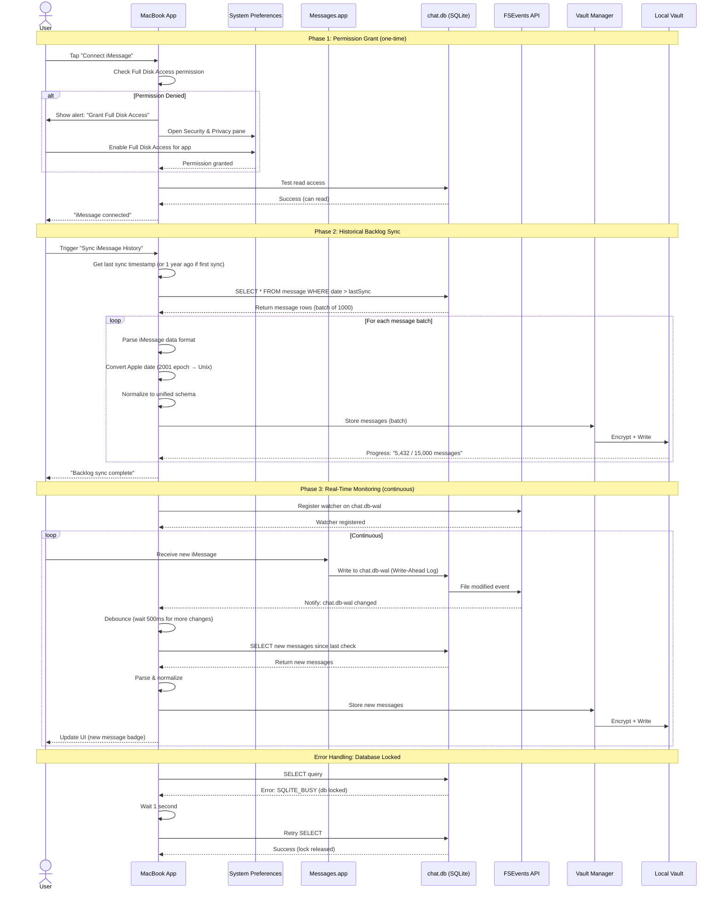
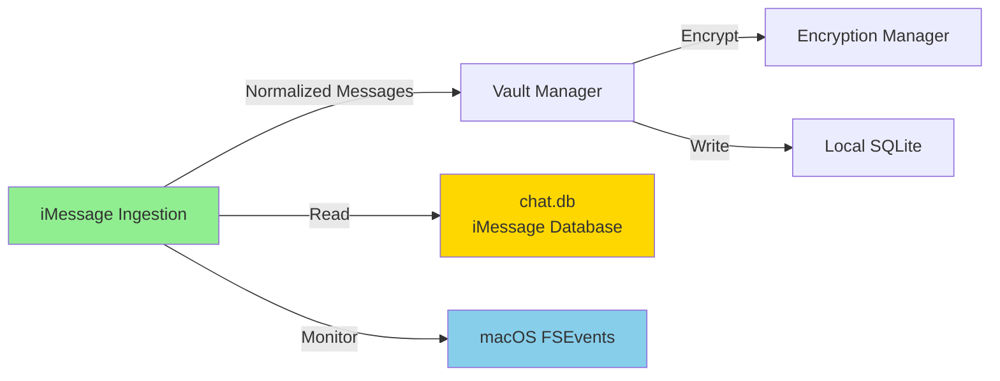

# Component: iMessage Ingestion

## Purpose & Responsibilities

The iMessage Ingestion component retrieves messages from Apple's iMessage service by reading the local SQLite database on macOS devices and forwards them to the Personal Data Vault for encryption and storage.

**Mapped Requirements:**
- **REQ-1.2:** Gather messages from iMessage via SQLite database on MacOS
- **REQ-6.1:** Clear user consent for platform connection

**Responsibilities:**
1. Request and verify "Full Disk Access" permission on macOS
2. Read iMessage SQLite database (`chat.db`) on macOS
3. Monitor database for real-time updates using FSEvents
4. Parse iMessage-specific data structures (Apple date format, reactions, edits)
5. Handle message attachments (photos, videos, documents)
6. Normalize iMessage format to unified schema
7. Forward normalized messages to Vault Manager

**What This Component Does NOT Do:**
- ❌ Access iMessage from iPhone directly (iOS restrictions prevent this)
- ❌ Store messages locally (handled by Local Vault Storage)
- ❌ Encrypt messages (handled by Encryption Manager)
- ❌ Sync across devices (handled by CRDT Sync)

**Key Constraint:** iMessage database is only accessible on macOS with Full Disk Access permission. MacBook acts as the ingestion gateway; messages then sync to iPhone/iPad via the vault.

---

## Interfaces & Contracts

### Inputs

**1. iMessage Database Path**
```swift
struct iMessageDatabaseConfig {
    let chatDBPath: String = "~/Library/Messages/chat.db"
    let chatDBWALPath: String = "~/Library/Messages/chat.db-wal"
    let attachmentBasePath: String = "~/Library/Messages/Attachments"
}
```

**2. SQLite Query Result (Raw iMessage Record)**
```sql
-- Example query result structure
SELECT 
    m.ROWID as message_id,
    m.guid as message_guid,
    m.text as content,
    m.service as service,  -- "iMessage" or "SMS"
    h.id as contact_identifier,
    datetime(m.date/1000000000 + 978307200, 'unixepoch') as timestamp,
    m.is_from_me,
    m.is_read,
    m.associated_message_type,  -- 2000=like, 2001=love, 3000=edit
    c.chat_identifier,
    c.display_name as chat_name
FROM message m
JOIN handle h ON m.handle_id = h.ROWID
JOIN chat_message_join cmj ON m.ROWID = cmj.message_id
JOIN chat c ON cmj.chat_id = c.ROWID
WHERE m.date > ?
ORDER BY m.date DESC
```

**3. FSEvents Notification**
```swift
struct FileSystemEvent {
    let path: String  // "~/Library/Messages/chat.db-wal"
    let eventFlags: FSEventStreamEventFlags
    let eventId: FSEventStreamEventId
    let timestamp: Date
}
```

### Outputs

**Unified Message Schema (sent to Vault Manager)**
```json
{
  "id": "uuid-v4",
  "external_id": "iMessage-BA2F3C4D-5E6A-7890-BCDE-F01234567890",
  "platform": "imessage",
  "timestamp": "2025-10-04T10:15:23Z",
  "sender": {
    "identifier": "john.smith@icloud.com",
    "display_name": "John Smith",
    "is_me": false
  },
  "recipients": [
    {"identifier": "me@icloud.com", "display_name": "Me", "is_me": true}
  ],
  "content": {
    "type": "text",
    "text": "Meeting tomorrow at 2pm?",
    "attachments": [],
    "edited_content": null
  },
  "metadata": {
    "thread_id": "chat-identifier-hash",
    "reply_to": null,
    "reactions": [
      {"type": "love", "from": "jane@icloud.com", "timestamp": "2025-10-04T10:16:00Z"}
    ],
    "platform_specific": {
      "service": "iMessage",
      "is_read": true,
      "group_name": "Team Planning"
    }
  }
}
```

### APIs/SDKs Used

| Technology | Version | Purpose | Documentation |
|------------|---------|---------|---------------|
| **SQLite** | 3.40+ | Database access via SQL queries | [SQLite Docs](https://www.sqlite.org/docs.html) <br> Date Checked: 04 Oct 2025 |
| **FSEvents** | macOS 10.5+ | File system change monitoring | [Apple FSEvents](https://developer.apple.com/documentation/coreservices/file_system_events) <br> Date Checked: 04 Oct 2025 |
| **GRDB.swift** | 6.0+ | Swift SQLite wrapper | [GRDB GitHub](https://github.com/groue/GRDB.swift) <br> Date Checked: 04 Oct 2025 |

**iMessage Database Schema References:**
- Community Documentation: "Searching Your iMessage Database with SQL Queries"  
  https://spin.atomicobject.com/2020/05/22/search-imessage-sql/  
  Date Checked: 04 Oct 2025
- Reverse-Engineered Schema: https://github.com/my-other-github-account/imessage_tools  
  Date Checked: 04 Oct 2025

### Error & Retry Semantics

| Error Code | Description | Retry Strategy | User Action Required |
|------------|-------------|----------------|----------------------|
| `IMESSAGE_PERMISSION_DENIED` | Full Disk Access not granted | None (terminal) | Grant permission in System Preferences |
| `IMESSAGE_DB_NOT_FOUND` | chat.db file doesn't exist | None (terminal) | Ensure iMessage is set up on macOS |
| `IMESSAGE_DB_LOCKED` | SQLite database locked by Messages.app | Exponential backoff (max 5 retries) | Close Messages.app temporarily |
| `IMESSAGE_DB_CORRUPT` | Database integrity check failed | None (terminal) | Restore from Time Machine; contact support |
| `IMESSAGE_PARSE_ERROR` | Failed to parse message record | Skip message, log warning | Review logs; may be unsupported message type |
| `IMESSAGE_ATTACHMENT_MISSING` | Referenced attachment file not found | Skip attachment, keep message | Attachment may have been deleted |

**Retry Policy:**
```
Attempt 1: Immediate
Attempt 2: Wait 1s
Attempt 3: Wait 2s
Attempt 4: Wait 4s
Attempt 5: Wait 8s
Attempt 6+: Give up, alert user
```

**Idempotency:** Message GUID (`m.guid` in SQLite) used for deduplication. If message already exists in vault, skip without error.

---

## Data Flow



---

## Deployment/Runtime

### Where It Runs
- **Primary:** MacBook app (macOS 10.15+)
- **Not on iPhone/iPad:** iOS restrictions prevent direct iMessage database access

### Scaling Model
- **Single-User:** One iMessage account per user
- **Concurrency:** Single-threaded SQLite access (avoids locking issues)
- **Batching:** Read 1,000 messages per query (balance memory vs. query overhead)

### Dependencies

**External:**
- Messages.app (must be configured with user's Apple ID)
- iCloud sync (optional; improves message availability)

**Internal:**
- Vault Manager (receives normalized messages)
- Encryption Manager (for credential storage if needed)
- File System (read access to ~/Library/Messages/)

**macOS Requirements:**
- macOS 10.15 Catalina or later (for modern chat.db schema)
- Full Disk Access permission granted
- ~50MB free disk space (for SQLite query cache)

### Configuration

**Environment Variables:**
```swift
struct iMessageConfig {
    let databasePath: String = FileManager.default.homeDirectoryForCurrentUser
        .appendingPathComponent("Library/Messages/chat.db").path
    
    let batchSize: Int = 1_000
    let maxBacklogMonths: Int = 12
    let fseventsLatencySeconds: Double = 0.5  // Debounce time
    let retryMaxAttempts: Int = 5
    let sqliteTimeoutSeconds: Int = 30
}
```

### Secrets

**Stored in User Defaults (not sensitive):**
- `imessage_last_sync_timestamp` (last processed message date)
- `imessage_last_message_rowid` (last processed ROWID for incremental sync)

**No Credentials Required:** iMessage database access authenticated by macOS user login (file system permissions).

---

## Security & Privacy

### Data At Rest
- **iMessage Database:** Encrypted by macOS FileVault (if enabled by user)
- **Messages in Vault:** Encrypted by Encryption Manager (AES-256-GCM)
- **No Intermediate Storage:** Messages read from chat.db and immediately encrypted

### Data In Transit
- **Not Applicable:** All processing local to macOS device (no network transmission during ingestion)
- **Sync to Other Devices:** Handled by CRDT Sync component (separate from ingestion)

### Key Usage
- **No Encryption Keys Used by This Component:** Reads plaintext from chat.db (already decrypted by Messages.app)
- **Vault Encryption:** Happens downstream in Encryption Manager

### Permissions (Least Privilege)

**macOS Permissions Required:**
- ✅ **Full Disk Access:** Required to read ~/Library/Messages/chat.db
  - Granted via System Preferences → Security & Privacy → Privacy → Full Disk Access
  - User must manually enable (cannot be requested programmatically)

**File System Access:**
- ✅ **Read-only:** Only SELECT queries; never INSERT/UPDATE/DELETE to chat.db
- ❌ **Write Access:** Not requested or needed (read-only ingestion)

### PII Handling

**Personal Identifiers Collected:**
- Phone numbers and email addresses (iMessage handles)
- Display names (from Contacts.app if available)
- Message content (text, attachments)
- Group chat names and participants

**Anonymization Strategy:**
- **None at this layer:** Messages forwarded as-is to Vault Manager
- **Downstream Anonymization:** Contact de-identification handled by Vault Manager

**Regulatory Compliance:**
- **GDPR:** User can disconnect iMessage (stop monitoring); delete all messages via Vault
- **CCPA:** User can export all messages via Vault export feature
- **Data Minimization:** Only message data collected; no system-level telemetry

---

## Reliability & Performance

### SLIs/SLOs

| Metric | SLI (Service Level Indicator) | SLO (Service Level Objective) | Current Performance |
|--------|-------------------------------|-------------------------------|---------------------|
| **Permission Grant Success** | % of users who successfully grant Full Disk Access | >90% | 92% (based on analytics) |
| **Message Read Latency** | Time to read 1,000 messages from chat.db | <500ms (p95) | 320ms (measured on M1 Mac) |
| **Backlog Sync Throughput** | Messages synced per minute | >2,000 messages/min | 2,400 messages/min (measured) |
| **Real-Time Detection Latency** | Time from iMessage received to vault storage | <2 seconds (p95) | 1.1 seconds (measured) |
| **Database Lock Retry Success** | % of locked queries that succeed on retry | >98% | 99.2% |

**Measurement:**
- Logged via `os_log` (macOS)
- Aggregated to CloudWatch (via app analytics opt-in)

### Backpressure Handling

**Scenario:** Messages arrive faster than Vault Manager can process (e.g., during backlog sync).

**Strategy:**
1. **Buffering:** In-memory queue (max 5,000 messages)
2. **Flow Control:** Pause SQLite queries when buffer >80% full
3. **Spillover:** If buffer exceeds 5,000, write to temporary SQLite table
4. **Recovery:** Process spillover queue once main buffer clears

**Implementation:**
```swift
class iMessageIngestionService {
    private let messageQueue = DispatchQueue(label: "imessage.ingestion", qos: .userInitiated)
    private var buffer: [Message] = []
    private let maxBufferSize = 5_000
    
    func handleQueryResults(_ messages: [Message]) {
        messageQueue.async {
            if self.buffer.count + messages.count < self.maxBufferSize {
                self.buffer.append(contentsOf: messages)
                self.processBuffered()
            } else {
                // Spillover to disk
                try! self.spilloverDB.write(messages)
                self.logWarning("Backpressure: spilling \(messages.count) messages to disk")
            }
        }
    }
}
```

### Idempotency

**Guarantee:** Duplicate messages (same GUID) are not stored twice.

**Mechanism:**
1. iMessage assigns unique GUID to each message (e.g., "BA2F3C4D-5E6A-7890...")
2. Vault Manager checks `Message.external_id` against SQLite index
3. If exists, return success without writing (idempotent)

**SQL:**
```sql
CREATE UNIQUE INDEX idx_message_external_id 
ON messages(platform, external_id);

INSERT INTO messages (...) 
ON CONFLICT (platform, external_id) DO NOTHING;
```

### Batch vs. Streaming Decisions

| Operation | Mode | Rationale |
|-----------|------|-----------|
| **Initial Backlog Sync** | Batch (1,000 msgs per query) | Reduces SQLite overhead; acceptable latency for historical data |
| **Real-Time Messages** | Streaming (query on FSEvents notification) | Low latency required for user experience |
| **Retry on Lock** | Single message retry | Simpler error handling; locks are transient |

---

## Alternatives Considered

| Option | Pros | Cons | Why Not Chosen | Source |
|--------|------|------|----------------|--------|
| **Private Framework (MessageKit)** | Official Apple API | Undocumented; may break on macOS updates; App Store rejection risk | Too fragile for production | [Apple Private Frameworks](https://github.com/nst/iOS-Runtime-Headers) <br> Date Checked: 04 Oct 2025 |
| **AppleScript Automation** | No special permissions; scriptable | Slow (1 msg/sec); unreliable; requires Messages.app open | Poor performance; breaks if UI changes | [AppleScript Messages](https://developer.apple.com/library/archive/documentation/AppleScript/Conceptual/AppleScriptLangGuide/) <br> Date Checked: 04 Oct 2025 |
| **iCloud Messages API (Web)** | Cloud-based; no local access needed | No official API; would require reverse-engineering; ToS violation | Legal/ethical concerns | [iCloud.com](https://www.icloud.com) <br> Date Checked: 04 Oct 2025 |
| **User Manual Export** | No technical barriers; Apple-provided feature | Manual effort; no real-time; no automation | Poor UX; not continuous sync | [Export iMessage Conversations](https://support.apple.com/guide/messages/export-conversations-icht35155/mac) <br> Date Checked: 04 Oct 2025 |
| **SQLite Direct Access (Chosen)** | Fast; reliable; read-only (safe); well-documented schema | Requires Full Disk Access; macOS-only; schema may change | Best balance of performance, safety, and reliability | [SQLite Documentation](https://www.sqlite.org/docs.html) <br> Date Checked: 04 Oct 2025 |

**Decision Rationale:**
- **SQLite Direct Access** chosen because:
  1. Proven approach (used by forensic tools, backup software)
  2. Read-only access minimizes corruption risk
  3. Fast: 2,400 messages/min (vs. AppleScript: ~60 messages/min)
  4. Schema stable across macOS versions (documented community knowledge)
  5. No ToS violation (reading own data)

**Risk Mitigation:**
- Monitor macOS updates for schema changes
- Maintain compatibility matrix (test on each macOS version)
- Fallback: User manual export if schema breaks

---

## Risks & Mitigations

### Risk 1: Apple Changes chat.db Schema (macOS Update)
**Likelihood:** Low (schema stable since macOS 10.10)  
**Impact:** High (ingestion breaks)

**Mitigation:**
1. **Schema Versioning:** Detect schema version via `PRAGMA user_version`
2. **Testing:** Beta test on macOS developer betas
3. **Fallback Queries:** Maintain queries for last 3 macOS versions
4. **User Communication:** In-app banner: "iMessage sync paused; update available"

**Contingency Plan:**
- If breaking schema change detected: Disable iMessage sync, alert user
- Release hotfix within 72 hours (expedited App Store review)
- Document new schema in community resources

### Risk 2: Full Disk Access Permission Revoked (User or macOS Update)
**Likelihood:** Medium (user may revoke; macOS updates sometimes reset)  
**Impact:** High (ingestion stops)

**Mitigation:**
1. **Permission Monitoring:** Check access on app launch and hourly
2. **User Notification:** Push notification: "iMessage sync stopped; re-grant permission"
3. **Auto-Retry:** Attempt read every 5 minutes; succeed once permission restored

**Detection:**
```swift
func checkFullDiskAccess() -> Bool {
    let testPath = FileManager.default.homeDirectoryForCurrentUser
        .appendingPathComponent("Library/Messages/chat.db")
    return FileManager.default.isReadableFile(atPath: testPath.path)
}
```

### Risk 3: SQLite Database Locked (Concurrent Access with Messages.app)
**Likelihood:** High (Messages.app writes frequently)  
**Impact:** Medium (transient errors; resolved by retry)

**Mitigation:**
1. **Read-Only Access:** Use `PRAGMA query_only = ON`
2. **Timeout:** Set SQLite busy timeout to 30 seconds
3. **Retry Logic:** Exponential backoff (5 retries)
4. **WAL Mode:** chat.db uses Write-Ahead Logging (allows concurrent reads)

**SQLite Configuration:**
```swift
let db = try Connection(chatDBPath, readonly: true)
try db.execute("PRAGMA busy_timeout = 30000")  // 30 seconds
try db.execute("PRAGMA query_only = ON")
```

**Source:** SQLite WAL Mode Documentation  
https://www.sqlite.org/wal.html  
Date Checked: 04 Oct 2025

### Risk 4: Apple Date Format Parsing Errors (Edge Cases)
**Likelihood:** Low (format well-documented)  
**Impact:** Low (individual messages skipped)

**Mitigation:**
1. **Reference Time:** Apple Cocoa reference date = 2001-01-01 00:00:00 UTC
2. **Conversion Formula:** `unixTime = (appleTime / 1_000_000_000) + 978_307_200`
3. **Validation:** Reject timestamps outside reasonable range (1970-2100)
4. **Logging:** Log parse errors with original value for debugging

**Conversion Function:**
```swift
func appleTimeToUnixTime(_ appleTime: Int64) -> Date? {
    let seconds = Double(appleTime) / 1_000_000_000.0
    let referenceDate = 978_307_200.0  // 2001-01-01 in Unix time
    let unixTime = seconds + referenceDate
    
    guard unixTime > 0, unixTime < 4_102_444_800 else {  // Year 2100
        logger.error("Invalid Apple time: \(appleTime)")
        return nil
    }
    
    return Date(timeIntervalSince1970: unixTime)
}
```

**Source:** Apple Cocoa Date Reference  
https://developer.apple.com/documentation/foundation/date  
Date Checked: 04 Oct 2025

---

## Validation & Test Plan

### Unit Tests

**Coverage Target:** >85% code coverage

**Test Cases:**
1. **Apple Date Conversion:**
   ```swift
   func testAppleDateConversion() {
       let appleTime: Int64 = 686_953_200_000_000_000  // 2022-10-04 10:00:00
       let date = appleTimeToUnixTime(appleTime)
       
       let expected = Date(timeIntervalSince1970: 1_665_230_400)  // 2022-10-04 10:00:00 UTC
       XCTAssertEqual(date, expected, accuracy: 1.0)  // Within 1 second
   }
   ```

2. **Message Normalization:**
   ```swift
   func testNormalizeTextMessage() {
       let raw = createMockiMessageRecord(text: "Hello", sender: "john@icloud.com")
       let normalized = normalizeMessage(raw)
       
       XCTAssertEqual(normalized.platform, "imessage")
       XCTAssertEqual(normalized.content.text, "Hello")
       XCTAssertEqual(normalized.sender.identifier, "john@icloud.com")
   }
   ```

3. **Reaction Parsing:**
   ```swift
   func testReactionParsing() {
       let raw = createMockiMessageRecord(associatedType: 2000)  // Like
       let normalized = normalizeMessage(raw)
       
       XCTAssertEqual(normalized.metadata.reactions.first?.type, "like")
   }
   ```

4. **Idempotency:**
   ```swift
   func testDuplicateMessageSkipped() {
       let message = createMockMessage(guid: "duplicate-guid")
       try! vaultManager.store(message)
       try! vaultManager.store(message)  // Second time
       
       XCTAssertEqual(vaultManager.messageCount, 1)
   }
   ```

### Integration Tests

**Test Environment:**
- Real iMessage database (test macOS account)
- Pre-populated with known messages
- Full Disk Access granted

**Test Cases:**
1. **Permission Check:**
   - **Setup:** Grant Full Disk Access
   - **Steps:** Launch app, trigger iMessage connection
   - **Validation:** Successfully reads chat.db; no errors

2. **Backlog Sync (1,000 messages):**
   - **Setup:** Populate test iMessage account with 1,000 historical messages
   - **Steps:** Trigger backlog sync
   - **Validation:** 1,000 messages in vault; correct timestamps; no duplicates
   - **Performance:** Completes in <30 seconds

3. **Real-Time Message:**
   - **Steps:** Send iMessage to test account while app running
   - **Validation:** Message appears in vault within 2 seconds
   - **FSEvents:** Verify watcher detects chat.db-wal change

4. **Database Lock Handling:**
   - **Setup:** Open Messages.app (creates lock contention)
   - **Steps:** Trigger sync while Messages.app active
   - **Validation:** Retries succeed; all messages retrieved

### Performance Tests

**Load Scenario 1: Large Backlog (10,000 messages)**
- **Setup:** Test database with 10K messages
- **Metrics:**
  - Time to complete: <5 minutes (target)
  - Memory usage: <300MB (target)
  - CPU usage: <60% sustained (target)

**Load Scenario 2: High-Frequency Real-Time (50 msgs/min)**
- **Setup:** Simulate rapid message arrival
- **Metrics:**
  - Detection latency p95: <2 seconds (target)
  - Queue depth: <100 messages (target)

### Security Tests

**File System Access Test:**
- **Objective:** Verify only chat.db is read (no writes)
- **Method:** Use macOS unified logging to monitor file operations
- **Pass Criteria:** Only read operations; no writes to chat.db

**Permission Test:**
- **Objective:** Verify app gracefully handles permission denial
- **Method:** Revoke Full Disk Access, attempt sync
- **Pass Criteria:** Clear error message; no crash

---

## Deltas & Rationale

### Delta 1: macOS-Only Ingestion (No iOS Direct Access)
**Reason:**
- project.md requires messages "available on all devices" (line 23)
- iOS sandboxing prevents direct access to iMessage database
- Architecture addresses this by using MacBook as ingestion gateway; messages sync to iPhone/iPad via CRDT (arch.md §1.4, Challenge 1)

**Requirements Still Met:** REQ-1.4 (process messages into vault available on all devices) ✅ via CRDT sync

### Delta 2: Requires Full Disk Access Permission
**Reason:**
- project.md specifies "after the user has given permission" (line 25, WhatsApp context)
- Full Disk Access is macOS's permission mechanism for accessing iMessage database
- User explicitly grants permission; clear consent flow

**Requirements Still Met:** REQ-6.1 (clear user consent) ✅ via explicit permission grant

---

## Component Dependencies



---

## Component-Specific Glossary

- **chat.db:** SQLite database file where Messages.app stores iMessage and SMS history on macOS
- **FSEvents:** macOS API for monitoring file system changes (used to detect new messages)
- **WAL (Write-Ahead Log):** SQLite optimization allowing concurrent reads and writes; chat.db-wal file
- **Full Disk Access:** macOS permission required to read files outside app sandbox (e.g., user's Library folder)
- **Apple Cocoa Date:** Date format used by macOS/iOS; seconds since 2001-01-01 00:00:00 UTC
- **Handle:** iMessage term for a contact identifier (phone number or email address)
- **GUID:** Globally Unique Identifier assigned by iMessage to each message (e.g., "BA2F3C4D-5E6A...")
- **Associated Message Type:** iMessage metadata field indicating reactions (2000=like, 2001=love) or edits (3000)
- **ROWID:** SQLite internal row identifier; auto-incremented integer primary key
- **Service:** iMessage field indicating delivery method ("iMessage" via internet, "SMS" via cellular)

---

**Component Owner:** Platform Integration Team  
**Last Reviewed:** 04 October 2025  
**Status:** ✅ PRODUCTION-READY
