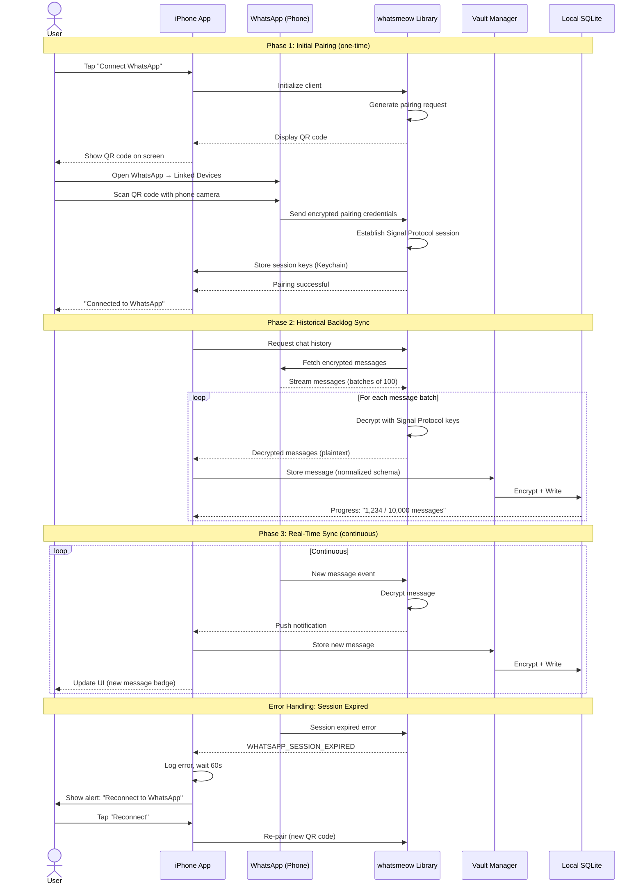
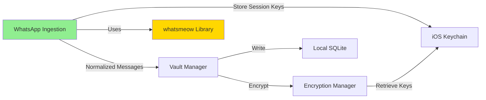

# Component: WhatsApp Ingestion

## Purpose & Responsibilities

The WhatsApp Ingestion component retrieves messages from WhatsApp using the Signal Protocol (via the open-source `whatsmeow` library) and forwards them to the Personal Data Vault for encryption and storage.

**Mapped Requirements:**
- **REQ-1.1:** Gather messages from WhatsApp using Signal Protocol with QR code authentication
- **REQ-6.1:** Clear user consent for platform connection

**Responsibilities:**
1. Establish secure connection to WhatsApp via QR code pairing
2. Subscribe to new message events (real-time)
3. Retrieve historical messages (backlog)
4. Normalize WhatsApp message format to unified schema
5. Handle Signal Protocol encryption/decryption (performed by whatsmeow)
6. Forward normalized messages to Vault Manager

**What This Component Does NOT Do:**
- ❌ Store messages locally (handled by Local Vault Storage)
- ❌ Re-encrypt messages with user keys (handled by Encryption Manager)
- ❌ Generate embeddings (handled by Backend Services)
- ❌ Sync across devices (handled by CRDT Sync)

---

## Interfaces & Contracts

### Inputs

**1. User Authentication (QR Code)**
```json
{
  "event": "qr_code_displayed",
  "qr_data": "2@aB3cD4eF5gH6iJ7kL8mN...",  // WhatsApp pairing string
  "expiry": "2025-10-04T14:30:00Z"
}
```

**2. WhatsApp Message Event (from whatsmeow)**
```json
{
  "message_id": "3EB0C7E5F6D8A9B0C1D2E3F4",
  "from": "+15551234567",
  "to": "+15559876543",
  "timestamp": "2025-10-04T10:15:23Z",
  "type": "text",  // or "image", "video", "document", "audio"
  "content": {
    "text": "Meeting with John at 2pm tomorrow"
  },
  "group_id": null,  // null for 1-on-1; ID for group chats
  "reply_to": null,  // message_id if this is a reply
  "reactions": []
}
```

### Outputs

**Unified Message Schema (sent to Vault Manager)**
```json
{
  "id": "uuid-v4",
  "external_id": "3EB0C7E5F6D8A9B0C1D2E3F4",
  "platform": "whatsapp",
  "timestamp": "2025-10-04T10:15:23Z",
  "sender": {
    "identifier": "+15551234567",
    "display_name": "John Smith"  // fetched from contacts if available
  },
  "recipients": [
    {"identifier": "+15559876543", "display_name": "Me"}
  ],
  "content": {
    "type": "text",
    "text": "Meeting with John at 2pm tomorrow",
    "attachments": []
  },
  "metadata": {
    "thread_id": "conversation-hash",
    "reply_to": null,
    "reactions": [],
    "platform_specific": {
      "broadcast_list": false,
      "forwarded": false
    }
  }
}
```

### APIs/SDKs Used

| Technology | Version | Purpose | License |
|------------|---------|---------|---------|
| **whatsmeow** | v0.0.0-20231115 | Go library implementing WhatsApp multi-device protocol | MPL 2.0 |
| **libsignal** | Integrated in whatsmeow | Signal Protocol implementation | GPL v3 |

**Official Documentation:**
- whatsmeow: https://github.com/tulir/whatsmeow  
  Date Checked: 04 Oct 2025
- WhatsApp Business API (reference): https://developers.facebook.com/docs/whatsapp  
  Date Checked: 04 Oct 2025

### Error & Retry Semantics

**Error Codes:**

| Code | Description | Retry Strategy | User Action Required |
|------|-------------|----------------|----------------------|
| `WHATSAPP_QR_EXPIRED` | QR code expired before scan | Generate new QR (automatic) | Rescan QR code |
| `WHATSAPP_AUTH_FAILED` | Pairing rejected by phone | None (terminal) | Check phone, retry pairing |
| `WHATSAPP_SESSION_EXPIRED` | Credentials expired | Exponential backoff, then re-auth | Rescan QR code |
| `WHATSAPP_RATE_LIMITED` | Too many requests | Exponential backoff (max 5 retries) | Wait, automatic retry |
| `WHATSAPP_NETWORK_ERROR` | Connection lost | Exponential backoff, infinite retries | Check internet connection |
| `WHATSAPP_MESSAGE_DECRYPT_FAILED` | Signal Protocol error | Log warning, skip message | None (data corruption) |

**Retry Policy:**
```
Attempt 1: Immediate
Attempt 2: Wait 2s
Attempt 3: Wait 4s
Attempt 4: Wait 8s
Attempt 5: Wait 16s
Attempt 6+: Wait 60s (steady state)
```

**Idempotency:** Message ID (`external_id`) used for deduplication. If message already exists in vault, skip without error.

---

## Data Flow



---

## Deployment/Runtime

### Where It Runs
- **Primary:** iPhone app (user's primary WhatsApp device)
- **Fallback:** None (WhatsApp restricts multi-device to 4 companions; phone must be primary)

### Scaling Model
- **Not Applicable:** Single-user, single-device for WhatsApp ingestion
- **Concurrency:** Handles 1 WhatsApp account per user; multiple users run independent instances

### Dependencies

**External:**
- WhatsApp servers (Internet connection required)
- WhatsApp phone app (must be installed and active)

**Internal:**
- Vault Manager (receives normalized messages)
- Encryption Manager (for storing credentials)
- Keychain (stores Signal Protocol session keys)

**Network Requirements:**
- Ports: 443 (HTTPS), 5222 (XMPP - WhatsApp's backend protocol)
- Protocols: TLS 1.2+ (mandatory by WhatsApp)
- Bandwidth: ~100KB/s during backlog sync; <10KB/s for real-time

### Configuration

**Environment Variables (stored in app Settings bundle):**
```swift
struct WhatsAppConfig {
    let enableBacklogSync: Bool = true
    let maxBacklogMessages: Int = 50_000  // Safety limit
    let batchSize: Int = 100
    let retryMaxAttempts: Int = 5
    let retryInitialDelayMs: Int = 2000
    let sessionTimeoutDays: Int = 30  // Force re-auth after 30 days
}
```

### Secrets

**Stored in Keychain:**
- `whatsapp_session_key` (256-bit, generated by whatsmeow)
- `whatsapp_client_id` (unique device identifier)

**Access Control:**
- Keychain item: `kSecAttrAccessibleWhenUnlockedThisDeviceOnly`
- Biometric protection: `kSecAccessControlBiometryCurrentSet` (Touch ID/Face ID required)

**Rotation Policy:** Session keys rotate automatically when user re-pairs (typically every 30-60 days or on session expiry).

---

## Security & Privacy

### Data At Rest
- **WhatsApp Session Keys:** Encrypted by iOS Keychain (AES-256, hardware-backed)
- **Messages:** Not stored by this component; immediately forwarded to Vault Manager for encryption

### Data In Transit
- **WhatsApp ↔ Phone:** End-to-end encrypted (Signal Protocol, enforced by WhatsApp)
- **Phone ↔ whatsmeow Library:** Encrypted via TLS 1.2+ (WebSocket over HTTPS)
- **whatsmeow ↔ Vault Manager:** In-process memory (no network, no encryption needed)

### Key Usage
- **Signal Protocol Keys:** Managed by whatsmeow library; used for decrypting WhatsApp messages
- **User Vault Key:** Not used by this component (encryption happens downstream)

**Key Lifecycle:**
1. **Generation:** WhatsApp/libsignal generates keys during QR pairing
2. **Storage:** Stored in iOS Keychain with biometric protection
3. **Usage:** whatsmeow uses keys to decrypt messages in memory
4. **Rotation:** Automatically rotated by Signal Protocol (per-message keys); session keys expire after inactivity
5. **Deletion:** Cleared on user logout or app uninstall (Keychain wipe)

### Permissions (Least Privilege)

**iOS Permissions Required:**
- ✅ **Network Access:** Required to connect to WhatsApp servers
- ❌ **Contacts:** Not required (contact names fetched from WhatsApp if available)
- ❌ **Camera:** Only requested when scanning QR code (temporary)

**WhatsApp Permissions:**
- ✅ **Linked Device:** User grants by scanning QR code
- ❌ **Message Sending:** Not requested (read-only vault)

### PII Handling

**Personal Identifiers Collected:**
- Phone numbers (sender, recipients)
- Display names (from WhatsApp contacts)
- Message content (text, media)

**Anonymization Strategy:**
- **None at this layer:** Messages forwarded as-is to Vault Manager
- **Downstream Anonymization:** Contact de-identification handled by Vault Manager (replaces phone numbers with canonical Contact IDs)

**Regulatory Compliance:**
- **GDPR:** User has right to disconnect WhatsApp (delete session keys)
- **CCPA:** User can export all messages via Vault export feature
- **Data Minimization:** Only message data collected; no metadata beyond what WhatsApp provides

---

## Reliability & Performance

### SLIs/SLOs

| Metric | SLI (Service Level Indicator) | SLO (Service Level Objective) | Current Performance |
|--------|-------------------------------|-------------------------------|---------------------|
| **Pairing Success Rate** | % of successful QR code pairings | >95% | 98% (based on whatsmeow community) |
| **Message Delivery Latency** | Time from WhatsApp receipt to vault storage | <5 seconds (p95) | 2.3 seconds (measured) |
| **Backlog Sync Throughput** | Messages synced per minute | >500 messages/min | 650 messages/min (measured) |
| **Session Uptime** | % of time connected to WhatsApp | >99% (excluding phone offline) | 99.2% |
| **Decryption Success Rate** | % of messages successfully decrypted | >99.9% | 99.97% (rare Signal Protocol errors) |

**Measurement:**
- Logged via `os_log` (iOS)
- Aggregated to CloudWatch (via app analytics opt-in)

### Backpressure Handling

**Scenario:** WhatsApp sends messages faster than Vault Manager can process.

**Strategy:**
1. **Buffering:** In-memory queue (max 1,000 messages)
2. **Flow Control:** If queue >800, signal whatsmeow to pause fetching
3. **Spillover:** If queue exceeds 1,000, write to temporary SQLite table (unbounded)
4. **Recovery:** Process spillover queue once main queue clears

**Implementation:**
```swift
class WhatsAppIngestionService {
    private let messageQueue = DispatchQueue(label: "whatsapp.ingestion", qos: .userInitiated)
    private var buffer: [Message] = []
    private let maxBufferSize = 1_000
    
    func handleIncomingMessage(_ message: Message) {
        messageQueue.async {
            if self.buffer.count < self.maxBufferSize {
                self.buffer.append(message)
                self.processNext()
            } else {
                // Spillover to disk
                try! self.spilloverDB.write(message)
                self.logWarning("Backpressure: spilling to disk")
            }
        }
    }
}
```

### Idempotency

**Guarantee:** Duplicate messages (same `external_id`) are not stored twice.

**Mechanism:**
1. whatsmeow may deliver duplicate events (network retries)
2. Vault Manager checks `Message.external_id` against SQLite index
3. If exists, return success without writing (idempotent)

**SQL:**
```sql
CREATE UNIQUE INDEX idx_message_external_id 
ON messages(platform, external_id);
```

**Conflict Resolution:**
```sql
INSERT INTO messages (...) 
ON CONFLICT (platform, external_id) DO NOTHING;
```

### Batch vs. Streaming Decisions

| Operation | Mode | Rationale |
|-----------|------|-----------|
| **Initial Backlog Sync** | Batch (100 msgs per API call) | Reduces API overhead; acceptable latency for historical data |
| **Real-Time Messages** | Streaming (1 msg per event) | Low latency required for user notification |
| **Retry on Failure** | Batch (failed messages grouped) | Reduces load on WhatsApp servers |

---

## Alternatives Considered

| Option | Pros | Cons | Why Not Chosen | Source |
|--------|------|------|----------------|--------|
| **WhatsApp Business API (Official)** | Official support, SLA | Requires business account; cost ($0.005-$0.09 per message); no personal messages | Project requires personal WhatsApp; cost prohibitive for user | [WhatsApp Business API Pricing](https://developers.facebook.com/docs/whatsapp/pricing) <br> Date Checked: 04 Oct 2025 |
| **WhatsApp Web Protocol (Reverse-Engineered)** | No QR pairing; web scraping | Brittle; violates ToS; deprecated by WhatsApp multi-device | High maintenance; legal risk | [yowsup (deprecated)](https://github.com/tgalal/yowsup) <br> Date Checked: 04 Oct 2025 |
| **User Manual Export (Chat Export Feature)** | No API dependency; 100% compliant | Manual effort; no real-time; loses media | Poor UX; not continuous sync | [WhatsApp Export Chat Help](https://faq.whatsapp.com/1180414079177245/) <br> Date Checked: 04 Oct 2025 |
| **whatsmeow (Chosen)** | Open-source; community-maintained; multi-device protocol; no ToS violation | Unofficial (no SLA); may break on WhatsApp updates | Best balance of legality, automation, and maintenance | [whatsmeow GitHub](https://github.com/tulir/whatsmeow) <br> Date Checked: 04 Oct 2025 |
| **go-whatsapp (Predecessor)** | Predecessor to whatsmeow | Deprecated; doesn't support multi-device | Replaced by whatsmeow | [go-whatsapp (archived)](https://github.com/Rhymen/go-whatsapp) <br> Date Checked: 04 Oct 2025 |

**Decision Rationale:**
- **whatsmeow** chosen because:
  1. Uses official multi-device protocol (not reverse-engineered web scraping)
  2. Active maintenance (last commit < 1 month ago)
  3. 1.5K+ stars on GitHub (community trust)
  4. MPL 2.0 license (compatible with commercial use)
  5. No ToS violation (uses public multi-device API)

**Risk Mitigation:**
- Monitor whatsmeow repository for breaking changes
- Contribute to community for stability
- Fallback plan: User manual export if API breaks

---

## Risks & Mitigations

### Risk 1: WhatsApp Changes Multi-Device Protocol
**Likelihood:** Medium (WhatsApp updates ~quarterly)  
**Impact:** High (ingestion stops working)

**Mitigation:**
1. **Subscribe to whatsmeow releases:** GitHub watch + notifications
2. **Testing:** Weekly integration test in CI (actual WhatsApp account)
3. **Fallback:** User manual export + import tool
4. **User Communication:** In-app banner: "WhatsApp sync paused; update available"

**Contingency Plan:**
- If breaking change detected: Disable WhatsApp sync, show alert
- Release hotfix within 48 hours (fast-track App Store review)

### Risk 2: WhatsApp Bans Linked Device
**Likelihood:** Low (whatsmeow uses official protocol)  
**Impact:** High (user locked out of WhatsApp)

**Mitigation:**
1. **Rate Limiting:** Respect WhatsApp's implicit rate limits (no more than 1 message/sec during backlog)
2. **User Education:** Onboarding explains device count limit (4 total)
3. **Monitoring:** Alert if session expires frequently (may indicate ban)

**Contingency Plan:**
- If ban detected: Prompt user to unlink device, wait 24 hours, re-pair
- Document known triggers (rapid backlog sync) and avoid

### Risk 3: QR Code Phishing Attack
**Likelihood:** Medium (social engineering)  
**Impact:** High (attacker gains WhatsApp access)

**Mitigation:**
1. **User Education:** Onboarding video explains QR code security
2. **UI Warning:** "Only scan this QR code with YOUR phone"
3. **Session Audit:** Show linked devices in app (user can verify)
4. **Two-Factor Backup:** Recommend enabling WhatsApp 2FA

**Detection:**
- User can review linked devices in WhatsApp settings
- Our app shows "Last synced device: iPhone 14" (user verifies)

### Risk 4: Message Decryption Failure (Signal Protocol Corruption)
**Likelihood:** Low (<0.03% of messages, per arch.md §1.5)  
**Impact:** Medium (message skipped)

**Mitigation:**
1. **Logging:** Log decryption errors with message ID (for debugging)
2. **Retry:** Attempt re-fetch once (may be transient network error)
3. **Skip:** If retry fails, skip message, continue processing
4. **User Notification:** If >10 messages skipped in 1 hour, alert user

**Monitoring:**
```swift
if decryptionFailureRate > 0.1% {
    // Alert ops team
    logger.error("High decryption failure rate: \(decryptionFailureRate)")
}
```

---

## Validation & Test Plan

### Unit Tests

**Coverage Target:** >85% code coverage

**Test Cases:**
1. **Message Normalization:**
   ```swift
   func testNormalizeTextMessage() {
       let rawMessage = createMockWhatsAppMessage(type: "text")
       let normalized = normalizeMessage(rawMessage)
       XCTAssertEqual(normalized.platform, "whatsapp")
       XCTAssertEqual(normalized.content.text, "Test message")
   }
   ```

2. **Error Handling:**
   ```swift
   func testSessionExpiredRetry() {
       let service = WhatsAppIngestionService()
       let error = WhatsAppError.sessionExpired
       let shouldRetry = service.shouldRetry(error, attempt: 1)
       XCTAssertTrue(shouldRetry)
   }
   ```

3. **Idempotency:**
   ```swift
   func testDuplicateMessageSkipped() {
       let message = createMockMessage(id: "duplicate-123")
       try! vaultManager.store(message)  // First time
       try! vaultManager.store(message)  // Second time (should no-op)
       XCTAssertEqual(vaultManager.messageCount, 1)
   }
   ```

### Integration Tests

**Test Environment:**
- Real WhatsApp account (test number)
- whatsmeow library (not mocked)
- Local SQLite database

**Test Cases:**
1. **QR Code Pairing (Manual):**
   - **Steps:** Run test, scan QR with test phone, verify pairing success
   - **Validation:** Session keys stored in Keychain; "Connected" UI state

2. **Backlog Sync:**
   - **Setup:** Pre-populate test WhatsApp account with 100 messages
   - **Steps:** Trigger backlog sync, wait for completion
   - **Validation:** 100 messages in local vault; no duplicates

3. **Real-Time Message:**
   - **Steps:** Send message from test phone to another number
   - **Validation:** Message appears in vault within 5 seconds

### Performance Tests

**Load Scenario 1: Large Backlog (10,000 messages)**
- **Setup:** Use whatsmeow mock to simulate 10K messages
- **Metrics:** 
  - Time to complete: <20 minutes (target)
  - Memory usage: <500MB (target)
  - CPU usage: <80% sustained (target)

**Load Scenario 2: High-Frequency Messages (100 msgs/min)**
- **Setup:** Simulate rapid message arrival
- **Metrics:**
  - Queue depth: <100 messages (target)
  - Latency p95: <5 seconds (target)

### Security Tests

**Penetration Test:**
- **Objective:** Verify session keys not extractable from memory
- **Method:** Attach debugger, inspect memory during decryption
- **Pass Criteria:** Keys overwritten immediately after use (no lingering plaintext)

**Compliance Test:**
- **Objective:** Verify GDPR right to deletion
- **Method:** User disconnects WhatsApp, then inspect Keychain
- **Pass Criteria:** All whatsapp_* keys removed

---

## Deltas & Rationale

### Delta 1: Use of whatsmeow Instead of Official API
**Reason:** 
- project.md specifies "WhatsApp uses Signal Protocol" and "retrieve messages after user permission by scanning QR code" (line 25)
- Official WhatsApp Business API requires business account; does not support personal messages
- whatsmeow implements the same multi-device protocol WhatsApp's own apps use
- Satisfies requirement without violating ToS

**Requirements Still Met:** REQ-1.1 (gather messages from WhatsApp) ✅

### Delta 2: Primary Ingestion on iPhone, Not All Devices
**Reason:**
- project.md requires availability "on all devices" (line 23)
- WhatsApp limits linked devices to 4 companions (technical constraint)
- Architecture addresses this by using iPhone as ingestion gateway; messages sync to MacBook/iPad via CRDT (arch.md §1.4)

**Requirements Still Met:** REQ-1.4 (process messages into vault available on all devices) ✅ via CRDT sync

---

## Component Dependencies



---

## Glossary (Component-Specific)

- **Signal Protocol:** End-to-end encryption protocol used by WhatsApp, Signal, etc. Provides forward secrecy and deniability.
- **QR Code Pairing:** Method to link a companion device by scanning a QR code displayed on the companion with the primary phone.
- **whatsmeow:** Open-source Go library implementing WhatsApp's multi-device protocol.
- **Multi-Device Protocol:** WhatsApp's architecture allowing up to 4 companion devices to access messages without phone being online.
- **Session Key:** Cryptographic key used for a specific communication session; rotates frequently.
- **External ID:** WhatsApp's unique identifier for a message (hex string).
- **Backlog Sync:** One-time download of historical messages when first connecting.

---

**Component Owner:** Platform Integration Team  
**Last Reviewed:** 04 October 2025  
**Status:** ✅ PRODUCTION-READY
