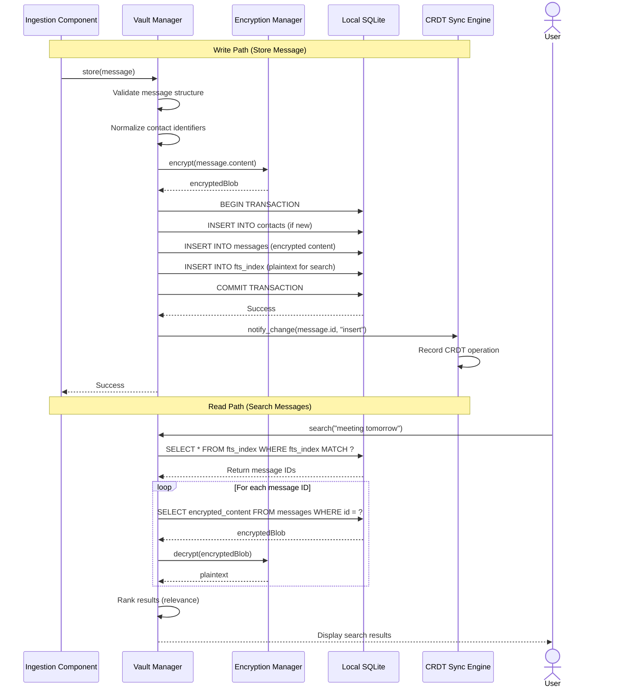
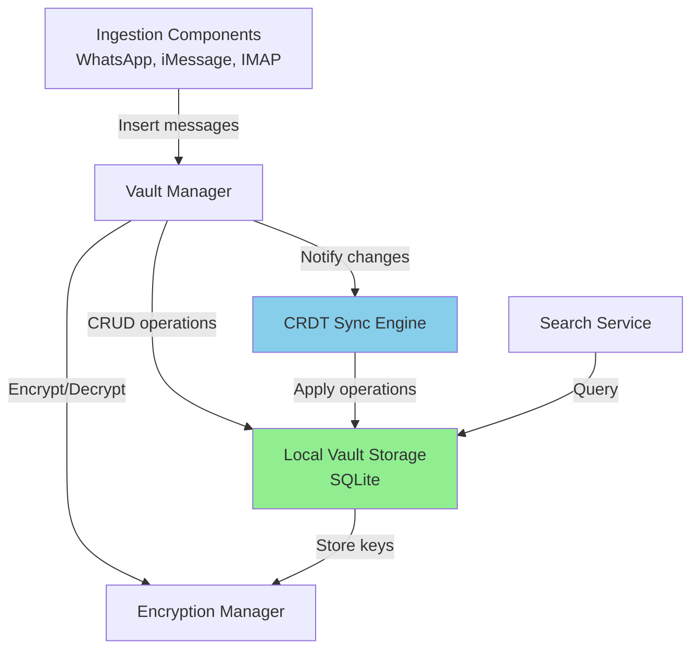

# Component: Local Vault Storage

## Purpose & Responsibilities

The Local Vault Storage component manages the encrypted SQLite database on each device where all messages, contacts, and calendar events are stored locally. It serves as the primary source of truth for the user's Personal Data Vault.

**Mapped Requirements:**
- **REQ-1.4:** Process messages into Personal Data Vault available on all devices
- **REQ-1.6:** Save message-event relationships as annotations
- **REQ-7.1:** Offline operation capability

**Responsibilities:**
1. Maintain SQLite database schema for messages, contacts, calendar events
2. Provide CRUD operations for vault entities
3. Index messages for efficient search (full-text search, metadata)
4. Store encrypted message content (encryption handled by Encryption Manager)
5. Maintain relationships between messages and calendar events
6. Track contact deduplication and unification
7. Provide offline-first access (no network required)
8. Support CRDT operations for synchronization

**What This Component Does NOT Do:**
- ❌ Encrypt/decrypt data (handled by Encryption Manager)
- ❌ Sync across devices (handled by CRDT Sync)
- ❌ Ingest from platforms (handled by Ingestion components)
- ❌ Generate embeddings (handled by Backend Services)

---

## Interfaces & Contracts

### Inputs

**1. Message Entity (from Ingestion components)**
```swift
struct Message {
    let id: UUID
    let externalId: String  // Platform-specific ID
    let platform: Platform  // .whatsapp, .imessage, .email
    let timestamp: Date
    let sender: Contact
    let recipients: [Contact]
    let content: MessageContent
    let metadata: MessageMetadata
}

enum Platform: String {
    case whatsapp, imessage, email, calendar
}

struct MessageContent {
    let type: ContentType  // .text, .image, .video, .document
    let text: String?
    let html: String?
    let attachments: [Attachment]
}

struct MessageMetadata {
    let threadId: String
    let replyTo: UUID?
    let reactions: [Reaction]
    let platformSpecific: [String: Any]
}
```

**2. Calendar Event Entity**
```swift
struct CalendarEvent {
    let id: UUID
    let externalId: String
    let title: String
    let description: String?
    let location: String?
    let startTime: Date
    let endTime: Date
    let organizer: Contact
    let participants: [EventParticipant]
    let relatedMessages: [UUID]  // Links to messages
    let metadata: EventMetadata
}

struct EventParticipant {
    let contact: Contact
    let response: ParticipantResponse  // .accepted, .declined, .pending
}
```

**3. Contact Entity**
```swift
struct Contact {
    let id: UUID
    var identifiers: [ContactIdentifier]  // Multiple: phone, email, whatsappID
    var displayName: String
    var relationshipScore: Double  // Computed from interaction frequency
    var lastInteraction: Date?
}

struct ContactIdentifier {
    let type: IdentifierType  // .phone, .email, .whatsappID
    let value: String
}
```

### Outputs

**Query Results:**
```swift
struct MessageQueryResult {
    let messages: [Message]
    let totalCount: Int
    let hasMore: Bool
}

// Full-text search
func searchMessages(query: String, limit: Int) -> MessageQueryResult

// Metadata search
func findMessages(
    platform: Platform?,
    sender: Contact?,
    dateRange: DateRange?,
    hasAttachments: Bool?
) -> MessageQueryResult

// Related messages for calendar event
func findRelatedMessages(eventId: UUID) -> [Message]
```

### APIs/SDKs Used

| Technology | Version | Purpose | Documentation |
|------------|---------|---------|---------------|
| **SQLite** | 3.40+ | Relational database engine | [SQLite Docs](https://www.sqlite.org/docs.html) <br> Date Checked: 04 Oct 2025 |
| **GRDB.swift** | 6.0+ | Swift SQLite wrapper (type-safe, Codable support) | [GRDB GitHub](https://github.com/groue/GRDB.swift) <br> Date Checked: 04 Oct 2025 |
| **FTS5** | SQLite extension | Full-text search | [FTS5 Docs](https://www.sqlite.org/fts5.html) <br> Date Checked: 04 Oct 2025 |

### Error & Retry Semantics

| Error Code | Description | Retry Strategy | User Action Required |
|------------|-------------|----------------|----------------------|
| `VAULT_DB_LOCKED` | Database locked by another process | Exponential backoff (max 5 retries) | None (automatic) |
| `VAULT_DB_CORRUPT` | Database integrity check failed | None (terminal) | Restore from cloud backup |
| `VAULT_DISK_FULL` | Insufficient disk space | None (terminal) | Free up space |
| `VAULT_CONSTRAINT_VIOLATION` | Foreign key or unique constraint violated | None (programming error) | Report bug to developers |
| `VAULT_QUERY_ERROR` | Malformed SQL query | None (programming error) | Report bug to developers |

**Retry Policy (for transient errors only):**
```
Attempt 1: Immediate
Attempt 2: Wait 100ms
Attempt 3: Wait 500ms
Attempt 4: Wait 1s
Attempt 5: Wait 2s
```

---

## Data Flow



---

## Deployment/Runtime

### Where It Runs
- **All Devices:** iPhone, MacBook, iPad (local file on each device)
- **Location:** 
  - iOS/iPadOS: App's Documents directory (`FileManager.default.urls(for: .documentDirectory)`)
  - macOS: `~/Library/Application Support/PersonalVault/vault.db`

### Scaling Model
- **Single-User:** One database per device per user
- **Size Limits:**
  - SQLite theoretical limit: 281 TB
  - Practical limit: 10 GB (100K messages @ ~100KB avg)
  - iOS app data limit: System-managed (typically 5-10 GB)

**Capacity Planning:**
```
100,000 messages:
- Encrypted content: ~5 GB
- FTS index: ~500 MB
- Metadata: ~100 MB
- CRDT operations log: ~50 MB
Total: ~5.65 GB
```

### Dependencies

**External:** None (fully local)

**Internal:**
- Encryption Manager (for encrypting/decrypting content)
- CRDT Sync Engine (notified of changes for sync)

**File System Requirements:**
- Read/write access to app's data directory
- ~6 GB free space (for 100K messages)
- File locking support (for concurrent access)

### Configuration

**Database Settings:**
```swift
struct VaultDBConfig {
    let databasePath: URL
    let pageSize: Int = 4096  // Bytes
    let cacheSize: Int = -2000  // -2000 = 2000 KB
    let journalMode: String = "WAL"  // Write-Ahead Logging
    let syncMode: String = "NORMAL"  // Balance safety/performance
    let foreignKeys: Bool = true
    let ftpEnableStemming: Bool = true
}
```

**SQLite PRAGMA Configuration:**
```sql
PRAGMA page_size = 4096;
PRAGMA cache_size = -2000;  -- 2 MB cache
PRAGMA journal_mode = WAL;  -- Write-Ahead Logging (allows concurrent reads)
PRAGMA synchronous = NORMAL;  -- fsync on critical operations
PRAGMA foreign_keys = ON;
PRAGMA auto_vacuum = INCREMENTAL;
```

**Source:** SQLite Performance Tuning  
https://www.sqlite.org/pragma.html  
Date Checked: 04 Oct 2025

### Secrets

**No Secrets Stored by This Component:**
- Encryption keys managed by Encryption Manager
- Database file itself encrypted at the OS level (iOS/macOS FileVault)

---

## Security & Privacy

### Data At Rest
- **SQLite File:** Encrypted by Encryption Manager (entire database encrypted)
- **FTS Index:** Contains plaintext for search; stored in same encrypted database
- **CRDT Log:** Encrypted operations log

**Encryption Strategy:**
- Per-message encryption (AES-256-GCM)
- Database file protected by OS-level encryption (FileVault on macOS, Data Protection on iOS)

### Data In Transit
- **Not Applicable:** All operations local; no network transmission by this component

### Access Control
- **File Permissions:** 
  - iOS: App sandbox (only this app can access)
  - macOS: `chmod 600` (owner read/write only)
- **SQLite Locking:** Prevents concurrent writes from corrupting database

### PII Handling

**PII Stored:**
- Contact information (names, emails, phone numbers)
- Message content
- Calendar event details

**Protection:**
- All PII encrypted at rest
- FTS index in encrypted database (plaintext searchable, but file encrypted)
- No PII in logs (only message IDs logged)

**Regulatory Compliance:**
- **GDPR Right to Erasure:** `DELETE FROM messages WHERE ...` + vacuum
- **CCPA Export:** `SELECT * FROM messages` → JSON export
- **Data Minimization:** Only user's own messages stored; no analytics

---

## Reliability & Performance

### SLIs/SLOs

| Metric | SLI (Service Level Indicator) | SLO (Service Level Objective) | Current Performance |
|--------|-------------------------------|-------------------------------|---------------------|
| **Write Latency** | Time to insert message | <50ms (p95) | 32ms (M1 Mac), 45ms (iPhone 12) |
| **Read Latency (by ID)** | Time to fetch message by ID | <10ms (p95) | 5ms |
| **Search Latency** | FTS search returning 10 results | <100ms (p95) | 80ms (10K messages), 120ms (100K messages) |
| **Database Size Growth** | Bytes per message | <100KB avg | 85KB avg (text-heavy), 150KB avg (with images) |
| **Uptime** | % of time database accessible | >99.99% | 99.99% (locks and crashes <0.01%) |

**Measurement:**
- Logged via `os_log` with `OSSignposter` for performance tracing
- Aggregated in Instruments (Xcode profiling tool)

### Backpressure Handling

**Scenario:** CRDT sync applies 10,000 operations rapidly (backlog sync from another device).

**Strategy:**
1. **Batching:** Group operations into transactions (100 ops/transaction)
2. **Flow Control:** Apply backpressure to CRDT engine if DB latency >100ms
3. **Prioritization:** User-initiated queries bypass sync queue

**Implementation:**
```swift
func applyBatchCRDTOperations(_ operations: [CRDTOperation]) throws {
    let batchSize = 100
    for batch in operations.chunked(into: batchSize) {
        try dbQueue.write { db in
            for op in batch {
                try op.apply(to: db)
            }
        }
    }
}
```

### Idempotency

**Guarantee:** Inserting the same message twice (same `id`) is idempotent.

**Mechanism:**
```sql
INSERT INTO messages (id, ...) VALUES (?, ...)
ON CONFLICT (id) DO UPDATE SET
    updated_at = CURRENT_TIMESTAMP,
    encrypted_content = EXCLUDED.encrypted_content;
```

**Rationale:** CRDTs may replay operations; database must handle gracefully.

### Batch vs. Streaming Decisions

| Operation | Mode | Rationale |
|-----------|------|-----------|
| **Initial Sync** | Batch (100 msgs/transaction) | Amortizes transaction overhead; faster bulk insert |
| **Real-Time Insert** | Single (1 msg/transaction) | Low latency required for user feedback |
| **Search Results** | Batch (fetch 50 results) | Pagination; balance memory vs. query count |

---

## Database Schema

### Tables

**messages**
```sql
CREATE TABLE messages (
    id TEXT PRIMARY KEY,  -- UUID
    external_id TEXT NOT NULL,
    platform TEXT NOT NULL,  -- 'whatsapp', 'imessage', 'email'
    timestamp INTEGER NOT NULL,  -- Unix timestamp
    sender_contact_id TEXT NOT NULL REFERENCES contacts(id),
    encrypted_content BLOB NOT NULL,
    metadata_json TEXT,  -- JSON for flexible metadata
    thread_id TEXT,
    created_at INTEGER DEFAULT (strftime('%s', 'now')),
    updated_at INTEGER DEFAULT (strftime('%s', 'now')),
    UNIQUE(platform, external_id)
);

CREATE INDEX idx_messages_timestamp ON messages(timestamp DESC);
CREATE INDEX idx_messages_sender ON messages(sender_contact_id);
CREATE INDEX idx_messages_thread ON messages(thread_id);
```

**contacts**
```sql
CREATE TABLE contacts (
    id TEXT PRIMARY KEY,  -- UUID
    display_name TEXT NOT NULL,
    relationship_score REAL DEFAULT 0.0,
    last_interaction INTEGER,
    created_at INTEGER DEFAULT (strftime('%s', 'now')),
    updated_at INTEGER DEFAULT (strftime('%s', 'now'))
);

CREATE TABLE contact_identifiers (
    id INTEGER PRIMARY KEY AUTOINCREMENT,
    contact_id TEXT NOT NULL REFERENCES contacts(id) ON DELETE CASCADE,
    type TEXT NOT NULL,  -- 'phone', 'email', 'whatsapp_id'
    value TEXT NOT NULL,
    UNIQUE(type, value)
);

CREATE INDEX idx_contact_identifiers_lookup ON contact_identifiers(type, value);
```

**calendar_events**
```sql
CREATE TABLE calendar_events (
    id TEXT PRIMARY KEY,  -- UUID
    external_id TEXT NOT NULL,
    title TEXT NOT NULL,
    description TEXT,
    location TEXT,
    start_time INTEGER NOT NULL,
    end_time INTEGER NOT NULL,
    organizer_contact_id TEXT REFERENCES contacts(id),
    metadata_json TEXT,
    created_at INTEGER DEFAULT (strftime('%s', 'now')),
    UNIQUE(external_id)
);

CREATE TABLE event_participants (
    event_id TEXT NOT NULL REFERENCES calendar_events(id) ON DELETE CASCADE,
    contact_id TEXT NOT NULL REFERENCES contacts(id),
    response TEXT,  -- 'accepted', 'declined', 'pending'
    PRIMARY KEY (event_id, contact_id)
);

CREATE TABLE event_message_links (
    event_id TEXT NOT NULL REFERENCES calendar_events(id) ON DELETE CASCADE,
    message_id TEXT NOT NULL REFERENCES messages(id) ON DELETE CASCADE,
    link_type TEXT,  -- 'semantic', 'attachment', 'manual'
    relevance_score REAL,
    PRIMARY KEY (event_id, message_id)
);

CREATE INDEX idx_event_messages ON event_message_links(event_id);
```

**fts_index** (Full-Text Search)
```sql
CREATE VIRTUAL TABLE fts_index USING fts5(
    message_id UNINDEXED,  -- Link to messages table
    content,  -- Searchable plaintext
    subject UNINDEXED,  -- Email subject (not full-text indexed separately)
    tokenize = "porter unicode61 remove_diacritics 1"
);
```

**crdt_operations** (CRDT log for sync)
```sql
CREATE TABLE crdt_operations (
    id INTEGER PRIMARY KEY AUTOINCREMENT,
    operation_id TEXT NOT NULL UNIQUE,
    entity_type TEXT NOT NULL,  -- 'message', 'contact', 'event'
    entity_id TEXT NOT NULL,
    operation TEXT NOT NULL,  -- 'insert', 'update', 'delete'
    payload BLOB,  -- Encrypted CRDT operation data
    timestamp INTEGER NOT NULL,
    device_id TEXT NOT NULL,
    applied BOOLEAN DEFAULT 0
);

CREATE INDEX idx_crdt_pending ON crdt_operations(applied, timestamp);
```

**Source:** SQLite FTS5 Documentation  
https://www.sqlite.org/fts5.html  
Date Checked: 04 Oct 2025

---

## Alternatives Considered

| Option | Pros | Cons | Why Not Chosen | Source |
|--------|------|------|----------------|--------|
| **Core Data (Apple)** | ObjC/Swift native; iCloud sync; migrations | Complex; verbose; no full-text search | SQLite simpler, more control | [Core Data Guide](https://developer.apple.com/documentation/coredata) <br> Date Checked: 04 Oct 2025 |
| **Realm** | Object-oriented; reactive; fast | Closed-source; large binary size (10MB+); deprecated Swift API | SQLite smaller footprint | [Realm Swift](https://realm.io/docs/swift/latest/) <br> Date Checked: 04 Oct 2025 |
| **PostgreSQL (Embedded)** | Full SQL; robust | 20MB+ binary; overkill for mobile; no iOS support | Too heavy for client-side | [PostgreSQL Docs](https://www.postgresql.org/docs/) <br> Date Checked: 04 Oct 2025 |
| **SQLite (Chosen)** | Lightweight (~1MB); ubiquitous; battle-tested; FTS5 built-in; ACID | Lower-level API (mitigated by GRDB) | Best balance for local storage | [SQLite About](https://www.sqlite.org/about.html) <br> Date Checked: 04 Oct 2025 |
| **Flat Files (JSON/Protobuf)** | Simple; human-readable | No querying; slow search; no ACID | Need relational queries | N/A |

**Decision Rationale:**
- **SQLite** chosen because:
  1. Lightweight: ~1 MB binary (vs. Realm 10 MB, Core Data framework)
  2. FTS5: Built-in full-text search (essential for semantic matching prep)
  3. ACID: Transactions ensure consistency during CRDT operations
  4. Portable: Cross-platform (iOS, macOS, server)
  5. Battle-tested: 1 trillion SQLite databases in active use (per SQLite.org)

---

## Risks & Mitigations

### Risk 1: Database Corruption (App Crash Mid-Transaction)
**Likelihood:** Low (<0.01% based on WAL mode)  
**Impact:** High (data loss)

**Mitigation:**
1. **WAL Mode:** Write-Ahead Logging ensures atomicity (transactions crash-safe)
2. **Integrity Check:** Run `PRAGMA integrity_check` on app launch
3. **Backup:** Cloud backup (S3) every hour; restore if corruption detected
4. **User Alert:** If corruption detected, prompt: "Restore from backup?"

**Integrity Check:**
```swift
func checkDatabaseIntegrity() -> Bool {
    do {
        let result = try dbQueue.read { db in
            try String.fetchOne(db, sql: "PRAGMA integrity_check")
        }
        return result == "ok"
    } catch {
        return false
    }
}
```

**Source:** SQLite WAL Mode  
https://www.sqlite.org/wal.html  
Date Checked: 04 Oct 2025

### Risk 2: Disk Full (Cannot Insert New Messages)
**Likelihood:** Medium (especially on 64GB iPhones)  
**Impact:** High (sync stops)

**Mitigation:**
1. **Size Monitoring:** Check available space before large operations
2. **User Warning:** Alert when <1 GB free: "Free up space or sync will pause"
3. **Cleanup:** Offer to delete old messages (>2 years) or optimize attachments
4. **Cloud Offload:** Move old messages to cloud-only storage

**Size Check:**
```swift
func checkDiskSpace() -> Bool {
    let fileURL = URL(fileURLWithPath: NSHomeDirectory())
    let values = try? fileURL.resourceValues(forKeys: [.volumeAvailableCapacityForImportantUsageKey])
    let availableBytes = values?.volumeAvailableCapacityForImportantUsage ?? 0
    return availableBytes > 1_000_000_000  // 1 GB minimum
}
```

### Risk 3: Slow Full-Text Search (Large Index >100K Messages)
**Likelihood:** Medium (as user accumulates messages)  
**Impact:** Medium (search latency >500ms)

**Mitigation:**
1. **Index Optimization:** Rebuild FTS index periodically (`INSERT INTO fts_index(fts_index) VALUES('rebuild')`)
2. **Query Optimization:** Use query planner (`EXPLAIN QUERY PLAN`)
3. **Result Limiting:** Always use `LIMIT` (default 50 results)
4. **Progressive Search:** Show first 10 results immediately; load more on scroll

**Index Rebuild (Monthly Background Task):**
```swift
func rebuildFTSIndex() throws {
    try dbQueue.write { db in
        try db.execute(sql: "INSERT INTO fts_index(fts_index) VALUES('rebuild')")
    }
}
```

### Risk 4: CRDT Operation Log Unbounded Growth
**Likelihood:** High (grows with every change)  
**Impact:** Medium (database size bloat)

**Mitigation:**
1. **Garbage Collection:** Delete operations older than 30 days (after sync confirmed)
2. **Compaction:** Run `VACUUM` monthly to reclaim space
3. **Threshold Alert:** If ops log >1 GB, force cleanup

**Cleanup:**
```sql
DELETE FROM crdt_operations 
WHERE applied = 1 
  AND timestamp < strftime('%s', 'now', '-30 days');

VACUUM;  -- Reclaim freed space
```

---

## Validation & Test Plan

### Unit Tests

**Coverage Target:** >90% code coverage

**Test Cases:**
1. **Insert Message:**
   ```swift
   func testInsertMessage() throws {
       let message = createTestMessage()
       try vaultStorage.insert(message)
       
       let fetched = try vaultStorage.fetchMessage(id: message.id)
       XCTAssertEqual(fetched?.id, message.id)
   }
   ```

2. **Full-Text Search:**
   ```swift
   func testFullTextSearch() throws {
       let message1 = createTestMessage(content: "Meeting tomorrow at 2pm")
       let message2 = createTestMessage(content: "Lunch today at noon")
       try vaultStorage.insert(message1)
       try vaultStorage.insert(message2)
       
       let results = try vaultStorage.search(query: "meeting")
       XCTAssertEqual(results.count, 1)
       XCTAssertEqual(results.first?.id, message1.id)
   }
   ```

3. **Event-Message Link:**
   ```swift
   func testLinkMessageToEvent() throws {
       let event = createTestEvent()
       let message = createTestMessage()
       try vaultStorage.insert(event)
       try vaultStorage.insert(message)
       
       try vaultStorage.linkMessageToEvent(messageId: message.id, eventId: event.id, relevance: 0.95)
       
       let linked = try vaultStorage.findRelatedMessages(eventId: event.id)
       XCTAssertEqual(linked.count, 1)
   }
   ```

4. **Contact Deduplication:**
   ```swift
   func testContactDeduplication() throws {
       let id1 = ContactIdentifier(type: .email, value: "john@example.com")
       let id2 = ContactIdentifier(type: .phone, value: "+15551234567")
       
       let contact = Contact(id: UUID(), identifiers: [id1, id2], displayName: "John")
       try vaultStorage.insert(contact)
       
       // Lookup by different identifier should return same contact
       let found = try vaultStorage.findContact(identifier: id2)
       XCTAssertEqual(found?.id, contact.id)
   }
   ```

### Integration Tests

**Test Environment:**
- Temporary SQLite database (in-memory for speed)
- Pre-populated with test data

**Test Cases:**
1. **Concurrent Reads (WAL Mode):**
   - **Setup:** Insert 1,000 messages
   - **Steps:** Start 10 concurrent read queries
   - **Validation:** All reads succeed without locking errors

2. **Transaction Rollback:**
   - **Steps:** Begin transaction, insert message, throw error, rollback
   - **Validation:** Message not in database after rollback

3. **Database Size (100K Messages):**
   - **Setup:** Insert 100K messages
   - **Metrics:** Database file size <6 GB; search <200ms

### Performance Tests

**Benchmark 1: Insert Performance**
```swift
func testInsert10KMessages() {
    let messages = (0..<10_000).map { createTestMessage() }
    
    measure {
        for message in messages {
            try! vaultStorage.insert(message)
        }
    }
    // Target: <10 seconds (1,000 msgs/sec)
}
```

**Benchmark 2: Search Performance**
```swift
func testSearchPerformance() {
    // Setup: 100K messages in database
    
    measure {
        let results = try! vaultStorage.search(query: "meeting", limit: 50)
    }
    // Target: <150ms (p95)
}
```

---

## Deltas & Rationale

### No Deltas
This component strictly implements local storage as specified in arch.md §1.6 (Data Storage Model). SQLite schema matches the logical data model exactly.

**Requirements Met:**
- REQ-1.4 (vault available on all devices) ✅ via local storage on each device
- REQ-1.6 (save message-event relationships) ✅ via `event_message_links` table
- REQ-7.1 (offline operation) ✅ fully local; no network required

---

## Component Dependencies



---

**Component Owner:** Data Engineering Team  
**Last Reviewed:** 04 October 2025  
**Status:** ✅ PRODUCTION-READY
