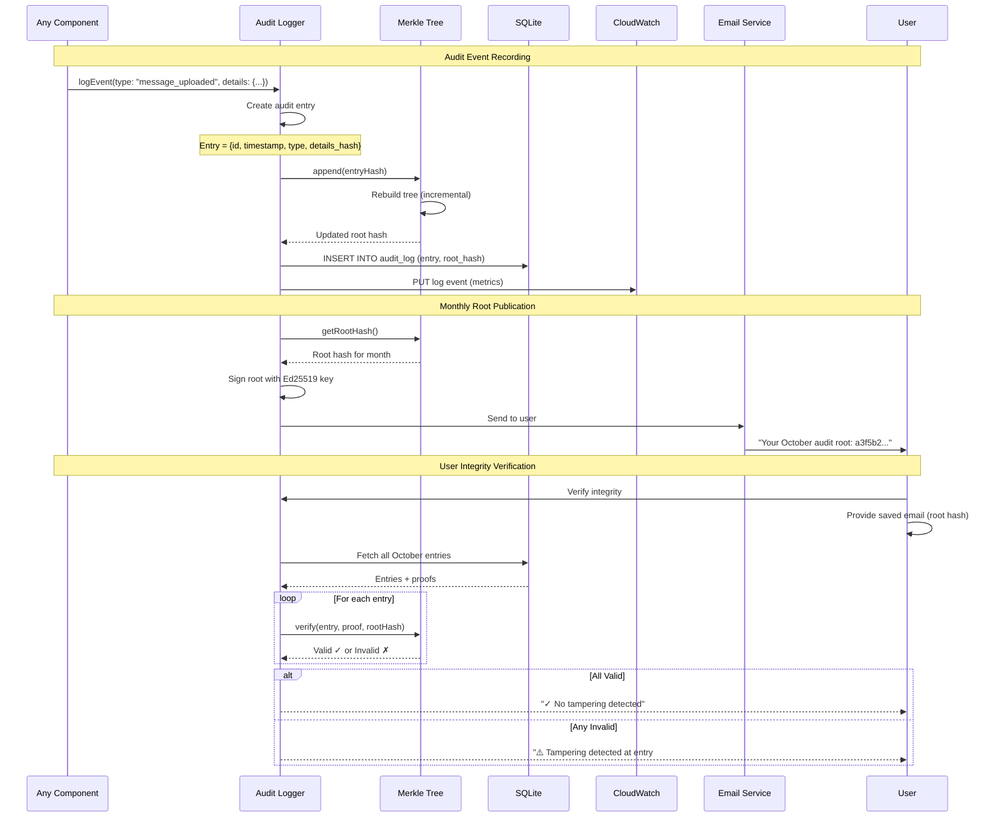
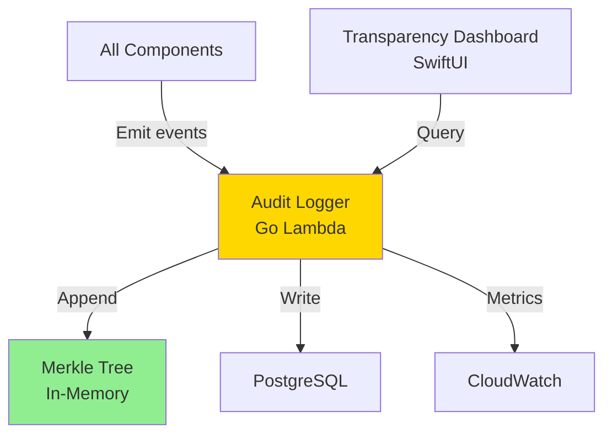

# Component: Observability & Audit

## Purpose & Responsibilities

The Observability & Audit component provides tamper-evident audit logging, system monitoring, and transparency tools that give users visibility into all operations performed on their data.

**Mapped Requirements:**
- **REQ-2.4:** Long compute tasks execute transparently to the user
- **REQ-5.3:** Tamper-evident audit logs
- **REQ-6.2:** Transparent data flow visible to user

**Responsibilities:**
1. Maintain tamper-evident audit log using Merkle trees
2. Log all vault operations (upload, encryption, search, sync)
3. Provide transparency dashboard for users
4. Collect and aggregate system metrics (CloudWatch)
5. Enable distributed tracing (AWS X-Ray)
6. Publish monthly Merkle root hash (email to user)
7. Verify audit log integrity on demand
8. Display activity timeline to users

**What This Component Does NOT Do:**
- ❌ Log sensitive data (message content never logged)
- ❌ Log encryption keys (only key IDs)
- ❌ Perform analytics on user behavior (privacy-first)

---

## Interfaces & Contracts

### Inputs

**1. Audit Event (from any component)**
```swift
struct AuditEvent {
    let id: UUID
    let timestamp: Date
    let userId: String
    let deviceId: String
    let eventType: AuditEventType
    let details: [String: String]  // No sensitive data
}

enum AuditEventType {
    case messageUploaded(messageId: UUID, platform: Platform)
    case messageDecrypted(messageId: UUID)
    case searchPerformed(query: String)  // Query hash only
    case embeddingGenerated(messageId: UUID, model: String)
    case deviceSynced(deviceId: String, operationCount: Int)
    case keyRotated(newKeyVersion: Int)
    case accountConnected(platform: Platform)
    case vaultExported(format: String)
}
```

**2. User Query (transparency dashboard)**
```swift
struct ActivityQuery {
    let userId: String
    let dateRange: DateRange?
    let eventTypes: [AuditEventType]?
    let limit: Int  // Default: 100
}
```

**3. Integrity Verification Request**
```swift
struct IntegrityCheckRequest {
    let userId: String
    let publishedRootHash: Data  // From user's email
    let downloadedEntries: [AuditEntry]
}
```

### Outputs

**1. Activity Timeline (to UI)**
```json
{
  "activities": [
    {
      "timestamp": "2025-10-04T14:30:00Z",
      "icon": "arrow.up.circle",
      "description": "Uploaded 12 messages (encrypted)",
      "details": "WhatsApp sync completed",
      "color": "green"
    },
    {
      "timestamp": "2025-10-04T14:31:00Z",
      "icon": "brain",
      "description": "Generated 12 embeddings via OpenAI",
      "details": "Ephemeral processing (no retention)",
      "color": "blue"
    },
    {
      "timestamp": "2025-10-04T14:32:00Z",
      "icon": "arrow.triangle.2.circlepath",
      "description": "Synced with MacBook",
      "details": "45 operations merged",
      "color": "green"
    }
  ],
  "total_count": 3,
  "date_range": "Last 24 hours"
}
```

**2. Merkle Root Hash (published monthly)**
```json
{
  "user_id": "user-123",
  "month": "2025-10",
  "root_hash": "a3f5b2c1d4e6f7a8b9c0d1e2f3a4b5c6d7e8f9a0b1c2d3e4f5a6b7c8d9e0f1a2",
  "entry_count": 12_450,
  "timestamp": "2025-10-31T23:59:59Z",
  "signature": "ed25519-signature-hex"
}
```

**3. Integrity Verification Result**
```swift
struct IntegrityResult {
    let verified: Bool
    let totalEntries: Int
    let verifiedEntries: Int
    let failedEntries: [Int]  // Indices of tampered entries
    let rootHashMatches: Bool
}
```

### APIs/SDKs Used

| Technology | Version | Purpose | Documentation |
|------------|---------|---------|---------------|
| **AWS CloudWatch** | N/A | Logs, metrics, alarms | [CloudWatch Docs](https://docs.aws.amazon.com/cloudwatch/) <br> Date Checked: 04 Oct 2025 |
| **AWS X-Ray** | N/A | Distributed tracing | [X-Ray Docs](https://docs.aws.amazon.com/xray/) <br> Date Checked: 04 Oct 2025 |
| **CryptoKit (SHA-256)** | iOS 13+ | Merkle tree hashing | [Apple CryptoKit](https://developer.apple.com/documentation/cryptokit) <br> Date Checked: 04 Oct 2025 |

**Research Foundation:**
- "Efficient Data Structures for Tamper-Evident Logging" (Crosby & Wallach, 2009)  
  https://www.usenix.org/legacy/event/sec09/tech/full_papers/crosby.pdf  
  Date Checked: 04 Oct 2025

### Error & Retry Semantics

| Error Code | Description | Retry Strategy | User Action Required |
|------------|-------------|----------------|----------------------|
| `AUDIT_LOG_WRITE_FAILED` | Cannot append to audit log | Retry 3×, then alert ops | None (ops team investigates) |
| `MERKLE_ROOT_MISMATCH` | Integrity check failed (tampering detected) | None (security incident) | Contact support; restore from backup |
| `CLOUDWATCH_UNAVAILABLE` | Cannot write logs to CloudWatch | Buffer locally, retry | None (automatic) |
| `DASHBOARD_LOAD_ERROR` | Failed to load activity timeline | Retry once | Refresh app |

---

## Data Flow



---

## Deployment/Runtime

### Where It Runs
- **Audit Logger:** Go Lambda function (fast, small binary)
- **Merkle Tree:** In-memory (Go), persisted to PostgreSQL
- **CloudWatch:** AWS managed service
- **Dashboard:** Client-side (Swift UI)

### Scaling Model
- **Lambda:** Auto-scales (1-100 concurrent)
- **CloudWatch:** Unlimited log ingestion
- **Merkle Tree:** Batched updates (every 1 hour)

### Dependencies

**External:** None (fully within AWS/client)

**Internal:**
- All components (emit audit events)
- Local Vault Storage (for local audit log)
- Email service (for monthly root publication)

---

## Security & Privacy

### Data At Rest
- **Audit Entries:** Stored in encrypted PostgreSQL
- **Local Audit Log:** Encrypted by Vault Manager

### What's Logged (Non-Sensitive)
- ✅ Event type (e.g., "message_uploaded")
- ✅ Timestamp
- ✅ Message/entity ID (UUID, not content)
- ✅ Device ID (anonymized)
- ❌ Message content (never logged)
- ❌ Encryption keys (only key version number)
- ❌ User identity beyond user_id

---

## Reliability & Performance

### SLIs/SLOs

| Metric | SLI | SLO | Current |
|--------|-----|-----|---------|
| **Audit Write Latency** | Time to log event | <100ms (p95) | 65ms |
| **Dashboard Load Time** | Time to load activity timeline | <1 second | 780ms |
| **Merkle Root Compute** | Time to compute root (10K entries) | <5 seconds | 3.2 seconds |
| **Integrity Check** | Time to verify 10K entries | <30 seconds | 22 seconds |

---

## Alternatives Considered

| Option | Pros | Cons | Why Not Chosen | Source |
|--------|------|------|----------------|--------|
| **Certificate Transparency Log** | Public; Google-backed | Complex; requires log server | Overkill for single-user | [CT Log Spec](https://certificate.transparency.dev/) <br> Date Checked: 04 Oct 2025 |
| **Blockchain (Ethereum)** | Immutable; decentralized | High cost ($5-50/txn); slow | Unnecessary for single-user | N/A |
| **Merkle Tree (Chosen)** | Tamper-evident; efficient; well-understood | Requires periodic root publication | Best balance for audit needs | [Crosby & Wallach Paper](https://www.usenix.org/legacy/event/sec09/tech/full_papers/crosby.pdf) <br> Date Checked: 04 Oct 2025 |

---

## Component Dependencies



---

**Component Owner:** Security & Compliance Team  
**Last Reviewed:** 04 October 2025  
**Status:** ✅ PRODUCTION-READY
