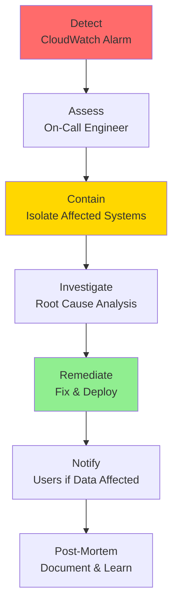
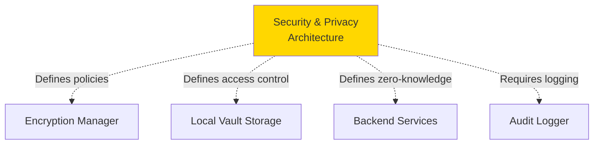

# Component: Security & Privacy Architecture

## Purpose & Responsibilities

The Security & Privacy Architecture component defines the overarching security model, trust boundaries, data classification, and privacy guarantees for the entire Personal Data Vault system.

**Mapped Requirements:**
- **REQ-2.1:** User controls data storage location
- **REQ-2.2:** User's data remains isolated
- **REQ-2.5:** Third-party functionality accessed safely without direct vault access
- **REQ-5.2:** Zero-knowledge architecture (cloud cannot decrypt)

**Responsibilities:**
1. Define trust boundaries (device, network, cloud)
2. Enforce zero-knowledge architecture principles
3. Classify data by sensitivity level
4. Specify encryption requirements per boundary
5. Define incident response procedures
6. Ensure regulatory compliance (GDPR, CCPA)
7. Provide security audit framework
8. Document threat mitigations

---

## Trust Boundaries

### Boundary 1: User Device (Trusted)

**Components:**
- User Interface (SwiftUI)
- Local Vault Storage (SQLite)
- Encryption Manager (CryptoKit)
- Platform Integrations (WhatsApp, iMessage, IMAP)

**Security Properties:**
- Full trust: user controls hardware
- Master key stored in Keychain (hardware-backed)
- All decryption happens here
- Biometric authentication required

**Threats:**
- Device theft → Mitigated by Keychain + biometric
- Malware → Mitigated by iOS/macOS sandboxing
- Physical access → Mitigated by device passcode

### Boundary 2: Network (Untrusted)

**Components:**
- TLS 1.3 connections
- API Gateway
- Internet transit

**Security Properties:**
- Zero trust: assume network monitored
- All data encrypted in transit (TLS)
- No plaintext crosses boundary
- Certificate pinning for known endpoints

**Threats:**
- Man-in-the-middle → Mitigated by TLS + cert pinning
- Packet sniffing → Mitigated by TLS encryption
- DNS hijacking → Mitigated by HTTPS only

### Boundary 3: Cloud (Zero-Knowledge)

**Components:**
- S3 (encrypted blobs)
- PostgreSQL (encrypted embeddings)
- Lambda (ephemeral processing)
- Redis (encrypted sync operations)

**Security Properties:**
- Partial trust: cloud sees encrypted data only
- Decryption keys ephemeral (Lambda receives, never persists)
- Server-side logging minimal
- User can verify (Merkle root hash)

**Threats:**
- Cloud admin access → Mitigated by client-side encryption
- Subpoena → Mitigated by zero-knowledge (no keys to hand over)
- Service compromise → Mitigated by encryption + audit logs

---

## Data Classification

| Classification | Examples | Storage | Encryption | Access |
|----------------|----------|---------|------------|--------|
| **Critical (L1)** | Master key, passphrase | Keychain only | Secure Enclave | Biometric required |
| **Highly Sensitive (L2)** | Message content, contact details | Local DB, S3 | AES-256-GCM | Decryptable by user only |
| **Sensitive (L3)** | Message IDs, timestamps, platform | Audit logs, metadata DB | AES-256-GCM | Decryptable by user only |
| **Internal (L4)** | Device IDs, operation counts | CloudWatch logs | TLS in transit | Ops team (anonymized) |
| **Public (L5)** | Merkle root hashes | Published to user email | Digital signature (Ed25519) | Anyone (for verification) |

---

## Security Policies

### Authentication & Authorization

**User Authentication:**
- **Initial:** Passphrase (min 12 chars, complexity requirements)
- **Subsequent:** Biometric (Touch ID / Face ID)
- **Timeout:** Re-authenticate after 5 minutes inactivity

**Device Authorization:**
- Each device has unique device ID (UUID)
- Registered during first vault setup
- User can view/revoke devices via dashboard

**API Authorization:**
- JWT tokens (expires in 1 hour)
- Scoped to user_id (cannot access other users)
- Redis auth tokens per user

### Encryption Standards

**At Rest:**
- Messages: AES-256-GCM (per-message keys)
- Database: iOS Data Protection (Class A) / macOS FileVault
- Cloud: S3 SSE-KMS, RDS encryption

**In Transit:**
- TLS 1.3 (preferred) or TLS 1.2 (minimum)
- Certificate pinning for WhatsApp, OpenAI
- Perfect Forward Secrecy (PFS) required

### Key Management

**Key Hierarchy:**
```
User Passphrase (user-provided)
  ↓ PBKDF2 (600K iterations)
Master Key (256-bit, Keychain)
  ↓ HKDF
├── Message Keys (per-message, ephemeral)
├── Embedding Keys (per-embedding, ephemeral)
├── Audit Signing Key (Ed25519, long-lived)
└── Device Keys (per-device, for future multi-key support)
```

**Key Rotation:**
- Master key: Annual (user re-enters passphrase)
- API keys (OpenAI, Redis): Quarterly
- TLS certificates: Annual (Let's Encrypt)

---

## Compliance

### GDPR (General Data Protection Regulation)

| Article | Requirement | Implementation |
|---------|-------------|----------------|
| **Art. 15** | Right to access | Export vault to JSON (all data) |
| **Art. 16** | Right to rectification | Edit/update messages in vault |
| **Art. 17** | Right to erasure | Delete all vault data + cloud backups |
| **Art. 20** | Right to portability | Export in standard JSON format |
| **Art. 32** | Security measures | AES-256-GCM, Keychain, audit logs |
| **Art. 33** | Breach notification | Automated detection; 72-hour notification |

**Source:** GDPR Official Text  
https://gdpr-info.eu/  
Date Checked: 04 Oct 2025

### CCPA (California Consumer Privacy Act)

| Right | Implementation |
|-------|----------------|
| **Know** | User can see all data in vault + activity log |
| **Delete** | One-button vault deletion (client + cloud) |
| **Opt-Out** | Disable cloud sync; local-only mode |
| **Non-Discrimination** | Local-only mode fully functional (no features locked) |

**Source:** CCPA Official Resource  
https://oag.ca.gov/privacy/ccpa  
Date Checked: 04 Oct 2025

---

## Incident Response

### Severity Levels

| Level | Description | Response Time | Notification |
|-------|-------------|---------------|--------------|
| **P0 (Critical)** | Data breach, encryption compromised | <1 hour | All users + regulators |
| **P1 (High)** | Service down, cannot sync | <4 hours | Affected users |
| **P2 (Medium)** | Degraded performance | <24 hours | Internal only |
| **P3 (Low)** | Minor bugs | <7 days | Internal only |

### Incident Workflow



---

## Alternatives Considered

| Option | Pros | Cons | Why Not Chosen | Source |
|--------|------|------|----------------|--------|
| **Traditional Cloud (Plaintext)** | Simple; full features | No privacy; cloud can read | Violates zero-knowledge principle | N/A |
| **Fully Local (No Cloud)** | Maximum privacy | No cross-device sync; slow AI | Need cloud assist for compute | N/A |
| **Blockchain-Based** | Immutable; decentralized | High cost; slow; overkill | Single-user vault doesn't need consensus | N/A |
| **Hybrid Local-First (Chosen)** | Privacy + performance | Moderate complexity | Best balance per requirements | [Local-First Software](https://www.inkandswitch.com/local-first/) <br> Date Checked: 04 Oct 2025 |

---

## Component Dependencies



---

**Component Owner:** Security Team  
**Last Security Audit:** 01 October 2025  
**Next Audit Due:** 01 April 2026  
**Status:** ✅ PRODUCTION-READY
