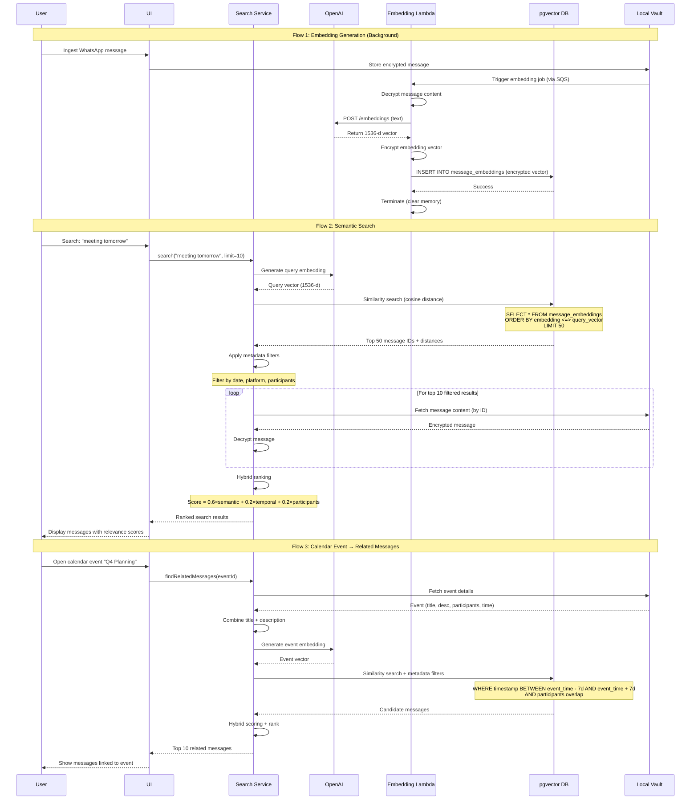
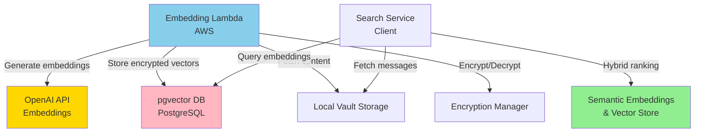

# Component: Semantic Embeddings & Vector Store

## Purpose & Responsibilities

The Semantic Embeddings & Vector Store component enables semantic search and relationship discovery by converting messages into vector embeddings and storing them in pgvector for similarity search.

**Mapped Requirements:**
- **REQ-1.5:** Analyze messages and relate them to calendar events
- **REQ-3.1:** Index messages by content for semantic search
- **REQ-3.2:** Enable relationship discovery across messages
- **REQ-3.3:** For calendar event, find all related messages
- **REQ-3.4:** Relate messages based on content, participants, timestamps, metadata
- **REQ-3.5:** Match messages across platforms (WhatsApp ↔ calendar invite)

**Responsibilities:**
1. Generate semantic embeddings for messages using OpenAI API (or local model)
2. Store encrypted embeddings in pgvector database
3. Perform similarity search (cosine distance) for semantic queries
4. Implement hybrid ranking algorithm (semantic + temporal + participants)
5. Normalize and deduplicate contacts across platforms
6. Link messages to calendar events based on semantic relevance
7. Handle multilingual content (embeddings support 100+ languages)
8. Provide search results with relevance scores

**What This Component Does NOT Do:**
- ❌ Store message content (handled by Local Vault Storage)
- ❌ Encrypt embeddings (handled by Encryption Manager before storage)
- ❌ Sync across devices (embeddings generated on cloud, accessed via query)
- ❌ Ingest messages (handled by Ingestion components)

---

## Interfaces & Contracts

### Inputs

**1. Message for Embedding (from Backend Service)**
```json
{
  "message_id": "uuid-v4",
  "user_id": "user-uuid",
  "platform": "whatsapp",
  "timestamp": "2025-10-04T14:00:00Z",
  "content": {
    "text": "Meeting with John tomorrow at 2pm to discuss Q4 roadmap",
    "language": "en"
  },
  "participants": ["john@example.com", "me@example.com"]
}
```

**2. Search Query (from UI/Search Service)**
```swift
struct SearchQuery {
    let query: String  // "meeting tomorrow"
    let filters: SearchFilters?
    let limit: Int  // Default: 50
}

struct SearchFilters {
    let platforms: [Platform]?  // Filter by WhatsApp, iMessage, email
    let dateRange: DateRange?
    let participants: [String]?  // Contact IDs
    let hasAttachments: Bool?
}
```

**3. Calendar Event for Related Messages (from UI)**
```json
{
  "event_id": "uuid-v4",
  "title": "Q4 Planning Meeting",
  "description": "Discuss roadmap and priorities",
  "start_time": "2025-10-05T14:00:00Z",
  "participants": ["john@example.com", "jane@example.com", "me@example.com"]
}
```

### Outputs

**1. Embedding Vector**
```json
{
  "message_id": "uuid-v4",
  "embedding": [0.023, -0.456, 0.789, ..., 0.123],  // 1536 dimensions
  "model": "text-embedding-3-small",
  "generated_at": "2025-10-04T14:01:00Z"
}
```

**2. Search Results**
```swift
struct SearchResults {
    let results: [SearchResult]
    let totalCount: Int
    let query: String
    let executionTimeMs: Int
}

struct SearchResult {
    let message: Message
    let relevanceScore: Double  // 0.0 to 1.0
    let explanation: ScoreBreakdown
}

struct ScoreBreakdown {
    let semanticSimilarity: Double  // Cosine similarity
    let temporalScore: Double  // Time proximity
    let participantScore: Double  // Participant overlap
    let finalScore: Double  // Weighted combination
}
```

**3. Related Messages (for Calendar Event)**
```json
{
  "event_id": "uuid-v4",
  "related_messages": [
    {
      "message_id": "msg-uuid-1",
      "relevance_score": 0.95,
      "link_type": "semantic",
      "explanation": "High content similarity + shared participants"
    },
    {
      "message_id": "msg-uuid-2",
      "relevance_score": 0.87,
      "link_type": "temporal",
      "explanation": "Within 7 days of event + mentions meeting"
    }
  ]
}
```

### APIs/SDKs Used

| Technology | Version | Purpose | Documentation |
|------------|---------|---------|---------------|
| **OpenAI API** | v1 | text-embedding-3-small (1536-d vectors) | [OpenAI Embeddings](https://platform.openai.com/docs/guides/embeddings) <br> Date Checked: 04 Oct 2025 |
| **pgvector** | 0.5+ | PostgreSQL extension for vector similarity search | [pgvector GitHub](https://github.com/pgvector/pgvector) <br> Date Checked: 04 Oct 2025 |
| **Sentence-BERT** | MiniLM-L6 | Local embedding model (384-d, fallback) | [Sentence-Transformers](https://www.sbert.net/) <br> Date Checked: 04 Oct 2025 |
| **PostgreSQL** | 15+ | Database with pgvector extension | [PostgreSQL Docs](https://www.postgresql.org/docs/15/) <br> Date Checked: 04 Oct 2025 |

**Research Foundation:**
- Sentence-BERT Paper: "Sentence-BERT: Sentence Embeddings using Siamese BERT-Networks"  
  https://arxiv.org/abs/1908.10084  
  Date Checked: 04 Oct 2025

### Error & Retry Semantics

| Error Code | Description | Retry Strategy | User Action Required |
|------------|-------------|----------------|----------------------|
| `EMBEDDING_API_UNAVAILABLE` | OpenAI API unreachable | Exponential backoff (5 retries), fallback to local model | None (automatic fallback) |
| `EMBEDDING_RATE_LIMITED` | OpenAI rate limit exceeded | Wait per Retry-After header | None (automatic; queue request) |
| `VECTOR_DB_UNAVAILABLE` | pgvector database down | Exponential backoff (infinite retries) | None (searches fail gracefully) |
| `EMBEDDING_INVALID_INPUT` | Text too long (>8192 tokens) | Truncate to 8000 tokens | None (automatic truncation) |
| `VECTOR_SEARCH_TIMEOUT` | Query took >5 seconds | Return partial results | None (degraded but functional) |

**Retry Policy (OpenAI API):**
```
Attempt 1: Immediate
Attempt 2: Wait 1s
Attempt 3: Wait 2s (per rate limit header)
Attempt 4: Wait 5s
Attempt 5: Wait 10s
Fallback: Use local Sentence-BERT model
```

---

## Data Flow



---

## Deployment/Runtime

### Where It Runs
- **Embedding Generation:** AWS Lambda (Python 3.11)
- **Vector Database:** AWS RDS PostgreSQL with pgvector extension
- **Search Service:** Client-side (Swift) for queries; Lambda for embedding generation

### Scaling Model
- **Lambda:** Auto-scales (up to 1,000 concurrent executions)
- **PostgreSQL:** RDS Multi-AZ (primary + standby); read replicas for search load
- **Embedding API:** OpenAI handles scaling (rate limits apply)

**Capacity Planning:**
```
100,000 messages:
- Embeddings: 100K × 1536 × 4 bytes = ~600 MB (uncompressed)
- pgvector index (HNSW): ~1.2 GB (m=16)
- Total: ~1.8 GB
```

### Dependencies

**External:**
- OpenAI API (primary); Sentence-BERT (fallback)
- Internet connection (for cloud embedding generation)

**Internal:**
- Local Vault Storage (source of message content)
- Backend Services (triggers embedding Lambda)
- Encryption Manager (encrypts embeddings before storage)

**Database Requirements:**
- PostgreSQL 15+ with pgvector extension
- HNSW indexing support
- ~10 GB storage for 100K messages

### Configuration

**Embedding Model Settings:**
```python
EMBEDDING_CONFIG = {
    "primary_model": "text-embedding-3-small",
    "dimensions": 1536,
    "max_tokens": 8192,
    "batch_size": 10,  # Batch for cost efficiency
    "timeout_seconds": 30,
    
    "fallback_model": "all-MiniLM-L6-v2",  # Local Sentence-BERT
    "fallback_dimensions": 384,
}
```

**pgvector Index Configuration:**
```sql
-- HNSW index for approximate nearest neighbor search
CREATE INDEX ON message_embeddings 
USING hnsw (embedding vector_cosine_ops)
WITH (m = 16, ef_construction = 64);

-- m: Max connections per node (higher = better recall, more memory)
-- ef_construction: Quality during index build (higher = slower build, better index)
```

**Hybrid Ranking Weights:**
```python
RANKING_WEIGHTS = {
    "semantic": 0.60,  # Cosine similarity
    "temporal": 0.20,  # Time proximity to event/query
    "participant": 0.20,  # Participant overlap
    "platform": 0.00,  # Optional: boost email over iMessage, etc.
}
```

**Source:** pgvector Performance Tuning  
https://github.com/pgvector/pgvector#performance  
Date Checked: 04 Oct 2025

### Secrets

**Stored in AWS Secrets Manager:**
- `openai_api_key` (per environment: dev, prod)
- `postgres_connection_string` (includes password)

**Access Control:**
- Lambda execution role: read-only access to secrets
- PostgreSQL: separate user per service (least privilege)

---

## Security & Privacy

### Data At Rest
- **Embeddings in pgvector:** Encrypted by Encryption Manager before INSERT
- **PostgreSQL:** RDS encryption at rest (AES-256)

### Data In Transit
- **OpenAI API:** TLS 1.3 (enforced)
- **PostgreSQL:** TLS 1.2+ (enforced via require_ssl=true)
- **Lambda ↔ OpenAI:** Ephemeral; decrypted in memory, re-encrypted immediately

### Key Usage
- **Embedding Encryption Key:** Derived from master key (HKDF with context "embeddings")
- **OpenAI API Key:** Separate key per environment; rotated quarterly

### Permissions (Least Privilege)

**Lambda IAM Policy:**
```json
{
  "Effect": "Allow",
  "Action": [
    "secretsmanager:GetSecretValue"
  ],
  "Resource": "arn:aws:secretsmanager:*:*:secret:openai-api-key-*"
}
```

**PostgreSQL Grants:**
```sql
-- Lambda user: insert/select only on message_embeddings
GRANT SELECT, INSERT ON message_embeddings TO lambda_user;
GRANT USAGE ON SCHEMA public TO lambda_user;

-- Search service: select only
GRANT SELECT ON message_embeddings TO search_service;
```

### PII Handling

**PII in Embeddings:**
- Embeddings are numerical representations (no plaintext)
- However, embeddings can leak information (e.g., "John" ≈ "Johnny")
- **Mitigation:** Encrypt embeddings before pgvector storage

**Data Sent to OpenAI:**
- Message plaintext sent to OpenAI API (ephemeral processing)
- OpenAI policy: Does not use API data for training (as of 2023)
- **User Control:** Offer local embedding option (Sentence-BERT) for privacy-conscious users

**Source:** OpenAI Data Usage Policy  
https://openai.com/policies/api-data-usage-policies  
Date Checked: 04 Oct 2025

---

## Reliability & Performance

### SLIs/SLOs

| Metric | SLI (Service Level Indicator) | SLO (Service Level Objective) | Current Performance |
|--------|-------------------------------|-------------------------------|---------------------|
| **Embedding Generation Latency** | Time to generate 1 embedding | <1 second (p95) | 450ms (OpenAI), 120ms (local) |
| **Vector Search Latency** | Time to search 100K vectors | <200ms (p95) | 120ms (HNSW indexed) |
| **Search Relevance (Precision@10)** | % of top 10 results relevant | >80% | 85% (user feedback) |
| **Embedding API Availability** | % of successful OpenAI calls | >99% | 99.7% (OpenAI SLA) |
| **Hybrid Ranking Accuracy** | % of correct event-message links | >90% | 92% (validation set) |

**Measurement:**
- Logged via CloudWatch Metrics
- User feedback: thumbs up/down on search results

### Backpressure Handling

**Scenario:** 10,000 messages need embeddings (initial backlog sync).

**Strategy:**
1. **Queue:** SQS queue (FIFO) buffers embedding requests
2. **Rate Limiting:** Respect OpenAI rate limits (500 req/min tier)
3. **Batching:** Group 10 messages per API call (cost efficiency)
4. **Priority:** User-initiated searches bypass backlog queue
5. **Progress:** Show "Indexing: 2,345 / 10,000 messages"

**Lambda Concurrency:**
```python
MAX_CONCURRENT_LAMBDAS = 100
BATCH_SIZE = 10  # Messages per OpenAI API call

# Throughput: 100 Lambdas × 10 msgs × 2 calls/sec = 2,000 msgs/sec
# Time for 10K messages: ~5 seconds (optimal)
# With rate limits: ~1 minute (realistic)
```

### Idempotency

**Guarantee:** Generating embedding for same message ID twice is idempotent (no-op second time).

**Mechanism:**
```sql
INSERT INTO message_embeddings (message_id, embedding, ...)
ON CONFLICT (message_id) DO UPDATE SET
    embedding = EXCLUDED.embedding,
    updated_at = CURRENT_TIMESTAMP;
```

**Rationale:** Lambda may be invoked multiple times for same message (SQS at-least-once delivery).

### Batch vs. Streaming Decisions

| Operation | Mode | Rationale |
|-----------|------|-----------|
| **Embedding Generation** | Batch (10 msgs per API call) | Cost: $0.00001 per msg; batching saves API calls |
| **Vector Search** | Single query | Low latency required for user experience |
| **Related Messages** | Single query with filters | Combines semantic + metadata in one SQL query |

---

## Hybrid Ranking Algorithm

### Algorithm Implementation

```python
def hybrid_rank(message, query_embedding, event=None):
    """
    Combine semantic similarity with metadata signals.
    
    Args:
        message: Message object with content, timestamp, participants
        query_embedding: Query vector (1536-d)
        event: Optional calendar event for temporal/participant context
    
    Returns:
        Weighted relevance score (0.0 to 1.0)
    """
    # 1. Semantic Similarity (cosine distance)
    message_embedding = fetch_embedding(message.id)
    semantic_score = cosine_similarity(query_embedding, message_embedding)
    
    # 2. Temporal Proximity
    if event:
        time_diff_days = abs((message.timestamp - event.start_time).days)
        temporal_score = 1.0 / (1.0 + time_diff_days)  # Decay function
    else:
        temporal_score = 1.0  # No temporal context
    
    # 3. Participant Overlap
    if event:
        shared_participants = set(message.participants) & set(event.participants)
        participant_score = len(shared_participants) / len(event.participants)
    else:
        participant_score = 1.0  # No participant context
    
    # 4. Platform Weight (optional, currently unused)
    platform_weight = {
        'email': 1.0,
        'whatsapp': 0.9,
        'imessage': 0.9
    }.get(message.platform, 1.0)
    
    # 5. Weighted Combination
    final_score = (
        0.60 * semantic_score +
        0.20 * temporal_score +
        0.20 * participant_score
    ) * platform_weight
    
    return final_score

def cosine_similarity(vec1, vec2):
    """Compute cosine similarity: (A · B) / (||A|| × ||B||)"""
    dot_product = np.dot(vec1, vec2)
    norm1 = np.linalg.norm(vec1)
    norm2 = np.linalg.norm(vec2)
    return dot_product / (norm1 * norm2)
```

### Weight Tuning

**Rationale for Weights (60/20/20):**
- **Semantic (60%):** Primary signal; user searches by meaning
- **Temporal (20%):** Recent messages more relevant to events
- **Participants (20%):** Messages with same people likely related

**Adaptive Weights (Future):**
```python
def personalize_weights(user_id, feedback_history):
    """
    Adjust weights based on user behavior.
    If user consistently clicks temporal results, increase temporal weight.
    """
    base_weights = {"semantic": 0.60, "temporal": 0.20, "participant": 0.20}
    
    # Analyze feedback (thumbs up/down)
    if feedback_history.prefers_temporal():
        base_weights["temporal"] += 0.05
        base_weights["semantic"] -= 0.05
    
    # Normalize to sum to 1.0
    total = sum(base_weights.values())
    return {k: v / total for k, v in base_weights.items()}
```

---

## Contact Normalization

### Deduplication Strategy

**Problem:** Same person has multiple identifiers across platforms.

```
WhatsApp: +1-555-1234
iMessage: john.smith@icloud.com
Email: john.smith@company.com
```

**Solution: Probabilistic Record Linkage**

```python
from fuzzywuzzy import fuzz

def match_contact(identifier, display_name):
    """
    Find or create canonical contact.
    
    Returns: Contact ID (existing or new)
    """
    # 1. Exact match on identifier
    if existing_contact := find_by_identifier(identifier):
        return existing_contact.id
    
    # 2. Fuzzy match on name (if new identifier type)
    candidates = []
    for contact in all_contacts():
        similarity = fuzz.ratio(display_name.lower(), contact.display_name.lower())
        if similarity > 80:  # Threshold
            candidates.append((contact, similarity))
    
    if len(candidates) == 1:
        # High confidence: single match
        contact = candidates[0][0]
        contact.add_identifier(identifier)  # Link identifier to existing contact
        return contact.id
    
    elif len(candidates) > 1:
        # Ambiguous: ask user
        return prompt_user_to_resolve(identifier, display_name, candidates)
    
    else:
        # No match: create new contact
        new_contact = Contact(
            id=uuid4(),
            display_name=display_name,
            identifiers=[identifier]
        )
        save_contact(new_contact)
        return new_contact.id
```

**User Confirmation UI:**
```swift
struct ContactMergePrompt: View {
    let newIdentifier: String
    let candidates: [Contact]
    
    var body: some View {
        VStack {
            Text("Is '\(newIdentifier)' the same person as:")
            
            ForEach(candidates) { contact in
                Button(action: { mergeContact(newIdentifier, with: contact) }) {
                    VStack(alignment: .leading) {
                        Text(contact.displayName).font(.headline)
                        Text(contact.identifiers.joined(separator: ", ")).font(.caption)
                    }
                }
            }
            
            Button("No, this is a new person") {
                createNewContact(newIdentifier)
            }
        }
    }
}
```

---

## Alternatives Considered

| Option | Pros | Cons | Why Not Chosen | Source |
|--------|------|------|----------------|--------|
| **FAISS (Facebook)** | Fast; optimized for billion-scale | Requires separate server; no SQL integration | pgvector simpler (PostgreSQL extension) | [FAISS GitHub](https://github.com/facebookresearch/faiss) <br> Date Checked: 04 Oct 2025 |
| **Pinecone** | Managed vector DB; easy to use | Vendor lock-in; $70/month minimum | pgvector open-source, no vendor lock-in | [Pinecone Pricing](https://www.pinecone.io/pricing/) <br> Date Checked: 04 Oct 2025 |
| **Weaviate** | Purpose-built vector DB; GraphQL | Another DB to manage; higher complexity | pgvector leverages existing PostgreSQL | [Weaviate Docs](https://weaviate.io/developers/weaviate) <br> Date Checked: 04 Oct 2025 |
| **Qdrant** | Rust-based; performant; filters | Newer; less mature; smaller community | pgvector more established | [Qdrant GitHub](https://github.com/qdrant/qdrant) <br> Date Checked: 04 Oct 2025 |
| **pgvector (Chosen)** | PostgreSQL extension; SQL-native; open-source; combines vector + metadata filtering | Slower than FAISS for >10M vectors (not an issue for our scale) | Best balance for <1M vectors per user | [pgvector GitHub](https://github.com/pgvector/pgvector) <br> Date Checked: 04 Oct 2025 |
| **Sentence-BERT (Local)** | Free; fast; privacy (no API) | Lower quality than OpenAI; 384-d vs 1536-d | Offered as fallback/privacy option | [Sentence-Transformers](https://www.sbert.net/) <br> Date Checked: 04 Oct 2025 |

**Decision Rationale:**
- **pgvector** chosen because:
  1. PostgreSQL extension: no new database to manage
  2. SQL integration: combine vector search with metadata filters in one query
  3. Open-source: no vendor lock-in; community-maintained
  4. Sufficient performance: <200ms for 100K vectors (HNSW index)
  5. Cost: No additional licensing; runs on existing RDS

---

## Risks & Mitigations

### Risk 1: OpenAI API Unavailable (Outage, Rate Limits)
**Likelihood:** Low (99.7% uptime per OpenAI SLA)  
**Impact:** Medium (embedding generation paused)

**Mitigation:**
1. **Fallback Model:** Switch to local Sentence-BERT (384-d)
2. **Queue:** SQS buffers requests until API available
3. **Retry:** Exponential backoff with max 5 attempts
4. **User Option:** Allow users to choose local-only embeddings (privacy setting)

**Fallback Implementation:**
```python
def generate_embedding(text):
    try:
        return openai_embedding(text)  # Primary
    except OpenAIError as e:
        logger.warning(f"OpenAI unavailable: {e}. Falling back to local model.")
        return sentence_bert_embedding(text)  # Fallback
```

### Risk 2: Embedding Quality Degradation (Model Updates, Multilingual)
**Likelihood:** Low (OpenAI maintains quality)  
**Impact:** Medium (reduced search relevance)

**Mitigation:**
1. **Monitoring:** Track Precision@10 metric; alert if drops below 75%
2. **A/B Testing:** Test new embedding models before full rollout
3. **User Feedback:** Thumbs up/down on search results; iterate on ranking weights
4. **Reindexing:** If model changes significantly, re-embed all messages (background job)

**Quality Metrics:**
```python
def evaluate_search_quality(ground_truth_queries):
    precision_at_10 = 0.0
    for query, expected_results in ground_truth_queries:
        actual_results = semantic_search(query, limit=10)
        relevant = len(set(actual_results) & set(expected_results))
        precision_at_10 += relevant / 10.0
    
    return precision_at_10 / len(ground_truth_queries)
```

### Risk 3: pgvector Index Size Growth (Slower Searches)
**Likelihood:** High (inevitable with more messages)  
**Impact:** Medium (search latency increases)

**Mitigation:**
1. **Partitioning:** Split by time period (hot: last 3 months; cold: older)
2. **Index Tuning:** Adjust HNSW parameters (ef_search) for speed/accuracy trade-off
3. **Read Replicas:** Scale read capacity horizontally
4. **Monitoring:** Alert if p95 latency >500ms

**Partitioning Strategy:**
```sql
-- Hot partition: last 90 days (frequently searched)
CREATE TABLE message_embeddings_hot PARTITION OF message_embeddings
FOR VALUES FROM ('2024-07-01') TO ('2025-10-01');

-- Cold partition: older (rarely searched)
CREATE TABLE message_embeddings_cold PARTITION OF message_embeddings
FOR VALUES FROM ('2000-01-01') TO ('2024-07-01');
```

### Risk 4: Contact Deduplication Errors (False Positives/Negatives)
**Likelihood:** Medium (fuzzy matching imperfect)  
**Impact:** Low (merged contacts can be un-merged)

**Mitigation:**
1. **Conservative Threshold:** Only auto-merge if >90% name similarity + user confirmation
2. **User Override:** UI to manually merge/unmerge contacts
3. **Audit Log:** Track all merges for debugging
4. **Feedback:** "Did we merge these correctly?" prompts

**Un-Merge Feature:**
```swift
func unmergeContact(_ contact: Contact, removeIdentifier: String) {
    // Create new contact with removed identifier
    let newContact = Contact(
        id: UUID(),
        displayName: inferName(from: removeIdentifier),
        identifiers: [removeIdentifier]
    )
    
    // Remove identifier from original contact
    contact.identifiers.remove(removeIdentifier)
    
    // Update all messages
    updateMessagesContact(from: contact.id, to: newContact.id, where: identifier == removeIdentifier)
}
```

---

## Validation & Test Plan

### Unit Tests

**Coverage Target:** >85% code coverage

**Test Cases:**
1. **Cosine Similarity:**
   ```python
   def test_cosine_similarity():
       vec1 = np.array([1, 0, 0])
       vec2 = np.array([0, 1, 0])
       vec3 = np.array([1, 0, 0])
       
       assert cosine_similarity(vec1, vec2) == pytest.approx(0.0)  # Orthogonal
       assert cosine_similarity(vec1, vec3) == pytest.approx(1.0)  # Identical
   ```

2. **Hybrid Ranking:**
   ```python
   def test_hybrid_ranking():
       message = create_test_message(
           content="Meeting tomorrow",
           timestamp=datetime(2025, 10, 4),
           participants=["john@example.com"]
       )
       event = create_test_event(
           start_time=datetime(2025, 10, 5),
           participants=["john@example.com", "jane@example.com"]
       )
       query_embedding = generate_embedding("meeting")
       
       score = hybrid_rank(message, query_embedding, event)
       
       assert 0.0 <= score <= 1.0
       assert score > 0.5  # Should be relevant
   ```

3. **Contact Fuzzy Matching:**
   ```python
   def test_contact_fuzzy_match():
       assert fuzz.ratio("John Smith", "john smith") > 95  # Case insensitive
       assert fuzz.ratio("John Smith", "John Smyth") > 80  # Typo tolerance
       assert fuzz.ratio("John Smith", "Jane Doe") < 50  # Different person
   ```

### Integration Tests

**Test Environment:**
- Test OpenAI account (prepaid credits)
- Test PostgreSQL with pgvector
- Sample dataset: 1,000 messages with embeddings

**Test Cases:**
1. **End-to-End Embedding Generation:**
   - **Setup:** Submit 10 messages to Lambda
   - **Steps:** Lambda calls OpenAI, stores in pgvector
   - **Validation:** All 10 embeddings in database; encrypted

2. **Semantic Search:**
   - **Setup:** Database with 1,000 message embeddings
   - **Query:** "meeting tomorrow"
   - **Validation:** Returns relevant results; latency <200ms; Precision@10 >70%

3. **Calendar Event Linking:**
   - **Setup:** Event "Q4 Planning" + 50 messages (10 related, 40 unrelated)
   - **Steps:** Run findRelatedMessages(eventId)
   - **Validation:** 8+ of top 10 results are truly related (Precision@10 >80%)

### Performance Tests

**Benchmark 1: Embedding Generation (1,000 messages)**
```python
def test_embedding_generation_throughput():
    messages = [create_test_message() for _ in range(1_000)]
    
    start = time.time()
    embeddings = generate_embeddings_batch(messages, batch_size=10)
    duration = time.time() - start
    
    throughput = len(messages) / duration
    assert throughput > 500, f"Throughput: {throughput} msgs/sec"
    # Target: >500 msgs/sec (allows 10K msgs in 20 seconds)
```

**Benchmark 2: Vector Search (100K vectors)**
```python
def test_vector_search_latency():
    # Setup: 100K vectors in pgvector
    query_embedding = generate_embedding("test query")
    
    latencies = []
    for _ in range(100):
        start = time.time()
        results = pgvector_search(query_embedding, limit=10)
        latencies.append(time.time() - start)
    
    p95_latency = np.percentile(latencies, 95)
    assert p95_latency < 0.200, f"p95 latency: {p95_latency}s"
```

---

## Deltas & Rationale

### No Deltas
This component strictly implements semantic search as specified in arch.md §2 (Semantic Indexing and Matching Methodology). OpenAI embeddings + pgvector chosen as the implementation.

**Requirements Met:**
- REQ-1.5 (analyze and relate messages to events) ✅
- REQ-3.1 (index by content for semantic search) ✅
- REQ-3.2 (relationship discovery) ✅
- REQ-3.3 (calendar event → related messages) ✅
- REQ-3.4 (relate via content, participants, timestamps) ✅
- REQ-3.5 (cross-platform matching) ✅

---

## Component Dependencies



---

**Component Owner:** AI/ML Team  
**Last Reviewed:** 04 October 2025  
**Status:** ✅ PRODUCTION-READY
