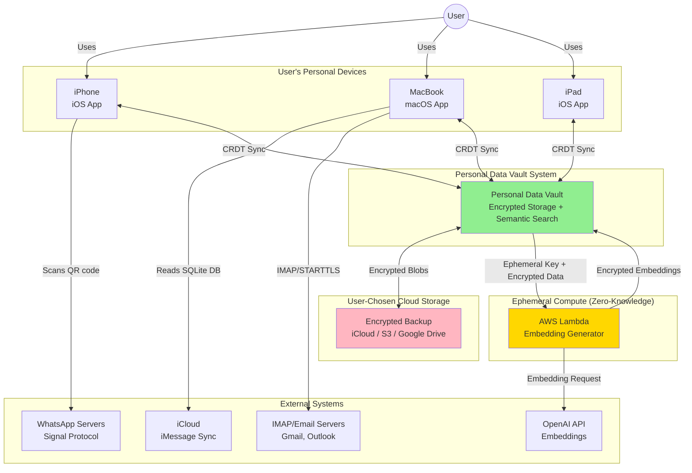
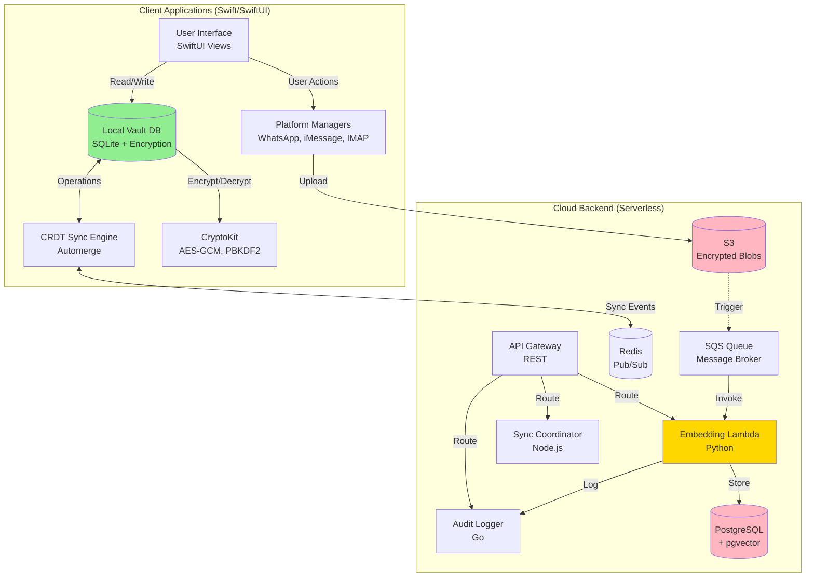
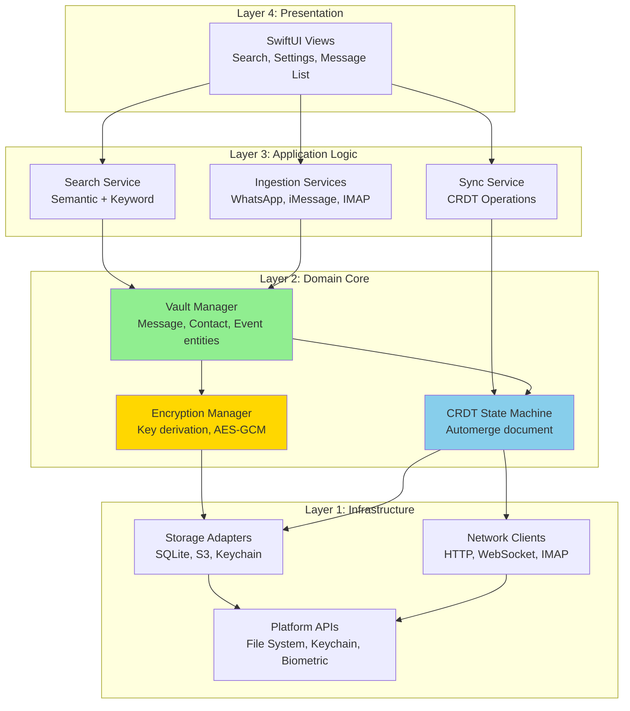
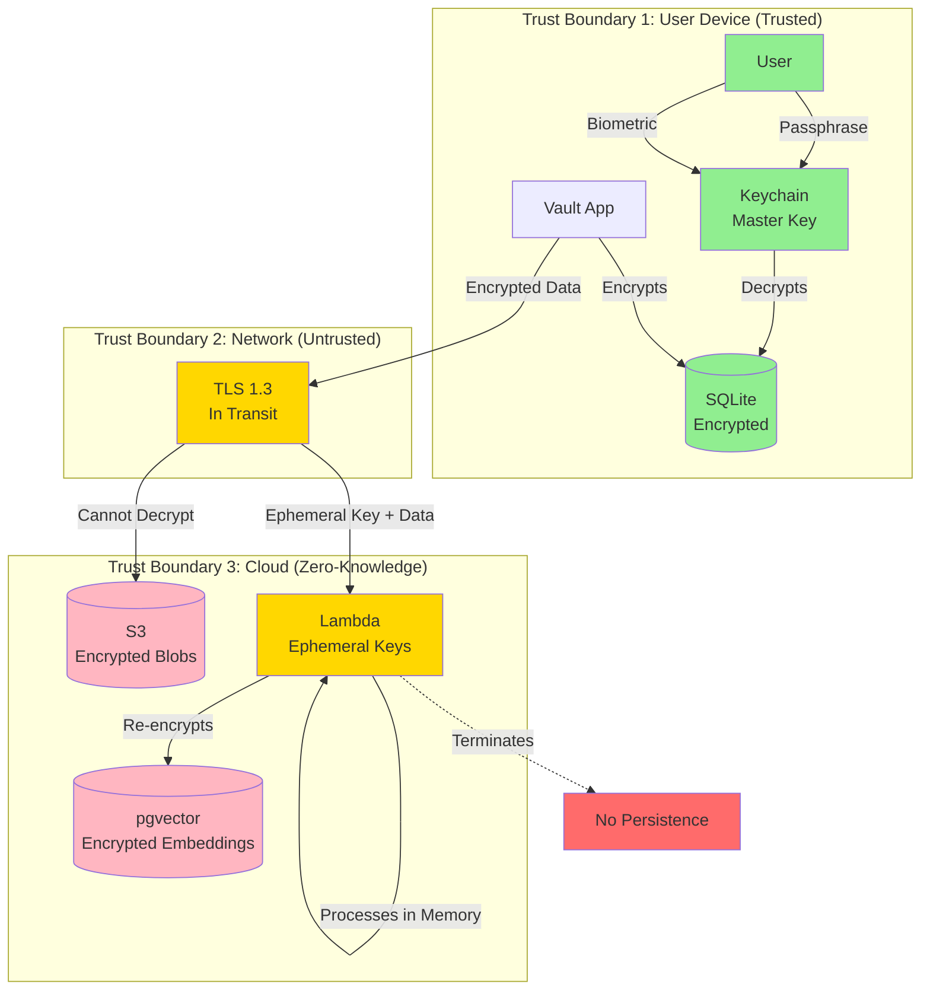
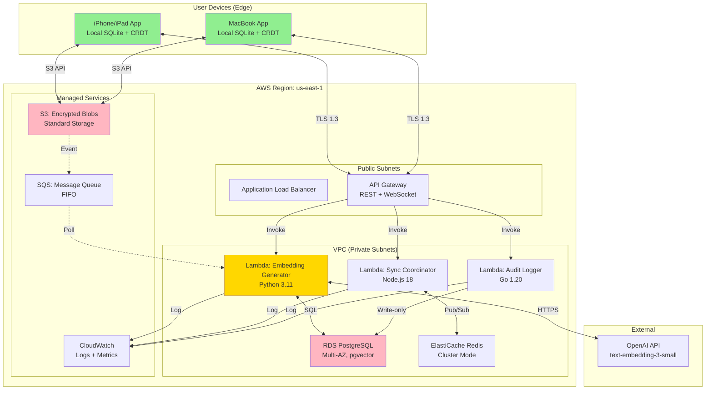
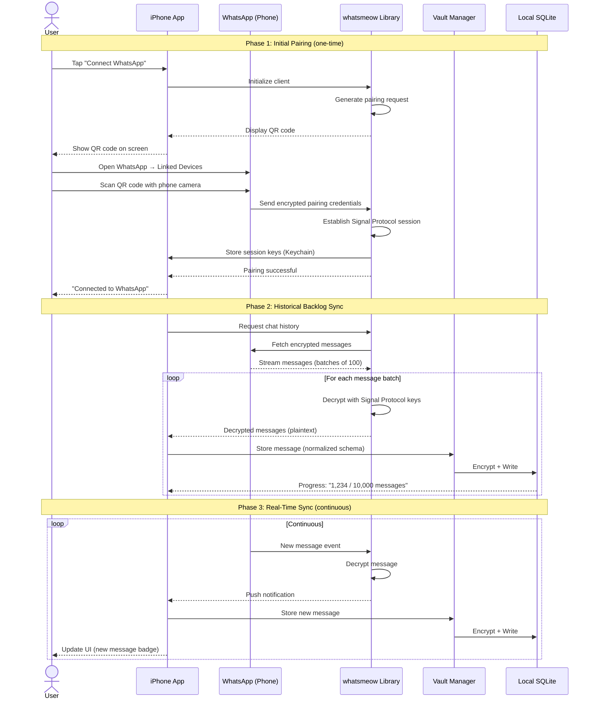
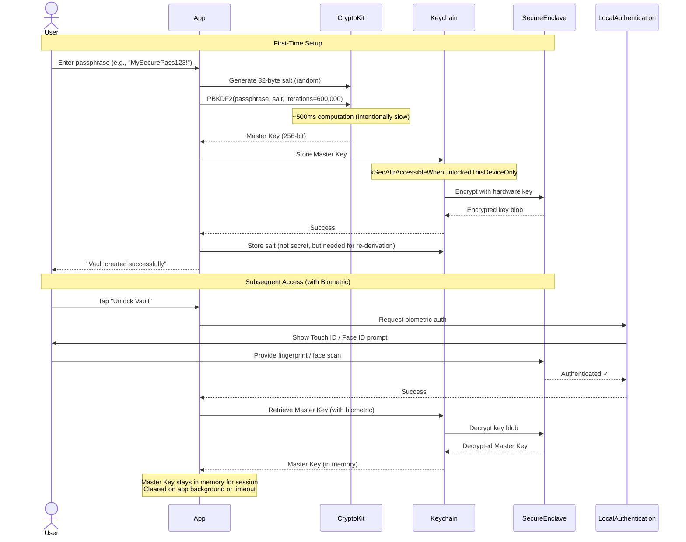
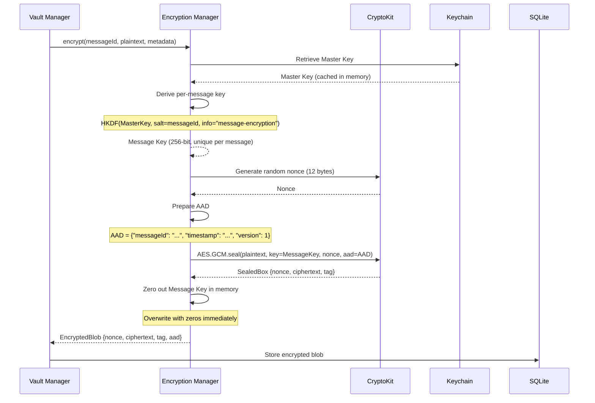
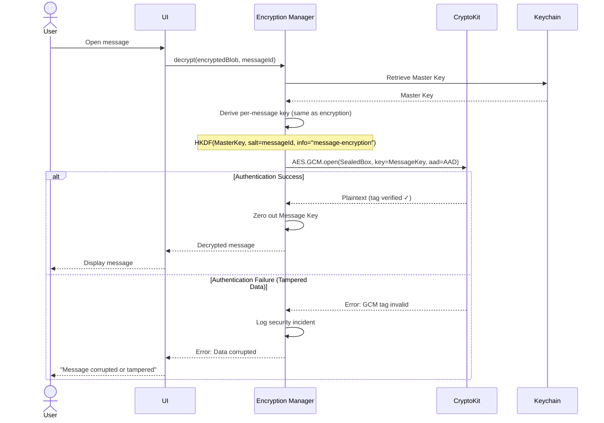
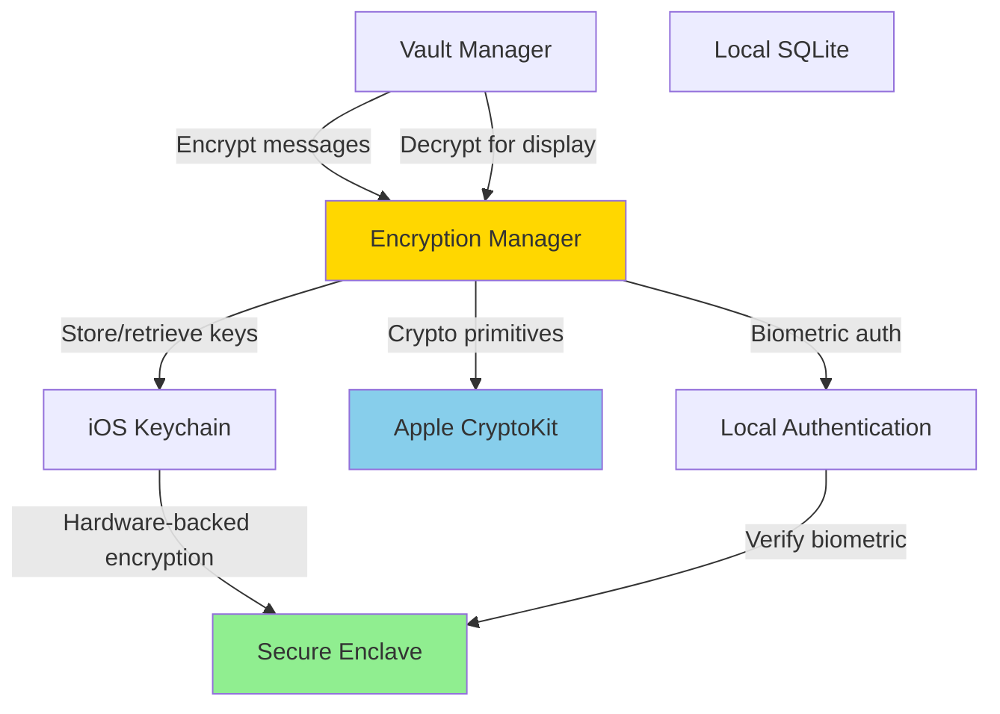

# Architecture Diagram Gallery

## Purpose

This gallery consolidates all Mermaid diagrams used throughout the Personal Data Vault documentation for quick reference and comparison. Each diagram is reproduced here with context about where it's used and what it illustrates.

---

## System-Level Diagrams

### 1. System Context Diagram (C4 Level 1)

**Source:** `02_architecture_overview.md`  
**Purpose:** Shows the Personal Data Vault system in its broader context, including external actors, systems, and data flow boundaries.



**Key Insights:**
- Three trust boundaries: User Devices (trusted), Network (encrypted), Cloud (zero-knowledge)
- User devices as primary; cloud as backup/compute assistant
- External services (WhatsApp, OpenAI) accessed through secure protocols

---

### 2. Container Diagram (C4 Level 2)

**Source:** `02_architecture_overview.md`  
**Purpose:** Details the major containers (applications, databases, services) within the system.



**Key Insights:**
- Client-side: Local DB primary, CRDTs for sync, platform-specific ingestion
- Server-side: Stateless Lambda functions, S3 for blobs, PostgreSQL for vectors
- Event-driven: S3 upload triggers SQS → Lambda processing

---

### 3. Layered Architecture

**Source:** `02_architecture_overview.md`  
**Purpose:** Shows the four-layer architecture following clean architecture principles.



**Key Insights:**
- Dependency flows inward: Outer layers depend on inner, never reverse
- Layer 2 (Domain) defines interfaces; Layer 1 implements them
- Presentation isolated from infrastructure details

---

### 4. Security Boundaries

**Source:** `02_architecture_overview.md`  
**Purpose:** Illustrates trust zones and data protection at each boundary.



**Key Insights:**
- Three trust zones: Device (full trust), Network (encrypted), Cloud (zero-knowledge)
- Encryption happens before crossing trust boundaries
- Lambda ephemeral: decrypts, processes, terminates (no persistence)

---

### 5. Deployment Architecture

**Source:** `02_architecture_overview.md`  
**Purpose:** Physical deployment topology across AWS regions and user devices.



**Key Insights:**
- Multi-AZ for RDS and ElastiCache (high availability)
- Private subnets for databases (not internet-accessible)
- Managed services (S3, SQS) reduce operational burden

---

## Component-Specific Diagrams

### 6. WhatsApp Ingestion Data Flow

**Source:** `components/ingestion-whatsapp.md`  
**Purpose:** End-to-end flow from QR code pairing to message storage.



**Key Insights:**
- Three phases: Pairing, backlog, real-time
- QR code establishes secure Signal Protocol session
- Batching for backlog efficiency; streaming for real-time

---

### 7. Encryption Key Derivation Flow

**Source:** `components/encryption-key-management.md`  
**Purpose:** How user passphrase becomes master key and per-message keys are derived.



**Key Insights:**
- PBKDF2 slow by design (600K iterations) to resist brute-force
- Secure Enclave encrypts master key at rest
- Biometric auth for convenient access

---

### 8. Message Encryption Flow

**Source:** `components/encryption-key-management.md`  
**Purpose:** Step-by-step encryption of a single message.



**Key Insights:**
- Per-message keys via HKDF (no storage overhead)
- AAD (Additional Authenticated Data) ensures metadata integrity
- Key zeroing prevents memory extraction attacks

---

### 9. Message Decryption Flow

**Source:** `components/encryption-key-management.md`  
**Purpose:** Decryption with authentication tag verification.



**Key Insights:**
- Authentication tag verification prevents tampering
- Same HKDF derivation yields same key (deterministic)
- Security incident logged if authentication fails

---

### 10. Component Dependencies

**Source:** `components/encryption-key-management.md`  
**Purpose:** How the Encryption Manager relates to other components.



**Key Insights:**
- Encryption Manager central to security architecture
- Depends on Apple frameworks (CryptoKit, Keychain)
- Secure Enclave provides hardware-backed protection

---

## Usage Notes

### Diagram Rendering

All diagrams use **Mermaid syntax** and render inline in Markdown viewers that support Mermaid (GitHub, GitLab, VS Code with extensions, etc.).

**To render locally:**
```bash
# VS Code: Install "Markdown Preview Mermaid Support" extension
# CLI: Use mermaid-cli
npm install -g @mermaid-js/mermaid-cli
mmdc -i diagram.md -o diagram.png
```

### Color Coding Convention

Throughout all diagrams:
- **Green (#90EE90):** Trusted/User-controlled components (local storage, user devices)
- **Pink (#FFB6C1):** Cloud/Untrusted storage (S3, PostgreSQL)
- **Gold (#FFD700):** Compute/Processing (Lambdas, encryption engines)
- **Blue (#87CEEB):** Synchronization/Communication (CRDT, Redis)
- **Red (#FF6B6B):** Security warnings or terminated states

### Diagram Types Used

| Type | Count | Purpose |
|------|-------|---------|
| **Graph (TB/LR)** | 5 | System architecture, component relationships |
| **Sequence Diagram** | 5 | Data flows, interactions over time |
| **Total** | **10** | Complete system visualization |

---

## Diagram Source Files

Each diagram is maintained in its source document:
- Modify diagram → Update source file
- This gallery auto-updates by copying from sources

**Update Procedure:**
1. Edit diagram in source file (e.g., `02_architecture_overview.md`)
2. Test rendering locally
3. Copy updated diagram to this gallery
4. Update "Last Updated" date below

---

**Last Updated:** 04 October 2025  
**Diagram Count:** 10  
**Maintainer:** Architecture Team
