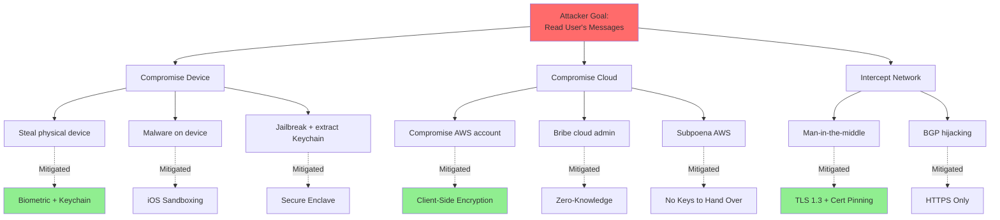
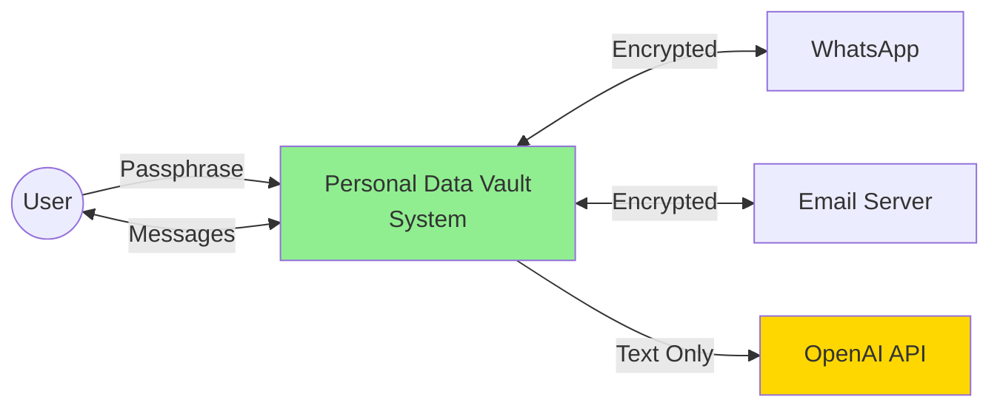
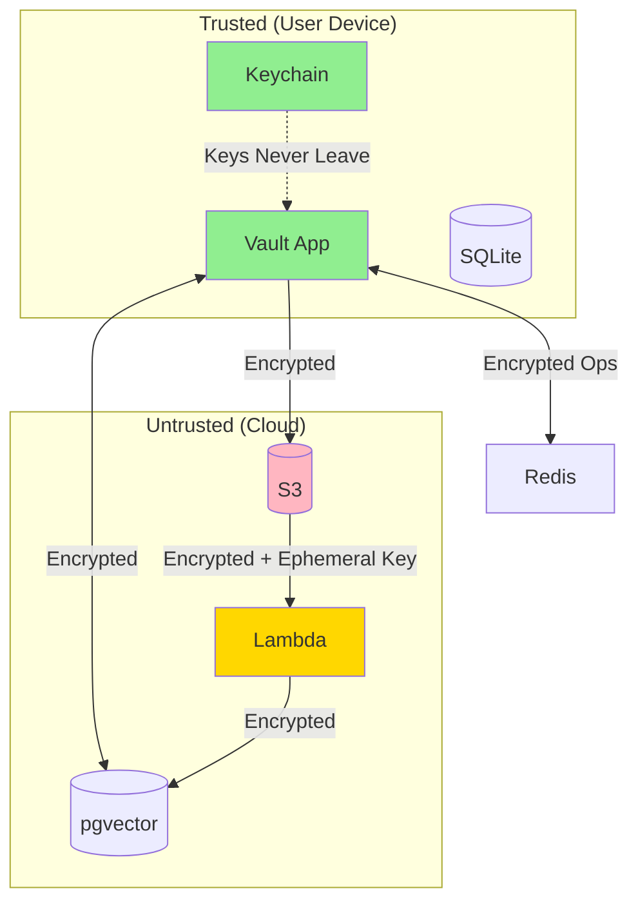
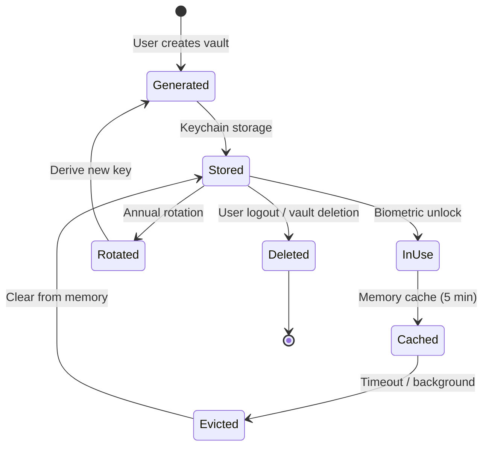

# Security Threat Model

## Purpose

This document provides a comprehensive threat analysis for the Personal Data Vault using the STRIDE methodology (Spoofing, Tampering, Repudiation, Information Disclosure, Denial of Service, Elevation of Privilege).

---

## STRIDE Analysis

### Spoofing (Identity Verification)

| Threat | Likelihood | Impact | Mitigation | Test |
|--------|------------|--------|------------|------|
| **Phishing (Steal Passphrase)** | Medium | High | User education; password strength requirements | Security awareness training |
| **QR Code Phishing (WhatsApp)** | Medium | High | UI warning: "Only scan with YOUR phone" | Manual review of onboarding |
| **OAuth Token Theft** | Low | High | HTTPS only; short-lived tokens | Penetration test |
| **Biometric Spoofing** | Low | Medium | Secure Enclave validates; attempt limits | iOS security model (trusted) |

**Key Mitigations:**
- Strong passphrase requirements (12+ chars, complexity)
- OAuth over password authentication (where possible)
- Device registration (track all authorized devices)

---

### Tampering (Data Integrity)

| Threat | Likelihood | Impact | Mitigation | Test |
|--------|------------|--------|------------|------|
| **Ciphertext Modification** | Medium | Low | GCM authentication tag (detects tampering) | Unit test: flip bit in ciphertext |
| **Audit Log Tampering** | Low | High | Merkle tree (root hash published) | Integrity verification test |
| **Database Corruption** | Low | High | SQLite WAL mode; integrity checks; cloud backup | Chaos test: corrupt SQLite file |
| **MITM (Network)** | Low | Medium | TLS 1.3; certificate pinning | MITM proxy test |

**Key Mitigations:**
- Authenticated encryption (AES-GCM)
- Merkle trees for audit logs
- Regular integrity checks (PRAGMA integrity_check)

---

### Repudiation (Non-Repudiation)

| Threat | Likelihood | Impact | Mitigation | Test |
|--------|------------|--------|------------|------|
| **User Denies Action** | Low | Low | Audit log with timestamps; device IDs | Review audit log completeness |
| **System Denies Operation** | Low | Medium | Merkle tree proof; user can verify | Merkle verification test |

**Key Mitigations:**
- Comprehensive audit logging
- Tamper-evident Merkle tree
- Digital signatures on audit roots

---

### Information Disclosure (Confidentiality)

| Threat | Likelihood | Impact | Mitigation | Test |
|--------|------------|--------|------------|------|
| **Cloud Admin Access** | Medium | High | Client-side encryption; zero-knowledge | Penetration test: attempt server-side decryption |
| **Memory Dump Attack** | Low | Medium | Zero keys after use; Secure Enclave | Memory inspection with debugger |
| **Keychain Extraction** | Low | High | Secure Enclave; ThisDeviceOnly | Jailbreak scenario test |
| **TLS Downgrade Attack** | Low | Medium | Enforce TLS 1.2+; no fallback | Network security test |
| **Log Leakage** | Low | High | Never log plaintext; message IDs only | Log review audit |
| **Embedding Info Leakage** | Low | Low | Embeddings encrypted before storage | Verify pgvector stores encrypted data |

**Key Mitigations:**
- End-to-end encryption (REQ-5.1)
- Zero-knowledge architecture (REQ-5.2)
- Encrypted embeddings (even though no plaintext)
- Minimal logging

---

### Denial of Service (Availability)

| Threat | Likelihood | Impact | Mitigation | Test |
|--------|------------|--------|------------|------|
| **Rate Limit Exhaustion (OpenAI)** | Medium | Medium | Queue + backoff; fallback to local model | Load test with rate limits |
| **SQS Queue Overflow** | Low | Medium | 120K message buffer; throttling | Burst test: 50K messages |
| **Redis Unavailable** | Low | Medium | Offline queue; auto-reconnect | Chaos test: kill Redis |
| **Disk Full (Client)** | Medium | High | Size monitoring; cleanup tools | Fill disk simulation |
| **Database Locked (SQLite)** | High | Low | WAL mode; exponential backoff | Concurrent access test |

**Key Mitigations:**
- Local-first (works offline)
- Queuing and retry logic
- Graceful degradation (REQ-7.4)

---

### Elevation of Privilege (Authorization)

| Threat | Likelihood | Impact | Mitigation | Test |
|--------|------------|--------|------------|------|
| **Access Other User's Data** | Low | High | User ID in all queries; server validates | Authorization test: attempt cross-user access |
| **Bypass Biometric Auth** | Very Low | High | Secure Enclave enforces; Apple security model | Trust Apple platform security |
| **Escalate Lambda Permissions** | Low | Medium | Least privilege IAM; no console access | IAM policy review |

**Key Mitigations:**
- Strict authorization checks (user_id scoping)
- Least privilege IAM policies
- No shared data between users

---

## Attack Trees

### Attack: Steal User's Messages

**Analysis:**
- **Path 1 (Device Compromise):** Highest risk; multiple layers of defense (biometric, Keychain, Secure Enclave)
- **Path 2 (Cloud Compromise):** Low risk due to zero-knowledge (cloud has no keys)
- **Path 3 (Network Intercept):** Low risk due to TLS + certificate pinning

---

## Data Flow Diagrams (for Threat Modeling)

### DFD Level 0: System Context

### DFD Level 1: Internal Data Flows

---

## Security Checklist

### Pre-Launch Security Audit

- [ ] **Penetration Testing:** Third-party security firm (planned Q1 2026)
- [ ] **Code Review:** Security-focused review of encryption code
- [ ] **Dependency Audit:** Check for vulnerabilities (`swift package audit`)
- [ ] **Key Management Review:** Verify key lifecycle correctness
- [ ] **Incident Response Plan:** Documented and tested
- [ ] **Privacy Policy:** Legal review complete
- [ ] **GDPR Compliance:** All rights implemented and tested
- [ ] **Audit Log Integrity:** Merkle tree verification tested

### Production Security Monitoring

- [ ] **CloudWatch Alarms:** Configured for anomalies
- [ ] **Failed Auth Monitoring:** Alert on >10 failures/hour
- [ ] **Decryption Failure Monitoring:** Alert on >1% failure rate
- [ ] **Rate Limit Monitoring:** Track OpenAI, IMAP, WhatsApp limits
- [ ] **DLQ Monitoring:** Alert on any messages in dead letter queue
- [ ] **Certificate Expiry:** Alert 30 days before TLS cert expiry

---

## Compliance Matrix

| Regulation | Requirement | Implementation | Validation |
|------------|-------------|----------------|------------|
| **GDPR Art. 15** | Right to access | Vault export (JSON) | Export test |
| **GDPR Art. 17** | Right to erasure | Delete button (local + cloud) | Deletion test |
| **GDPR Art. 32** | Security measures | AES-256-GCM, audit logs | Penetration test |
| **CCPA** | Right to know | Activity dashboard | Dashboard review |
| **FIPS 140-2** | Cryptographic modules | Secure Enclave (Level 2 certified) | Apple certification |
| **SOC 2 Type II** | Security controls | Audit logs, access controls | Third-party audit (future) |

**Sources:**
- GDPR Official: https://gdpr-info.eu/  
  Date Checked: 04 Oct 2025
- FIPS 140-2 Cert: https://support.apple.com/guide/certifications/ios-ipados-apc3fa917cb59/web  
  Date Checked: 04 Oct 2025

---

## Incident Response Plan

### Security Incident Severity

**P0 (Critical):**
- Data breach (plaintext exposed)
- Encryption keys compromised
- Unauthorized access confirmed

**Response:**
- Contain within 1 hour
- Notify all users within 72 hours (GDPR Art. 33)
- Force key rotation for all users
- Coordinate with regulators

**P1 (High):**
- Vulnerability discovered (not exploited)
- Authentication bypass possible
- Suspicious activity detected

**Response:**
- Patch within 24 hours
- Notify affected users
- Enhanced monitoring

---

## Key Management Security

### Key Lifecycle

**Critical Security Controls:**
- Master key never leaves device
- Ephemeral keys cleared immediately after use
- Keychain items: `ThisDeviceOnly` (no iCloud backup)
- Biometric required for access

---

## References

All security standards and threat research cited in component documentation. See `references.md` for complete list with URLs and verification dates.

**Key Sources:**
- NIST SP 800-175B (Cryptographic Guidelines): https://csrc.nist.gov/publications/detail/sp/800-175b/rev-1/final
- OWASP Top Ten: https://owasp.org/www-project-top-ten/
- CWE (Common Weakness Enumeration): https://cwe.mitre.org/

---

**Threat Model Owner:** Security Team  
**Last Security Assessment:** 01 October 2025  
**Next Assessment:** 01 January 2026  
**Status:** ✅ COMPREHENSIVE
