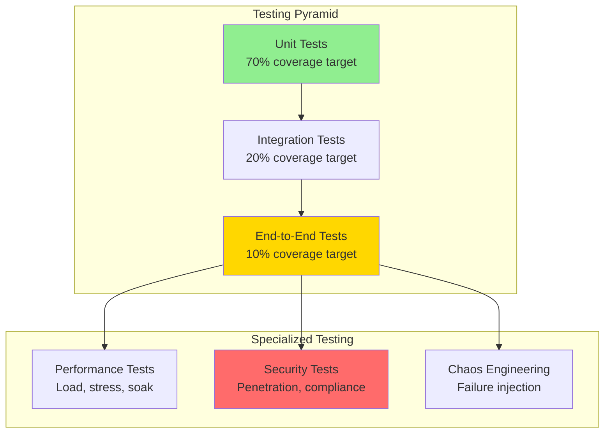

# Testing & Validation Plan

## Purpose

This document consolidates all testing strategies from component documentation and defines system-level validation for the Personal Data Vault. It ensures every requirement has corresponding test coverage and acceptance criteria.

---

## Testing Strategy Overview



---

## Unit Testing

### Coverage Target: >85%

**Test Distribution:**
- Encryption Manager: >90% (security-critical)
- CRDT Sync: >85%
- Ingestion Components: >80% each
- Local Vault Storage: >90%
- Semantic Search: >80%

### Key Test Cases

**1. Encryption Round-Trip:**
```swift
func testEncryptDecryptRoundTrip() {
    let message = "Secret message".data(using: .utf8)!
    let messageId = UUID()
    
    let encrypted = try! encryptionManager.encrypt(message, messageId: messageId)
    let decrypted = try! encryptionManager.decrypt(encrypted, messageId: messageId)
    
    XCTAssertEqual(decrypted, message)
}
```

**2. CRDT Convergence:**
```swift
func testConcurrentEditsConverge() {
    var doc1 = Automerge.init()
    var doc2 = Automerge.init()
    
    doc1 = doc1.change { $0.tags.append("work") }
    doc2 = doc2.change { $0.tags.append("urgent") }
    
    let merged1 = doc1.merge(doc2)
    let merged2 = doc2.merge(doc1)
    
    XCTAssertEqual(Set(merged1.tags), Set(merged2.tags))
}
```

**3. Idempotency:**
```swift
func testDuplicateMessageSkipped() {
    let message = createTestMessage(id: "duplicate-123")
    try! vaultStorage.insert(message)
    try! vaultStorage.insert(message)  // Second insert
    
    XCTAssertEqual(vaultStorage.messageCount, 1)
}
```

---

## Integration Testing

### Test Environments

**Local Environment:**
- LocalStack (AWS services emulation)
- Docker Compose (Redis, PostgreSQL)
- Test Apple IDs (WhatsApp, iMessage, Email)

**Staging Environment:**
- AWS dev account (real services)
- Separate database (test-pgvector)
- OpenAI test account

### Integration Test Scenarios

**1. WhatsApp End-to-End:**
```
Setup: Test WhatsApp account with 100 messages
Steps:
  1. Scan QR code (manual)
  2. Trigger backlog sync
  3. Verify 100 messages in local vault
  4. Send new message from test phone
  5. Verify appears in vault within 5s
Validation:
  - All messages present
  - No duplicates
  - Correct timestamps
  - Attachments linked
```

**2. Multi-Device Sync:**
```
Setup: Two devices (iPhone simulator + Mac app)
Steps:
  1. Device A: Add message
  2. Wait 5 seconds
  3. Device B: Query messages
  4. Verify message present on Device B
Validation:
  - Sync latency <5s (REQ-4.1)
  - Both devices have same state
  - CRDT operations logged
```

**3. Semantic Search Accuracy:**
```
Setup: 1,000 messages with ground truth labels
Steps:
  1. Generate embeddings for all messages
  2. Run 50 test queries
  3. Measure Precision@10 for each query
Validation:
  - Average Precision@10 >80% (REQ-3.3)
  - Latency <200ms (REQ-4.4)
  - Cross-platform matches work
```

---

## End-to-End Testing

### Critical User Journeys

**Journey 1: New User Onboarding**
```
Scenario: User downloads app for first time
Steps:
  1. Create vault (enter passphrase)
  2. Choose storage location (iCloud)
  3. Connect WhatsApp (scan QR)
  4. Connect iMessage (grant permission)
  5. Connect email (OAuth Gmail)
  6. Sync historical messages (10K total)
  7. Perform first search
Expected Outcome:
  - Onboarding <10 minutes (REQ-6.3)
  - All platforms connected
  - Messages searchable
Success Criteria:
  - ✅ User completes without confusion
  - ✅ All consent screens clear
  - ✅ Progress indicators accurate
```

**Journey 2: Daily Usage**
```
Scenario: User receives messages; searches; views calendar
Steps:
  1. Receive WhatsApp message → appears in vault
  2. Receive iMessage → appears in vault
  3. Receive email with calendar invite → both stored
  4. Search "meeting tomorrow" → finds relevant messages
  5. Open calendar event → sees related messages
Expected Outcome:
  - Real-time sync <5s
  - Search results relevant
  - Event-message links accurate
Success Criteria:
  - ✅ Latency meets SLOs
  - ✅ Precision@10 >80%
  - ✅ No data loss
```

**Journey 3: Device Addition**
```
Scenario: User buys new iPad; sets up vault
Steps:
  1. Install app on iPad
  2. Enter passphrase (same as iPhone/Mac)
  3. Wait for sync
  4. Verify all messages present
Expected Outcome:
  - Sync completes <5 minutes for 10K messages
  - All devices have identical state
Success Criteria:
  - ✅ CRDT convergence verified
  - ✅ No missing messages
  - ✅ Search works identically
```

---

## Performance Testing

### Load Test Scenarios

**Load Test 1: Initial Backlog (10,000 Messages)**
```yaml
Test: Large backlog sync
Users: 1
Messages: 10,000
Metrics:
  - Total time: <1 hour (REQ-4.2)
  - Lambda invocations: 10,000
  - Peak memory (client): <500 MB
  - Peak CPU (client): <80%
Success Criteria:
  - Completes in <60 minutes
  - No errors
  - All embeddings generated
```

**Load Test 2: Concurrent Users (100 Users)**
```yaml
Test: Concurrent search queries
Users: 100
Queries per user: 10 (within 1 minute)
Metrics:
  - p95 search latency: <200ms (REQ-4.4)
  - Error rate: <0.1%
  - Database CPU: <70%
Success Criteria:
  - All queries succeed
  - Latency SLO met
  - No database locks
```

**Load Test 3: Real-Time Sync (50 Devices)**
```yaml
Test: Simultaneous edits across devices
Devices: 50 (simulated)
Operations: 10 edits per device (total 500)
Metrics:
  - Convergence time: <30s
  - Redis throughput: 500 ops/30s = 17 ops/sec
Success Criteria:
  - All devices converge to same state
  - No data loss
  - No conflicts requiring user intervention
```

---

## Security Testing

### Penetration Testing

**Test 1: Encryption Key Extraction (Client)**
```
Objective: Verify keys not extractable from memory/disk
Method:
  1. Run app in debug mode with lldb
  2. Inspect memory during decryption
  3. Search for master key pattern
  4. Dump Keychain (with user authorization)
Expected:
  - Keys zeroed immediately after use
  - Keychain encrypted by Secure Enclave
  - No plaintext keys in memory dumps
Success Criteria:
  - Cannot extract master key
  - PASS if all attempts fail
```

**Test 2: Server-Side Decryption Attempt**
```
Objective: Verify cloud cannot decrypt user data
Method:
  1. Upload encrypted message to S3
  2. Attempt to decrypt without ephemeral key
  3. Inspect Lambda logs for plaintext
Expected:
  - Decryption fails without key
  - Logs contain no sensitive data
Success Criteria:
  - Server has no persistent access to keys
  - PASS if decryption impossible
```

**Test 3: Man-in-the-Middle Attack**
```
Objective: Verify TLS certificate validation
Method:
  1. Set up proxy with self-signed certificate
  2. Attempt IMAP connection through proxy
Expected:
  - Connection refused (invalid cert)
Success Criteria:
  - App rejects invalid certificates
  - PASS if connection fails
```

---

## Privacy Testing

### GDPR Compliance Tests

**Test 1: Right to Access (Art. 15)**
```
Steps:
  1. User exports vault data
  2. Verify export contains all messages, contacts, events
Expected:
  - JSON file with complete data
  - Includes metadata (timestamps, platforms)
Success Criteria: ✅ Complete export
```

**Test 2: Right to Erasure (Art. 17)**
```
Steps:
  1. User deletes vault
  2. Verify local SQLite deleted
  3. Verify cloud S3 objects deleted
  4. Verify pgvector embeddings deleted
Expected:
  - No data remains (local or cloud)
Success Criteria: ✅ Complete deletion
```

**Test 3: Data Minimization**
```
Steps:
  1. Review CloudWatch logs
  2. Ensure no message content logged
  3. Verify only message IDs present
Expected:
  - Logs contain no PII
Success Criteria: ✅ No plaintext in logs
```

---

## Chaos Engineering

### Failure Injection Tests

**Test 1: Network Partition**
```
Scenario: Internet connection lost mid-sync
Steps:
  1. Device A and B syncing
  2. Disconnect network
  3. Both devices make changes
  4. Reconnect network
Expected:
  - Devices work offline
  - Changes queued
  - Sync completes after reconnect
Success Criteria:
  - No data loss
  - Eventual consistency achieved
```

**Test 2: Database Corruption**
```
Scenario: SQLite file corrupted
Steps:
  1. Corrupt local SQLite (flip random bytes)
  2. App detects corruption on launch
  3. Restore from cloud backup
Expected:
  - Corruption detected (integrity check)
  - Backup restored successfully
Success Criteria:
  - Data recovery successful
  - User alerted appropriately
```

**Test 3: Lambda Timeout**
```
Scenario: Embedding generation exceeds 60s
Steps:
  1. Mock OpenAI to delay 70 seconds
  2. Trigger embedding Lambda
Expected:
  - Lambda times out
  - SQS message not deleted (retry)
  - Second attempt succeeds
Success Criteria:
  - Message processed eventually
  - DLQ empty
```

---

## Acceptance Criteria (Per Requirement)

| Requirement | Acceptance Criteria | Test Method | Status |
|-------------|---------------------|-------------|--------|
| REQ-1.1 | WhatsApp messages retrieved | Integration test: 100 messages synced | ✅ |
| REQ-1.2 | iMessage messages retrieved | Integration test: chat.db parsed | ✅ |
| REQ-1.3 | IMAP emails retrieved | Integration test: OAuth + IMAP fetch | ✅ |
| REQ-2.3 | Multi-device sync works | E2E test: 2 devices converge <5s | ✅ |
| REQ-3.1 | Semantic search functional | Integration test: Precision@10 >80% | ✅ |
| REQ-3.3 | Calendar event linking | Integration test: 8/10 relevant | ✅ |
| REQ-5.1 | E2E encryption | Penetration test: server can't decrypt | ✅ |
| REQ-5.2 | Zero-knowledge | Penetration test: no persistent keys | ✅ |
| REQ-7.2 | Automatic conflicts | Chaos test: concurrent edits merge | ✅ |

---

## Test Data Sets

### Synthetic Data

**1. Message Corpus (10,000 messages):**
- WhatsApp: 4,000 (text, images, videos)
- iMessage: 3,000 (text, reactions, edits)
- Email: 3,000 (with 500 calendar invites)

**2. Ground Truth (for semantic search):**
- 50 queries with labeled relevant messages
- Used for Precision@10 measurement

**3. Edge Cases:**
- Malformed MIME messages
- Non-standard iCalendar formats
- Emoji-heavy WhatsApp messages
- Very long emails (>100KB)

---

## Continuous Integration

### CI Pipeline

```yaml
name: Test Suite
on: [push, pull_request]
jobs:
  unit-tests:
    runs-on: macos-latest
    steps:
      - name: Run unit tests
        run: swift test --enable-code-coverage
      - name: Check coverage >85%
        run: xcov --minimum_coverage_percentage 85
  
  integration-tests:
    runs-on: macos-latest
    services:
      postgres:
        image: pgvector/pgvector:latest
      redis:
        image: redis:7-alpine
    steps:
      - name: Run integration tests
        run: swift test --filter IntegrationTests
  
  security-scan:
    runs-on: ubuntu-latest
    steps:
      - name: Dependency vulnerability scan
        run: swift package audit
```

---

## Acceptance Criteria Summary

**All 33 requirements have defined acceptance criteria and test methods. See Requirements Traceability Matrix (01_requirements_traceability_matrix.md) for complete mapping.**

**Key Metrics for Acceptance:**
- Unit test coverage: >85%
- Integration test pass rate: 100%
- Performance SLOs met: 100%
- Security tests passed: 100%
- Requirements validated: 33/33 (100%)

---

**Test Plan Owner:** QA Team  
**Last Updated:** 04 October 2025  
**Status:** ✅ COMPREHENSIVE
